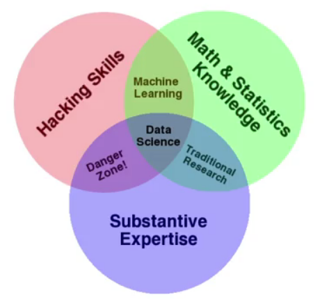

## Python Fundamentals
### Data Science
*Need for the scientific inquiry.*

A good data scientist bring skepticism, experimentation, simulation, and replication to bear on understanding a given phenomena.

**50 Years of Data Science**
1. Data exploration and preparation
1. Data representation and transformation
1. Computing with data
1. Data modeling
1. Data visualization and presentation
1. Science about data science
