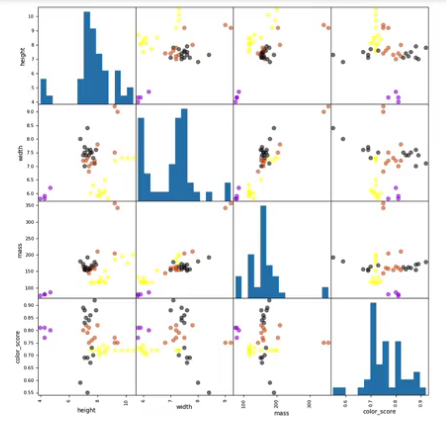

## Fundamentals of Machine Learning (ML)
### What is ML
- The study of computer programs (algorithms) that can learn by example
- ML algorithms can generalize form existing examples of a task, i.e. predict new examples not in the training set

### Key Concepts in Machine Learning
**Supervised ML:**
*Learn to predict target values from labelled data*
- Classification: target values are discrete classes
- Regression: target values are continuous values

**Unsupervised ML:**
*Find structure in unlabeled data*
- Clustering: Find groups of similar instances in the data
- Outlier detection: Finding unusual patterns

### Basic ML Workflow
1. Representation
    - Feature representation describe the object
    - Type of classifier to use  
    > Visualize as table. Where each row represents a single data instance. And where the columns represent the features of the object.

1. Evaluation
    - What criterion distinguishes good vs. bad classifiers?
1. Optimization
    - Search for the best settings/parameters for the chosen criterion

**Feature pair plot**
Shows all possible pairs of features and produces a scatter plot for each pair, showing how the features are correlated to each other or not.

### K-Nearest Neighbors Classification
*Can be used for classification and regression.*

k-NN classifiers are an example of what's called instance based or memory based supervised learning.

What this means is that instance based learning methods work by memorizing the labeled examples that they see in the training set. And then they use those memorized examples to classify new objects later.

> The k in k-NN refers to the number of nearest neighbors the classifier will retrieve and use in order to make its prediction.

We're trying to find the one point that's closest to our query point, this is the point we want to classify.

Things to specify:
- Distance metric
- How many *nearest* neighbors to look at
- Optional weighting function on the neighbor points
- Method for aggregating the classes of neighbor points

**Bias variance tradeoff**
When K = 1, the prediction is sensitive to noise, outliers, mislabeled data, and other sources of variation in individual data points.

For larger values of K, the areas assigned to different classes are smoother and not as fragmented and more robust to noise in the individual points. But possibly with some mistakes, more mistakes in individual points.

- A low value of $k$ is more likely to overfit the training data and lead to worse accuracy on the test data, compared to higher values of $k$

- Setting $k$ to the number of points in the training set will result in a classifier that *always* predicts the majority class

- The k-nearest neighbors classification algorithm hast to memorize all of the training examples to make a prediction
