## Supervised Machine Learning
Supervised learning algorithms because they use labeled examples in the training set to learn how to predict the labels for new, previously unseen/future examples.

In Machine Learning we use the term **features** to refer to the **input**, or independent variables. And **target** value or target label to refer to the **output**, dependent variables.

**Important terms**
- Data representation
    - Features
    - Data instances/samples/examples X
    - Target value y
- Train/Test sets
    - Model/Estimator
        - Model fitting produces a trained model
        - Training is the process of estimating model parameters
    - Evaluation method
    - Prediction

**Types of Supervised Learning**
- Classification
    - Binary, the target value is a discrete class value
        - e.g. 0:negative, 1: positive class
    - Multi-class: the target value is one of a set of discrete values
        - e.g. labelling the type of fruit
- Regression
    - The target value is continuous
        - e.g. predicting the selling price of a house from its attributes

> Both take a set of training instances and learn a mapping to a target value

**Supervised Learning methods**
- K-nearest neighbors
    - makes few assumptions about the structure of the data
    - potentially accurate but sometimes unstable predictions
    - predictions sensitive to small changes in the training data
        - small values of k give models with higher complexity
        - large values of k result in simpler models with lower complexity
- Linear models
    - make strong assumptions about the structure of the data
    - stable but potentially inaccurate predictions

> As the increasingly complex models begin to overfit too specifically to the training data, and don't capture more global patterns that help it generalize well to unseen testing.

### Overfitting and Underfitting
*We want the ability to predict a class or target value correctly on a test set of future examples that haven't been seen before, i.e. to generalize.*

- Generalization
Ability to give accurate predictions for new, previously unseen data
    - assumptions
        - future/unseen data (test set), will have the same properties as the current training set
        - thus, models that are accurate on the training set are expected to be accurate on the test set
        - but, if the trained model is tuned too specifically that may not happen

- Not likely to generalize well
    - Overfitting
        - models that are **too complex**
        - low bias, high variance
        - do very well on the training data
    - Underfitting
        - models that are too **simple**
        - high bias, low variance
        - don't even do well on the training data
### K-Nearest Neighbors: Classification and Regression
Given a training set X_train with labels y_train classify a new instance X_test

1. Find the most similar instances of X_test that are in X_train
1. get the labels of these similar instances
1. predict the labels for X_test by combining the previously found labels

**R-squared regression score**
*Measures how well a prediction model for regression fits the given data*

- The score is between 0 and 1:
  - 0: corresponds to a constant model that predicts the mean value of all training target values
  - 1: corresponds to prefect prediction

> Also known as *coefficeint of determination*

**Parameters**
- Model complexity:
    - n_neighbors: number of nearest neighbors (k) to consider
- Model fitting:
    - metric: distance function between data points

> If your data set has hundreds or thousands of features, you should consider alternatives to k-nearest neighbors models, especially if your data is sparse. Meaning that each instance has lots of features, but most of them are zero.

### Linear Regression: Least-Squares
*A linear model is a sum of weighted variables that predicts a target output value given an input data instance.*


Linear models may seem simplistic, but for data with many features linear models can be very effective and generalize well to new data beyond the training set.

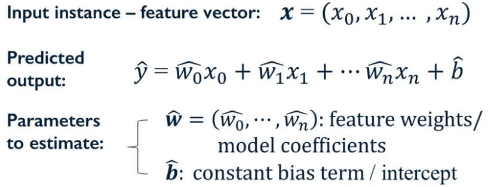

> Training means estimating values for the parameters or coefficients of the model.

**Least-Squares**
*Finds $w$ and $b$ that minimizes the mean squared error (MSE/RSS) of the model.*

*MSE:* the mean of squared differences between predicted target and actual target values.

*RSS:* the sum of squared differences between predicted target and actual target values
$$
\text{RSS}(w, b) = \sum^N_{i=1}(y_i - (w x_i + b))^2
$$

> No parameters to control model complexity

**How linear regression parameters are estimated?**
- Different methods correspond to different *fit* criteria and goals and ways to control model complexity

- The learning algorithm finds the parameters that optimize an **objective function**, to minimize a **loss function** of the predicted target value vs actual target values.

## K-NN Regression vs Least-Squares Linear Regression
- K-NN
    - doesn't make a lot of assumptions about the structure of the data
    - gives potentially accurate but sometimes unstable predictions
    - sensitive to small changes in the training data.

- linear models
    - make strong assumptions about the structure of the data, i.e. the target value can be predicted using a weighted sum of the input variables
    - stable but potentially inaccurate predictions

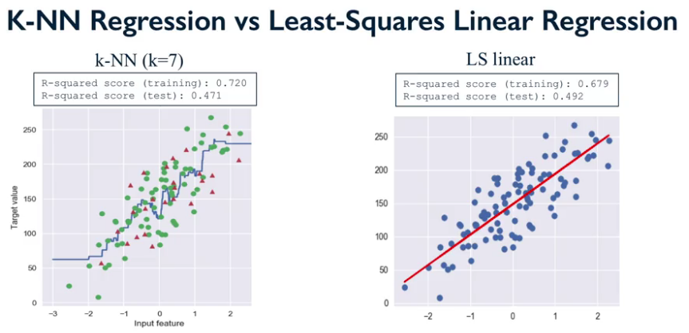

## Linear Regression: Ridge, Lasso, and Polynomial Regression
Uses the same least-squares criterion, but with one difference. During the training phase, it adds a penalty for feature weights
that are too large.

> Large weights means mathematically that the sum of their squared values is large.

**Ridge**
Ridge uses *L2 regularization*, i.e minimize the sum of squares of $w$ entries

$$
\text{RSS}_\text{RIDGE}(w, b) = \sum^N_{i=1}(y_i - (w x_i + b))^2 + \alpha \sum^p_{j=1} w_j^2
$$

**Lasso**
Lasso uses *L1 regularization*, i.e minimize the sum of the absolute values of $w$ entries

$$
\text{RSS}_\text{LASSO}(w, b) = \sum^N_{i=1}(y_i - (w x_i + b))^2 + \alpha \sum^p_{j=1} \vert w_j \vert
$$

- Has the effect of setting parameter weights to **zero** for the least influential variables.
- This produces a *sparse solution*, a kind of feature selection

**When to use RIDGE vs LASSO**
- Ridge: many small/medium effects
- Lasso: few variables with medium/large effects

### Regularization
- prevents overfitting, and thus, improve the likely generalization performance of a model by reducing the complexity of the final estimated model

- the amount of regularization to apply is controlled by $\alpha$
    - Larger alpha means more regularization and simpler linear models with weights closer to zero.

> If the input variables (features), have different scales, then when this shrinkage happens of the coefficients, input variables with different scales will have different contributions to this L2 penalty

Regularization becomes less important as the amount of training data increases.

**Feature Normalization**
- Faster convergence in learning
- Fair influence for all weights

MinMax scaling:
- find $x_i^\text{Min}$ and $x_i^\text{Max}$ of the training set
- transform each feature $x_i$ to a scaled version

```Python
from sklearn.preprocessing import MinMaxScaler

scaler = MinMaxScaler()
scaler.fit(X_train)
X_train_scaled = scaler.transform(X_train)
X_test_scaled = scaler.transform(X_test)

# or fit and transform on the training set
X_train_scaled = scaler.fit_transform(X_train)
X_test_scaled = scaler.transform(X_test)
```

Important:
- Train the scalar object on the training data and not on the test data, *data leakage*.
- Fit the scaler using the training set, then apply the same scaler to transform the test set

### Polynomial Regression
*Capture interactions between features*

- Generate new features consisting of all polynomial combinations of the original two features
$$
x = (x_0, x_1) \rightarrow x' =(x_0, x_1, x_0^2, x_0 x_1, x_1^2) \\
\hat{y} = \hat{w}_0 x_0 + \hat{w}_1 x_1 + \hat{w}_{00} x_0^2 + \hat{w}_{01} x_0 x_1 + \hat{w}_{11} x_1^2 + b
$$

- The degree of the polynomial specifies how many variables participate at time in each new feature
- Weighted linear combination of features, so it's still a linear model and we can use least-squares

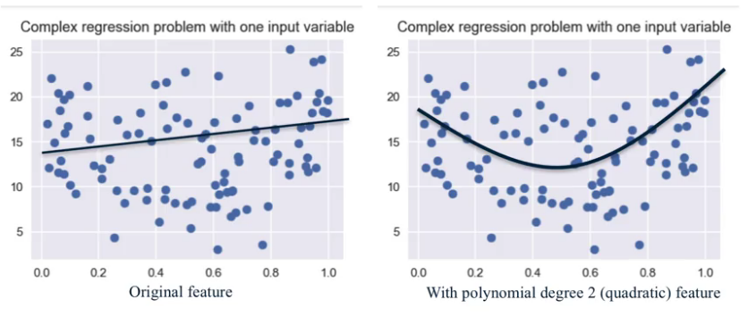

We can apply other non-linear transformations to create new features, *non-linear basis functions*.

> Beware of polynomial feature expasion with high degree, this can lead to complex models that overfit, often uses with regularization

```Python
from sklearn.preprocessing import PolynomialFeatures
poly = PolynomialFeatures(degree=2)
X_F1_poly = poly.fit_transform(X_F1)
```

## Logistic Regression
*Spite of being called a regression measure, is actually used for classification.*

The logistic regression model still computes a weighted sum of the input features $x_i$ and the intercept term $b$, but it runs this result through a special non-linear function $f$.


The logistic function compress the output of the linear function so that it's limited to a range between 0 and 1, interpreted as the probability that the input belongs to the positive class given its input features.

## Linear Classifiers: Support Vector Machines (LSVM)
Take the output of the linear function and apply the *sign* function to produce a binary output with two possible class labels.

**Classifier Margin**
*The amount of separation that can provide between the two classes.*

Defined as the maximum width the decision boundary area can be increased before hitting a data point

**Regularization**
C parameter controls the amount of regularization
- Higher values of C
    - less regularization
    - fit the training data as well as possible
    - each individual data point is important to classify correctly
- Smaller values of C
  - more regularization
  - find coefficients that are closer to 0
  - fits the training data a little bit worse
  - More tolerant of error on individual data points

> Normalize all the features so that they are on the same scale

**Linear models summary**
Pros:
- simple and easy to train
- fast prediction
- scales well to very large datasets
- works well with sparse data
- predictions are easy to interpret

Cons:
- for lower-dimensional data, other models may have superior generalization performance
- for classification, data may be not linearly separable (use non-linear kernels)

## Multi-Class Classification
*Convert a multiclass classification problem into a series of binary problems.*

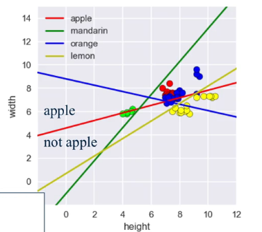

## Kernelized Support Vector Machines (SVM)
*A kernel is a similarity measure (modified dot product) between data points in the original and the feature space.*

- provide more complex models that can go beyond linear decision boundaries
- used for both classification and regression

They take the original input data space and transform it to a new higher dimensional feature space, where it becomes much easier to classify the transform to data using a linear classifier.

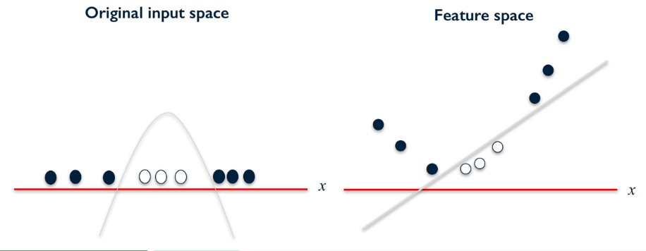  
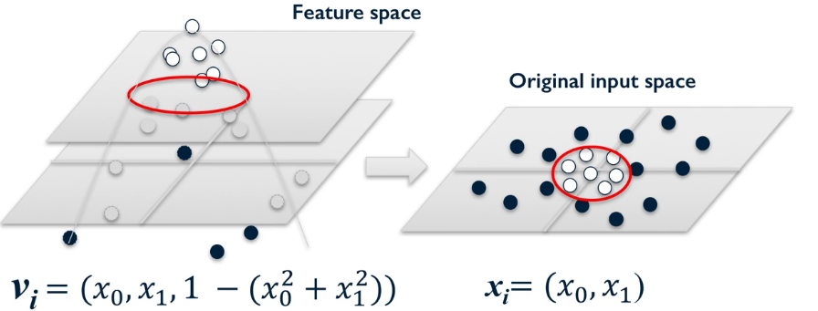  

> Transforming the data can make it much easier for a linear classifier

The linear decision boundary learn in the feature space corresponds to a non-linear decision boundary in the original input space.

The SVM classifier is still using a maximum margin principle to find these decision boundaries. But because of the non-linear transformation of the data, these boundaries may no longer always be equally distant from the margin edge points in the original input space.

**Radial Basis Function kernel**
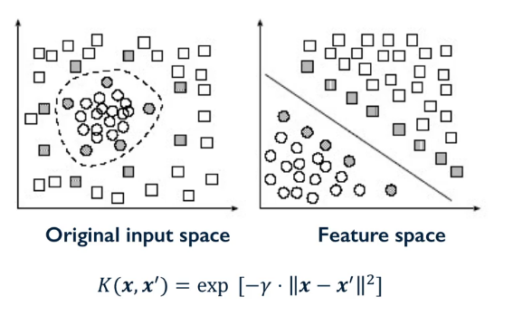  

- Gamma parameter:
  - Controls how far the influence of a
  single training example reaches
  - how tightly the decision boundaries end up surrounding points in the input space.
  - small gamma
      - larger similarity radius
      - points farther apart are considered similar
      - more points are grouped together
      - smoother decision boundaries
  - larger gamma
      - kernel value decades more quickly
      - points have to be very close to be considered similar
      - more complex, tightly constrained decision boundaries

  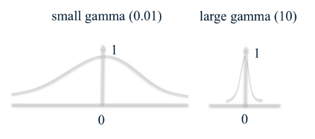  

  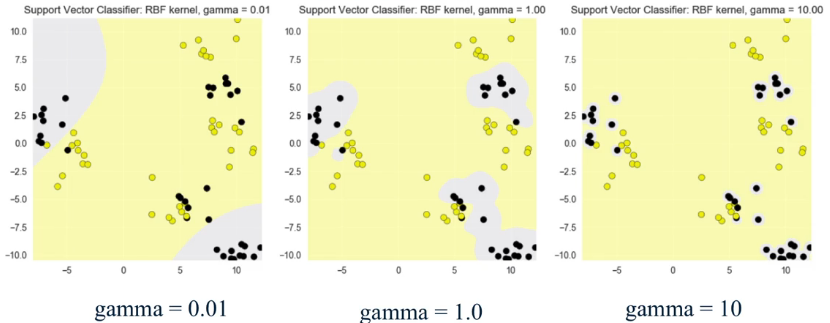

- Gamma with regularization parameter C
    - if gamma is large
    C will have little to no effect.
    - if gamma is small
    the model is much more constrained and the effective C will be similar to how it would affect a linear classifier.

> Kernelized SVMs are pretty sensitive to settings of gamma.

**Kernelized SVM summary**
Pros:
- Can perform well on a range of datasets
- Versatile, different kernel for specific data
- Works well for both low and high dimensional data

Cons:
- Efficiency decreases as training set increases (over 50,000 samples)
    - runtime speed
    - memory usage
- Needs careful normalization of input data and parameter tuning
- Does not provide direct probability estimates (use Platt scaling to estimate)
- Predictions are difficult to interpret

Important parameters:
- kernel
  Type of kernel function to be used
- kernel parameters ($\gamma$)
- regularization parameter $C$

> Typically, gamma and C are tuned together.

## Cross-Validation
*Cross-validation uses multiple Train/Test splits, each of which is used to train and evaluate a separate model.*

Steps:
1. Partition the data set into training and test sets using the train/test split function.
1. Call the fit method on the training set to estimate the model.
1. Apply the model by using the predict method to estimate a target value for the new data instances
1. Use the score method to evaluate the trained model's performance on the test set.

> Cross-validation gives more stable and reliable estimates by running multiple different training test splits and then averaging the results.

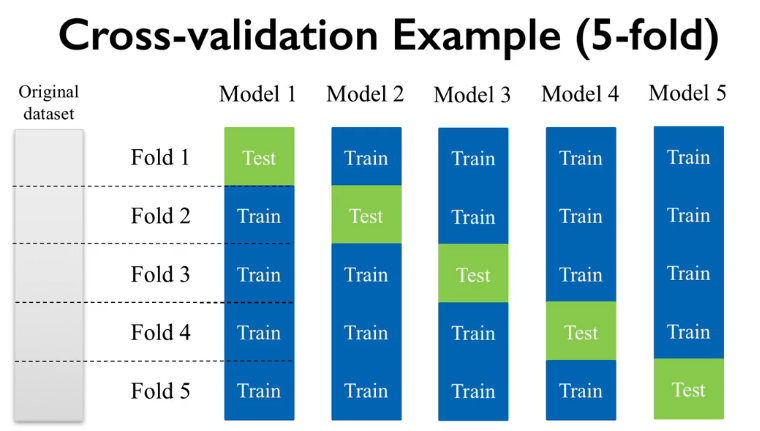

Scikit-learn actually does *Stratified K-fold Cross-validation*.

When splitting the data, the proportions of classes in each fold are made as close as possible to the actual proportions of the classes in the overall data set as shown here.

For regression, scikit-learn uses regular k-fold cross-validation since the concept of preserving class proportions isn't something that's really relevant for everyday regression problems.

*Leave-one-out cross-validation:* is just k-fold cross-validation with k set to the number of data samples N, so each fold consists of a single sample and the rest of the data s the training set.

**Validation curve**
*Shows sensitivity to changes in an important parameter*

The validation curve shows the mean cross-validation accuracy for training and test sets as a function of the parameter. Also shows the variation around the mean as computed from k-fold cross-validation scores.

> Cross-validation is used to evaluate the model and not learn or tune a new model.

## Decision Trees
Decision trees are easy to use and understand and are often a good exploratory method if you're interested in getting a better idea about what the influential features are in your dataset.

To predict, we simply start at the root of the decision tree and take the decision at each level based on the appropriate feature measurement until we get to a leafnode.

*Information game:* Mathematical way to compute the best split.

> Can be used for both regression and classification

Form these questions into a tree with a node representing one question and the yes or no possible answers as the left and right branches from that node that connect the node to the next level of the tree. One question being answered at each level.

At the bottom of the tree are nodes called leaf nodes that represent actual objects as the possible answers.

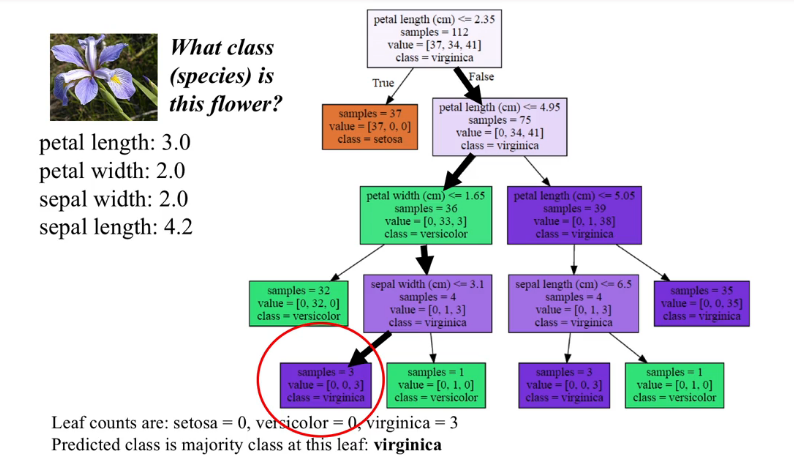

> The goal when building a decision tree is to find the sequence of questions that has the best accuracy at classifying the data in the fewest steps.

Trees whose leaf nodes each have all the same target value are called pure, as opposed to mixed where the leaf nodes are allowed to contain at least some mixture of the classes.

**Overfitting**
- Decision trees that keep adding rules until the leafnodes are pure.
- Typically such trees are overly complex and essentially memorized the training data.

*pre-pruning:* One strategy to prevent overfitting is to prevent the tree from becoming really detailed and complex by stopping its growth early.

*post-pruning/pruning:* Another strategy is to build a complete tree with pure leaves but then to prune back the tree into a simpler form.

We can control tree complexity via pruning:
- limiting the maximum depth of the tree
- limiting the maximum number of leafnode
- set a threshold on the minimum number of instances that must be in a node to consider splitting it.

**Feature importance**
*How important is a feature to overall prediction accuracy?*
- A number between 0 and 1 assigned to each feature
    - 0: the feature was not used in the prediction
    - 1: feature predicts the target perfectly
> All feature importances are normalized to sum 1

If a feature has a low feature importance value, that doesn't necessarily mean that the feature is not important for prediction. It simply means that the particular feature wasn't chosen at an early level of the tree and this could be because the future may be identical or highly correlated with another informative feature and so doesn't provide any new additional signal for prediction.

Feature importance values don't tell us which specific classes a feature might be especially predictive for.

They also don't indicate more complex relationships between features that may influence prediction

Because feature importance can vary depending on the specific model learned for a particular train/test split for example.

It's common when computing feature importance to use an average over multiple train/test splits.

**Decision trees summary**
Pros:
- Easily visualized and interpreted
- No feature normalization or scaling is typically needed
- Work well with datasets using a mixture of feature types (continuous, categorical, binary)

Cons:
- Even after tuning, decision trees can often still overfit
- Usually need an ensemble of trees for better generalization performance

Important parameters:
- max_depth
  controls maximum depth (number of split points) to reduce complexity and overfitting
- min_samples_leaf:
  threshold for the minimum number of data instances a lead can have to avoid further splitting
- max_leaf_nodes: limits total number of leaves in the tree
