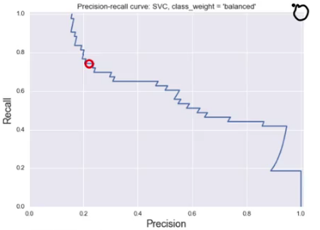

## Model Evaluation & Selection
*Evaluation provides critical feedback on the trained model's performance characteristics.*

- Different applications have very different goals
- Compute your selected evaluation metric for multiple different models

**Accuracy with imbalanced classes/skew**
$$
\text{Accuracy} = \frac{\text{#correct predictions}}{\text{#total instances}}
$$

You build a classifier to predict relevant items, and see that its accuracy on a test set is 99.9%. Compare it to a *dummy* classifier that didn't look at the features at all, and just predicted the most frequent class $\text{Accuracy}_\text{dummy}$ = 999/1000 = 99.9%

> F1-scoring, when the positive class is in the minority

**DummyClassifiers**
*Completely ignores the input data.*
- Serve as a sanity check on your classifier's performance
- Provide a *null metric*, e.g. null accuracy baseline
- In sklearn:
    - most_frequent: most frequent label in the training set
    - stratified: random predictions based on training set class distribution, i.e. random output in proportion to the ratio labels in the training set
    - uniform: generates predicionts uniformly at random
    - constant: always predicts a constant label

> Should not be used for real problems.

What if my classifier accuracy is close to the null accuracy baseline?, this could be a sign of:
- Ineffective/erroneous/missing features
- Poor choice of kernel or hyperparameter
- Large class imbalance

**Dummy Regressors**
The counterpart to DummyClassifiers, since regression models have continuous value prediction outputs.

- In sklearn:
    - mean: predicts the mean of the training targets
    - median: predicts the mean of the training targets
    - quantile: predicts a user-provided quantile of the training targets
    - constant: predicts a constant user-provided value

### Confusion Matrices & Basic Evaluation Metrics
**Confusion Matrix**
Not a single number like accuracy, but there are many possible metrics that can be derived from the confusion matrix.

  

The successful predictions of the classifier are on the diagonal where the true class matches the predicted class.

The cells off the diagonal represent errors of different types.

**Basic Evaluation Metrics**
$$
\text{Accuracy} = \frac{\text{#correct predictions}}{\text{#total instances}} = \frac{\text{TN + TP}}{\text{TN + TP + FN + FP}}
$$
$$
\text{Classification Error} = \frac{\text{FP + FN}}{\text{TN + TP + FN + FP}}
$$
$$
\text{Precision} = \frac{\text{TP}}{\text{TP + FP}}
$$
$$
\text{Recall} = \frac{\text{TP}}{\text{TP + FN}}
$$
$$
\text{False Positive Rate} = \frac{\text{FP}}{\text{FP + TN}}
$$

Precision:
When the classifier predict the positive class, we want to be very confident that it's correct.

Recall is also known as:
- True positive rate (TPR)
- Sensitivity
- Probability of detection

False Positive Rate (FPR)/specificity:
What fraction of all negative kinstances does the classifier **incorrectly** identify as positive.

**Precision Recall tradeoff**
- **High Precision** Low Recall
    - Search engine ranking, query suggestion
    - Document classification
    - Customer-facing tasks
      
- Low Precision, **High Recall**
    - Search and information extraction
    - Tumor detection, often paired with a human expert to filter out FP
    

#### F1-score
*Combines precision and recall into a single number*
$$
\text{F1} = 2 * \frac{\text{Precision * Recall}}{\text{Precision + Recall}} = \frac{\text{2 * TP}}{\text{2 * TP + FN + FP}}
$$

**F-score**
$$
F_\beta = (1+\beta)^2 \frac{\text{Precision * Recall}}{\beta^2 \text{Precision + Recall}} = \frac{(1+\beta^2)* \text{TP}}{(1+\beta^2)* \text{TP} + \beta * \text{FN + FP}}
$$
$\beta:$ allows adjustment of the metric to control the emphasis on recall vs precision
- Precision oriented: $\beta < 1$
    - False positives hurt performance more than false negatives
- Recall oriented: $\beta > 1$
    - False negatives hurt performance more than false positives

> $\beta = 1$ for F1-score

### Classifier Decision Functions
A model that overfit might provide overly optimistic high probabilities that were in fact not accurate.

**Decision Functions - Threshold**
- Each classifier score value per test point indicates how confidently the classifier predicts
    - the positive class $\rightarrow$ large magnitude positive values
    - the negative class $\rightarrow$ large magnitude negative values

By sweeping the decision threshold thorough the entire range of possible score values we get a series of classification outcomes that form a curve.  

> We might pick a specific decision threshold depending on whether we want the classifier to be more or less conservative about making false-positive or false-negative errors.

**Predicted Probability of class membership**
- Typical rule: choose most likely class
- Adjusting threshold affects predictions of classifier
- Higher threshold results in a more conservative classifier
    - e.g. predict class if probability is above 70%
    - This increases precision. Doesn't predict class as often, but when it does, a high proportion is correct

> Not all models provide realistic probability estimates

### Precision-recall and ROC curves
**Precision-recall curves**
- Axis:
    - X-axis: Precision
    - Y-axis: Recall
- Ideal point
    - Top right corner
    - Precision = 1.0
    - Recall = 1.0

> Maximize precision while maximizing recall

**Receiver Operating Characteristic (ROC) curves**
- Axis:
    - X-axis: False Positive Rate
    - Y-axis: True Positive Rate
- Ideal point
    - Top left corner
    - False positive rate = 0.0
    - True positive rate = 1.0

The dotted line here is used as a base line.

> Maximize true positive rate while minimizing the false positive rate

## Multi-Class Evaluation
*An extension of the binary case.*

- Collection of true vs predicted binary outcomes, one per class
- Confusion matrices are specially useful
- Classification report

> Multi-label also exists.

**Multi-Class Confusion Matrix**
For example, in our digits data set, there are ten classes for the digits, zero through nine. So, the ten class confusion matrix is a ten by ten matrix with the true digit class indexed by row and the predicted digit class indexed by column.

The correct prediction, where the true class matches the predicted class are all along the diagonal and misclassifications are off the diagonal.

**Micro vs Macro Average**
- Macro Average:
  Each **class has equal weight**
  1. Compute metric within each class (e.g. precision)
  1. Average resulting metrics across classes

  

- Micro-Average:
  Each **instance has equal weight**
  1. Compute metric directly, so 4/9 = 0.44

Differences and summary:
- If some classes are much larger (more instances) than others,
    - Use macro-averaging: to weight your metric toward the smallest ones
    - Use micro-averaging: to weight your metric toward the largest ones
- If the macro is much lower than the micro
    - examine the smaller classes for poor metric performance
- If the micro is much lower than the macro
    - examine the larger classes for poor metric performance

> If the classes have the same number of instances, macro and micro will be about the same

## Regression Evaluation
- Typically r2_score is enough
    - how well future instances will be predicted
    - best possible score is 1.0
    - constant prediction score is 0.0
    - have the potential to go negative for bad model fits, such as when fitting non-linear functions to data
- Alternative metrics include:
    - mean_absolute_error (L1): absolute difference of target and predicted values
    - mean_squared_error (L2): squared difference of target and predicted values
    - median_absolute_error: robust to outliers

> Dummy prediction model uses a fixed rule for comparison, i.g. dummy mean

## Model Selection: Optimizing Classifiers for Different Evaluation Metrics
*Selecting the best classifier for your application.*

- We used training and testing on the same dataset, overfits and doesn't generalize well to new data.
- We used a single train-test split to produce a single evaluation metric.
    - While fast and easy, this doesn't give as realistic a set of estimates for how well the model may work on future, new data.
    - We don't get a good picture for the variance in the evaluation metrics that may result as we do prediction on different test sets.
- We used k-fold cross-validation to create K random train-test splits, where the evaluation metric was averaged across splits.
    - This leads to models that are more reliable on unseen data.
    - GridSearchCV method within each cross-validation fold, to find optimal parameters for a model with respect to the evaluation.

> Using only cross-validation or a test set to do model selection may lead to more subtle overfitting/optimistic generalization estimates

*Data leakage:* The more information we see about our dataset as part of repeated cross-validation passes in choosing our model, the more influence any potential held-up test data has played into selecting the final model. Not merely evaluating it.

**Train/Validate/Test Protocol**
- Three data splits:
    - training: for model building
    - validation: for model selection
    - test: for the final evaluation

> The training and test sets are typically split out first, and then cross-validation is run using the training data to do model and parameter selection (the test set is not seen).

**Summary**
- Learning curves are used to assess how a machine learning algorithm's evaluation metric changes or improves as the algorithm gets more training data.

- Sensitivity analysis amounts to looking at how an evaluation metric changes as small adjustments are made to important model parameters.
