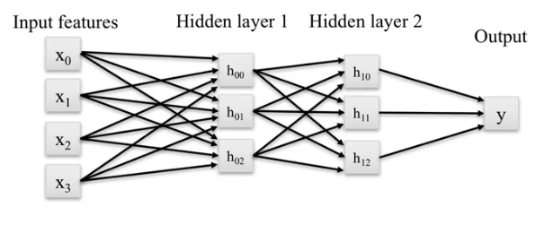
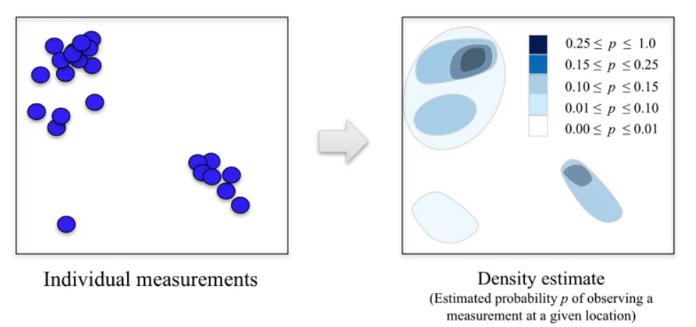

## Naive Bayes Classifiers
Called naïve because they assume that each feature of an instance is independent of all the others.

> In practice, this is not often the case, features often are somewhat correlated.

**Classifier Types**
- Bernoulli: binary features
    - e.g. word presence/absence
    - doesn't take into account how often the word occurs in the text
- Multinomial: discrete features
    - e.g. word counts
    - does take into account how often the word occurs in the text
- Gaussian: continuous/real-valued features
    - statistics computed for each class
    - e.g. mean, std
    - Predicting the class of a new data point corresponds mathematically to estimating the probability that each classes Gaussian distribution was most likely to have generated the data point. Classifier then picks the class that has the highest probability.
    - A parabolic separate the classes. Except in the special case where the variance of these feature is the same for both classes, then the decision boundary will be linear.

*partial fit:* train the classifier incrementally in case you're working with a huge data set that doesn't fit into memory.

**Uses**
- Gaussian Naive Bayes is used for high-dimensional data (multiple features)
- Bernoulli and Multinomial are used for text classification
    - very large number of distinct words are features and where the future vectors are sparse because any given document uses only a small fraction of the overall vocabulary.

**Pros and cons**
Pros:
- Easy to understand
- Simple, efficient parameter estimation
- Works well with high-dimensional data
- Often useful as baseline comparison vs more sophisticated methods

Cons:
- Assumption that features are conditionally independent, so other classifiers can be better
- Their confidence estimates for predictions are not very accurate

## Random Forests
*An ensemble of trees, not just one tree.*

An ensemble takes multiple individual learning models and combines them to produce an aggregate model that is more powerful than any of its individual learning models alone.

Each individual model might overfit to a different part of the data. By combining different individual models into an ensemble, we can average out their individual mistakes to reduce the risk of overfitting while maintaining strong prediction performance.

- One decision tree $\rightarrow$ Prone to overfitting
- Many decision trees $\rightarrow$ More stable, better generalization

> Ensemble of trees should be diverse, i.e. introduce random variation into tree-building

**Random variation during tree building**

The resulting bootstrap sample has N rows just like the original training set but with possibly some rows from the original dataset missing and others occurring multiple times

> the data used to build each tree is selected randomly, *bootstrap sample*

Instead of finding the best split across all possible features, a random subset of features is chosen and the best split is found within that smaller subset of features.

> the features chosen in each split tests are also randomly selected.

To create a random forest model you first decide on how many trees to build (n_estimated) and the number of features in the subset that are randomly considered at each stage (max_features).

**Max_Features parameter**
- is one:
    - the forest will likely be very different from each other and possibly with many levels in order to produce a good fit to the data.
- is close to the total number of features (high):
    - the trees in the forest will tend to be similar and probably will require fewer levels to fit the data using the most informative features.

**On regression**
- The overall prediction is then typically the mean of the individual tree predictions.

- For classification the overall prediction is based on a weighted vote.
    - Each tree gives a probability for each possible target class label then the probabilities for each class are averaged across all the trees and the class with the highest probability is the final predicted class.

> Notice that we did not have to perform scaling or other pre-processing as we did with a number of other supervised learning methods.

**Pros and cons**
Pros:
- Widely used, excellent prediction performance on may problems
- Doesn't require careful normalization of features
- Doesn't require extensive parameter tuning
- Like decision trees, handles a mixture of features types
- Easily parallelized across multiple CPUs

Cons:
- The resulting models are often difficult to interpret
- Like decision trees, random forest may not be a good choice for very high-dimensional sparse features tasks
    - e.g. text classifiers

**Key parameters**
- n_estimators: number of trees to use in ensemble
    - Should be larger for datasets to reduce overfitting
- max_features: influences the diversity of trees in the forest
- max_depth: controls the depth of each tree
- n_jobs: How many cores to use in parallel during training

> use random_state for reproducible results and debugging

## Gradient Boosted Decision Trees (GBDT)
*Ensemble of multiple tress*

- Training builds a series of small/shallow decision trees, *weak learners*. Built in a nonrandom way
- Each tree attempts to correct error from the previous stage

> Model that makes fewer and fewer mistakes as more trees are added.

**Learning rate**
controls how the gradient boost the tree algorithms, builds a series of collective trees

When the learning rate is **high**:
- each successive tree put strong emphases on correcting the mistakes of its predecessor
- more complex individual tree $\rightarrow$ more complex model

**Reduce overfitting**
- reduce the learning rate
- reduce the max_depth parameter for the individual trees in the ensemble

**Pros and Cons**
Pros:
- Often best of-the-shelf accuracy on many problems
- Modest memory and fast for prediction
- Doesn't require careful normalization of features
- Doesn't require careful normalization of features to perform well
- Like decision trees, handles a mixture of feature types

Cons:
- Like random forests, the models are difficult to interpret
- Requires careful tuning of the learning rate and other parameters
- Training can require significant computation
- Like decision trees, may not be a good choice for very high-dimensional sparse features

**Key parameters**
- n_estimators: sets of number of small decision trees to use
- learning_rate: controls emphasis on fixing errors from previous iteration
- max_depth: controls the depth of each tree
    - assumes small tree

> n_stimators is adjusted first

## Neural Networks
Linear regression:
predicts a continuous output; as the sum of the input variables $x_i$. Each weighted by a corresponding coefficient $\hat{w_i}$ + an intercept or bias term.


Logistic regression:
The output is now constrained to lie between zero and one, because an additional nonlinear function, the logistic function.


**Multi-Layer Perceptron (MLP)**
*Feed-forward neural networks*

There are a lot more weights, model coefficients, to estimate in the training phase. Which means that both more training data and more computation are typically needed.


> Example with one *hidden layer* and tanh activation function. Within the hidden layer, are hidden units

With a single hidden unit, the model is mathematically equivalent to logistic regression.



Each hidden unit in the hidden layer computes a nonlinear function of the weighted sums of the input features. Resulting in intermediate output values.
> Two hidden layers

Adding more hidden layer further increases the complexity of functions that the neural network can learn, from more complex data sets $\rightarrow$ use regularization.

**Regularization**
*$\alpha$, controls model complexity.*

L2 regularization penalizes models that have a large sum of squares of all the weight values.

> neural network prefers models with more weights shrunk close to zero.

**Pros and Cons**
Pros:
- Can form advanced architectures that effectively capture complex features given enough data and computation

Cons:
- require significant training time, data and customization
- Careful preprocessing of the data is needed
- A good choice when the features are similar types.

**Parameters**
- hidden_layer_sizes: list with the number of hidden units to use for each hidden layer
- alpha: controls weight on the regularization penalty that shrinks weights to zero
- activation: controls the nonlinear function
- Solver: algorithm that finds the optimal weights
    - Adam, tends to be both efficient and effective on large data sets
    - lbfgs, for small data sets, tends to be faster, and find more effective weights.

## Deep Learning
*Combines automatic feature extraction with a supervised learning phase.*

- Subsampling or pooling
    - can detect a translated or rotated version of a feature anywhere in the image
    - reduces the computational complexity of the network
- The first layer of their deep learning architecture extracts the most primitive low-level features,
    - such as edges and different kinds of blobs
- The second layer creates new features from combinations of those first layer features.
    - for faces, this might correspond to key elements that capture shapes of higher level features like noses or eyes.

**Pros vs Cons**
Pros:
- Powerful: have achieved impressive gains and have achieved state-of-the-art performance on many difficult tasks.
- Automatic feature extraction mechanisms also reduce the need for human guesswork in finding good features.
- Architectures are quite flexible. It could be adapted for different tasks and domains.

Cons:
- Require very large training sets and computing power
- Architectures can be complex and often must be highly tailored to a specific application
- The resulting models may not be easily interpretable

## Data Leakage
*The data you're using to train includes  information about what you're trying to predict.*

Keeping information about the prediction securely separated from the training and model development phase

Examples:
- we included the true label of a data instance as a feature in the model.
- having test data included in the training data which leads to over fitting
- there are many different ways data leakage and it's often the case that more than one leakage problem is present at once

> Typically causes results during your model development phase that are too optimistic, followed by the nasty surprise of disappointing results after the prediction model is actually deployed and evaluated on new data.

**Types of Leakage**
- Leakage in the training data
    - test data or future data gets mixed into the training data
    - e.g. performing data preprocessing using parameters or results from analyzing the entire dataset
    - e.g. time-series; using records from the future when computing features for the current prediction
    - e.g. Errors in data or missing values (999 special case), can encode information that reveals information about the future
- Leakage in features
    - where something highly informative about the true label somehow gets included as a feature
    - e.g. diagnosis info may still exist in patient ID

**Detecting Data Leakage**
- Before building the model
    - exploratory data analysis, e.g features highly correlated with the target value
- After building the model
    - surprising feature behavior in the fitted model
    - features with high weights
    - overall model performance surprisingly food compared to known results on the same dataset or similar problems
    - simple rule-base models (decision trees) can help with features
- Limited real-world deployment of the trained model
    - trained model generalizing well to new data?

**Minimizing Data Leakage**
- Perform data preparation (scaling, normalization, feature selection) within each cross-validation fold separately not using the entire dataset
    - for any such parameters estimated on the training data, you must use those same parameters to prepare the data on the corresponding held-out test fold
- For time series, use a timestamp cutoff
    - cutoff value, time where prediction is to occur using current and past records not in the future
- Before any work with a new dataset, split off a final test validation dataset

## Unsupervised Machine Learning
*No target value to be predicted. Instead, take the raw data and capture some structure in it.*

Notice here since we're not doing supervised learning, we don't have to split our dataset into training and test sets.

Two types:
- Transformations
    - run the data through some kind of useful process that extracts or computes information of some kind
    - e.g. Density Estimation
    - e.g. Dimensionality Reduction, PCA
- Clustering
    - Finds group in the data
    - Assign every point in the dataset to one of the groups

**Density Estimation**
*calculates a continuous probability density over the feature space, given a set of discrete samples in that feature space*

  

  

> Often used as features for classification or regression

**Dimensionality Reduction**
- Finds an approximate version of your dataset using fewer features
- Used for exploring and visualizing
- Used for compression (features)


**Principal Component Analysis (PCA)**
*Rotate data points, so the dimensions are statistically uncorrelated.*

Each feature should be normalized so its feature values have zero mean and unit variance


- First principal component / first dimension: rotation to the direction of highest variance
- Second principle component: then find the direction at right angles that maximally captures the remaining variance

> For higher dimensions, there would be infinitely many.

We can take any data point that used two features before (x, y) and approximate it using just one feature, namely its location when projected onto the first principal component

> Find informative features that could then be used in a later supervised learning stage.

**Manifold Learning Algorithms**
*Visualize a high dimensional dataset and project it onto a lower dimensional space*

We should try at least a few different approaches when visualizing data using manifold learning to see which works best for a particular dataset.

Each feature should be normalized so its feature values have zero mean and unit variance.

- Multidimensional scaling (MDS): attempts to find a distance preserving low-dimensional projection
    - preserves information about how the points in the original data space are close to each other
- t-SNE: finds a 2D projection
    - gives much more weight to preserving information about distances between points that are neighbors
    - work better on datasets that have more well-defined local structure, i.e. a more clearly defined patterns of neighbors.

> In this way, you can find and visualize clustering behavior in your high dimensional data.

## Clustering
*Groups similar data instances to the same cluster.*

- Data points within the same cluster should be *close* in some way
- Data points in different clusters should be *far apart*
- Clustering algorithms output a cluster membership index for each data point
    - *hard clustering:* each data point belongs to exactly one cluster
    - *soft/fuzzy clustering:* each data point is assigned a weight/score/probability of membership for each cluster

**K-means clustering**
Finds k-cluster centers in different regions of the feature space that represent different groups.


> You need to specify the value of k ahead of time, which is one of the draw backs of k-means

Process:
*It's important to normalize using min-max scaling*
1. Initialization
    - pick the number of clusters k to find
    - then, pick k random points to serve as an initial guess for the cluster centers
1. Iterate until the centers converge to a stable solution
    - assign each data point to the nearest cluster center
    - update each cluster center by replacing it with the mean of all points assigned to that cluster

> Different random starting points for the cluster centers often result in very different clustering solutions.

```Python
import pandas as pd
from sklearn.datasets import make_blobs
from sklearn.cluster import KMeans
from adspy_shared_utilities import plot_labelled_scatter
from sklearn.preprocessing import MinMaxScaler

fruits = pd.read_table('fruit_data_with_colors.txt')
X_fruits = fruits[['mass','width','height', 'color_score']].as_matrix()
y_fruits = fruits[['fruit_label']] - 1

X_fruits_normalized = MinMaxScaler().fit(X_fruits).transform(X_fruits)  

kmeans = KMeans(n_clusters = 4, random_state = 0)
kmeans.fit(X_fruits_normalized)
plot_labelled_scatter(
  X_fruits_normalized,
  kmeans.labels_,
  ['Cluster 1', 'Cluster 2', 'Cluster 3', 'Cluster 4']
)
```

Limitations of k-means:
- Works well for simple clusters that are same size, well-separated, globular shapes
- Does not do well with irregular, complex clusters
> variants like k-medoids can work with categorical features

**Agglomerative Clustering**
*Work by doing an iterative bottom up approach.*

Arranges the data into a hierarchy, reflecting the order and cluster distance at which each data point is assigned to successive clusters.

The height (y axis) captures how far apart the two clusters were when they merged, with the branch going up representing the new merged cluster.

> We want clusters that have highly similar items within each cluster, but that are far apart from other clusters.


###### Process:  
*Repeat until some stopping condition is met*
1. each data point is put into its own cluster of one item
1. a sequence of clusterings are done where the most similar two clusters at each stage are merged into a new cluster.


###### Linkage Criteria:
- Ward's method: least increase in total variance around cluster centroids
- Average linkage: average distance between clusters
- Complete linkage: max distance between clusters


> If the sizes of the clusters are very different, for example, that one cluster is much larger than the rest. It's worth trying average and complete linkage.

**DBScan Clustering**
*Density-Based Spatial clustering of applications with noise.*

- Unlike k-means, you don't need to specify the number of clusters
- Can be used with large datasets, so relatively efficient
- Identifies likely noise points
    - outliers that shouldn't reasonably be assigned to any cluster


###### Definition:
*The EPS setting does implicitly control the number of clusters that are found.*

- points that lie in a more dense region are called core samples
    - for a given data point, if there are min sample of other data points that lie within a distance of eps, that given data points is labeled as a core sample.
    - then, all core samples that are with a distance of eps units apart are put into the same cluster.
- points that are within a distance of eps units from core points, but not core points themselves, are termed boundary points.
- points that don't end up belonging to any cluster are considered as noise.

> One consequence of not having the right settings of eps and min samples for your particular dataset might be that the cluster memberships returned by DBSCAN may all be assigned as noise.

**Clustering Evaluation**
- Difficult to evaluate automatically. Since there's typically no ground truth to compare against.
- There's ambiguity, in a sense that there are typically multiple clusterings that could be plausibly assigned to a given data set.
- It can be hard to automatically interpret or label the meaning of the clusters that are found.

> When used as features for supervised learning, we could use the overall classifier accuracy gain from adding these clustering-based features as a measure of success for the underlying clustering.
