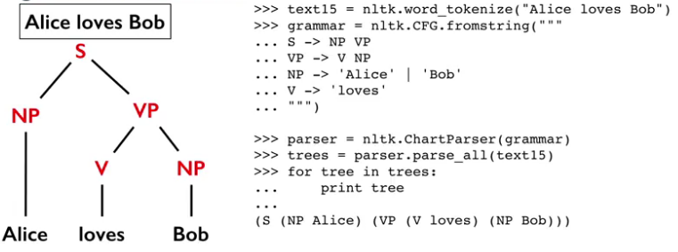

## Basic Natural Language Processing
*Language used for everyday communication by humans.*

- Any computation/manipulation of natural language
- Natural languages evolve
  - new words get added
  - old words lose popularity
  - meaning of words change
  - language rules themselves change

NLP Tasks:
- Counting words, counting frequency of words
- Finding sentence boundaries
- Part of speech tagging
- Parsing the sentence structure
- Identifying semantic role labeling
- Identifying entities in sentences. Named Entity Recognition
- Finding witch pronoun refers to which entity. Co-reference and pronoun resolution

### NLTK
*Natural Language Toolkit*
```Python
import nltk
nltk.download()
from nltk.book import *
```

**Stemming**
Different forms of the same word, e.g. "list listed lists listing listings"
> Finding the root form  

**Lemmatization**
Stemming, but resulting stems are all valid words. There are rules of why something was lemmatized and something was kept as is.

**Tokenization**
Splitting a sentence into words/tokens

**Sentence Splitting**
```Python
sentences = nltk.sent_tokenize(text)
```

**Part-of-speech (POS) tagging**
```Python
import nltk
tokens = nltk.word_tokenize(text)
nltk.pos_tag(tokens)
nltk.help.upenn_tagset('MD')
```

**Parsing Sentence Structure**
*How are they related in the sentence?*
- Noun Phrase (NP)
- Verb Phrase (VP)

> The word phrase itself can be a word followed by a noun phrase.



**NLTK and Parse Tree Collection**
```python
from nltk.corpus import treebank
treebank.parsed_sents('wsj_0001.mrg')[0]
```

**Concepts**
- POS tagging provides insights into the word classes / types in a sentence
- Parsing the grammatical structures helps derive meaning
- Both tasks are difficult, linguistic ambiguity increases the difficulty even more
- Better models could be learned with supervised training
- NLTK provides access to tools and data for training
