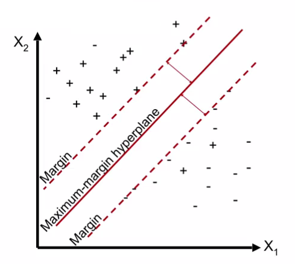
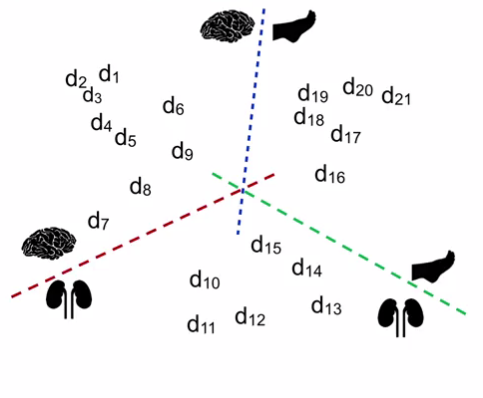

## Classification of Text
*Assign the correct class label to a given input.*

Examples of Text Classification:
- Topic identification
- Spam detection
- Sentiment analysis (positive or negative)
- Spelling correction

**Supervised Learning**
*Learn from past instances.*

Learn a *classification model* on properties (*features*) and their importance (*weights*) from labeled instances

In the training phase, you learn on the training data and then test/evaluate the parameters on the validation data.

Questions to ask:
- Training phase:
  - What are the features? How do to represent them?
  - What us the classification model?
  - What are the model parameters?

- Inference phase:
  - What is the expected performance?
  - What is a good measure?

### Identifying Features from Text
Types of textual features:
- Words
  - Handling commonly-occurring words: Stop Words
  - Normalization: make lower case vs leave as is
  - Stemming / Lemmatization
- Characteristics of words: Capitalization
- Parts of speech of words in a sentence
- Grammatical structure, sentence parsing
- Grouping words of similar meaning/semantics
  - buy, purchase
  - numbers, digits
  - dates
- Features may come form inside words and sequences
  - n-grams (word constructs)
  - character sub-sequences in words (ing, ion)

### Naïve Bayes Classifiers
**Probabilistic Model**
Update the likelihood of the class given new information, *Baye's Rule*
$$
\text{Posterior Pr.} = \frac{\text{Prior Pr.} \times \text{Likelihood}}{\text{Evidence}}
$$

*Naïve assumption:* Given the class label, features are assumed to be independent of each other.

> The model is just individual probabilities that you multiply together.

**Smoothing**
Do not set priors to zero. Instead add Laplace/Additive smoothing, i.e. add a dummy count

**Naive Bayes Variations**
- Multinomial distribution: Each feature value is a count
  - word occurrence
  - TF-IDF
  - weighting
- Multivariate Bernoulli distribution: Each feature is binary
  - word is present or absent
  - does not matter how many times that word was present
  - does not matter whether the word is significant or not

*Bag-of-words model:* All the words that were used in this model, how often each word occurs.

### Support Vector Machines
Whenever you use a decision boundary, the main purpose is when you get a new point that is unlabeled, depending on the decision boundary you have learned, you can label it as one of the classes.

*Data overfitting:* Decision boundary learned over training data doesn't generalize to test data.

**Linear Boundaries**
- Easy to find
- Easy to evaluate
- More generalizable (*Occam's razor*)

*Maximum margin:* more resistant to noise or perturbations.



**Support Vector Machines (SVM)**
- Are maximum-margin classifiers
- Are linear classifiers that find a hyperplane to separate **two classes** of data \{-1, +1\} (negative and positive)

**SVM: Multi-class classification**
- One vs Rest/All


- One vs One


**SVM: Parameters**
- Regularization: How much importance should you give individual data points as compared to better generalized model
  - Less regularization, $\uparrow$ c: Fit training data as well as possible, every data point is important
  - More regularization, $\downarrow$ c: More tolerant to errors on individual data points
- Kernel
  - Linar, rbf, polynomial
- MultiClass or not
  - One vs rest
- Class Weight: Different classes can get different weights

> Handles only numeric features, so we must convert categorical features and normalize

### Toolkits for supervised text classification
- Scikit-learn
- NLTK (weka)

**Scikit-learn**
```Python
from sklearn import naive_bayes
clfrNB = naive_bayes.MultinomialNB()
clfrNB.fit(train_data, train_labels)
predicted_labels = clfrNB.predict(test_data)
metrics.f1_score(test_labels, predicted_labels, average='micro')

# SVM Classifier
from sklearn import svm
clfrSVM = svm.SVC(kernel='linear', C=0.1)
clfrSVM.fit(train_data, train_labels)
predicted_labels = clfrSVM.predict(test_data)

# Model selection
from sklearn import model_selection
X_train, X_test, y_train, y_test = model_selection.train_test_split(train_data, train_labels, test_size=0.333, random_state=0)

# cross-validation and folds
predicted_labels = model_selection.cross_val_predict(clfrSVM, train_data, train_labels, cv=5)
```

**NLTK**
```Python
from nltk.classify import NaiveBayesClassifier

classifier = NaiveBayesClassifier.train(train_set)
classifier.classify(unlabeled_instances)
classifier.classify_many(unlabeled_instances)

nltk.classify.util.accuracy(classifier, test_set)

classifier.labels()

classifier.show_most_informative_features()

# SVM
from nltk.classify import SKlearnClassifier
from sklearn.naive_bayes import MultinomialNB
from sklearn.svm import SVC

clfrNB = SKlearnClassifier(MultinomialNB()).train(train_set)

clfrSVM = SKlearnClassifier(SVC(), kernel='linear').train(train_set)
```
