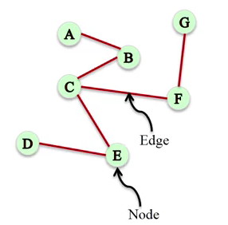
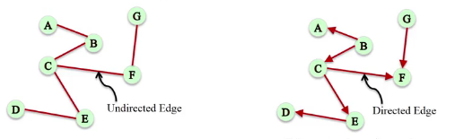
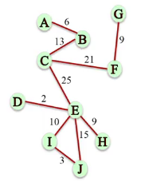
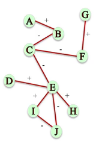
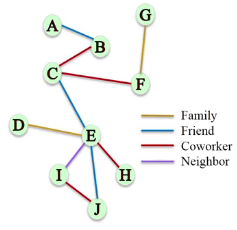
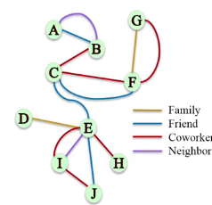
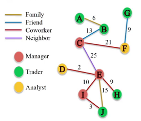
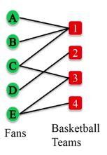
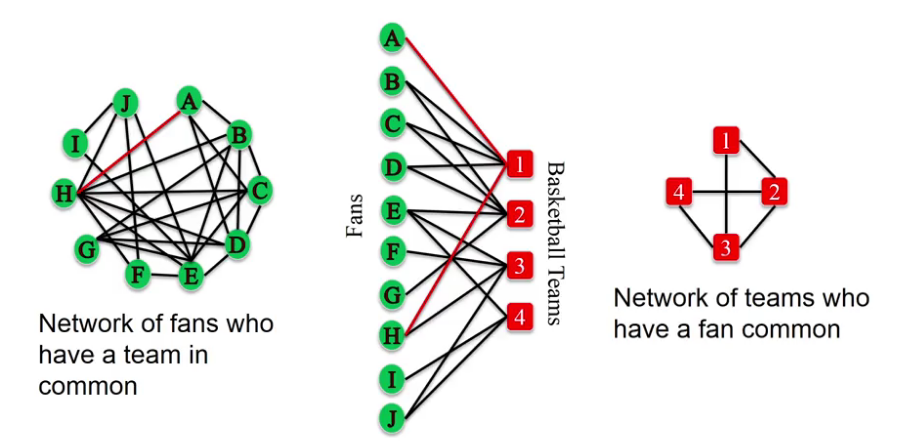
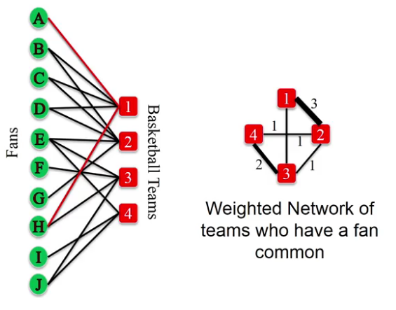

## Why Study Networks and Basics on NetworkX
**Networks**
*A set of objects (nodes) with interconnections (edges)*
- Many complex structures can be modeled by networks

- Studying the structure of a network can allows us to answer questions about complex phenomena

### Network (or Graph):
*A representation of connections among a set of items*

**Network**
- Items/Nodes/Vertices
- Connections/Edges/Link/Ties



```Python
import networkx as nx
# auto adds the connections
# undirected
G = nx.Graph()
G.add_edge('A', 'B')
G.add_edge('B', 'C')
```

 **Edge Direction**
 *Symmetric relationships:* If A is a friend of B, then B is also a friend of A.



```Python
G = nx.DiGraph()
G.add_edge('A', 'B')
G.add_edge('B', 'C')
```

**Weighted Networks**
- Not all relationships are equal
- Some edges carry higher weight than others



```Python
G = nx.Graph()
G.add_edge('A', 'B', weight=6)
G.add_edge('B', 'C', weight=13)
```

**Signed Networks**
- Carry information about friendship and antagonism based on conflict or disagreement
- Positive/Negative edges



```Python
G = nx.Graph()
G.add_edge('A', 'B', sign='+')
G.add_edge('B', 'C', sign='-')
```

**Others: labels**
- Edges can carry many other labels or attributes



```Python
G = nx.Graph()
G.add_edge('A', 'B', relation='friend')
G.add_edge('B', 'C', relation='coworker')
```

**Multigraphs**
- A pair of nodes can have different types of relationships simultaneously

- A network where multiple edges can connect the same nodes (parallel edges)



```Python
G = nx.MultiGraphs()
G.add_edge('A', 'B', relation='friend')
G.add_edge('A', 'B', relation='neighbor')
```

### Node and Edge attributes
**Edge attributes**
```Python
# list of all edges
G.edges()

# list of all edges with attributes
G.edges(data=True)

# list of all edges with attribute 'relation'
G.edges(data='relation')

# dictionary of attributes of edge (A, B)
G.edge['A']['B']
G.edge['A']['B']['weight']

# Directed Graph
G = nx.DiGraph()
G.add_edge('C', 'B', weight=13, relation='friend')
# order matters, KeyError
G.edge['B']['C']['weight']

# MultiGraph
G = nx.MultiGraph()
G.add_edge('A', 'B', weight=6, relation='family')
G.add_edge('A', 'B', weight=18, relation='friend')
# dictionary of dictionary of attributes per (A, B) edge
G.edge['A']['B']
# first edge
G.edge['A']['B'][0]['weight']
```

**Node attributes**


```Python
G = nx.Graph()
G.add_edge('A', 'B', weight=6, relation='family')
G.add_edge('B', 'C', weight=6, relation='friend')

# add node attributes
G.add_node('A', role='trader')

# Access node attributes
# list of all nodes
G.nodes()

# list of all nodes with attributes
G.nodes(data=True)

# particular node
G.node['A']['role']
```

### Bipartite Graphs
This graph has a particular structure that all the edges go from one set of nodes to another set of nodes.



> A graph whose nodes can be split into two sets L and R, and every edge connects an node in L with a node in R

```Python
from networkx.algorithms import bypartite

B = nx.Graph()

# label one set of nodes 0
B.add_nodes_from(['A', 'B', 'C', 'D', 'E'], bipartite=0)
# label other set of nodes 1
B.add_nodes_from([1, 2, 3, 4], bipartite=1)

B.add_edges_from([('A', 1), ('B', 1), ('C', 1), ('C', 3), ('D', 2), ('E', 3), ('E', 4)])
```

> Bipartite graph cannot contain a cycle of an odd number of nodes, like a triangle

```Python
# check if B is bipartite
bipartite.is_biparitate(B)

# check a set of nodes
X = set([1, 2, 3, 4])
Y = set([1, 2, 3, 4, 'A'])
bipartite.is_biparitate_node_set(B, X) # True
bipartite.is_biparitate_node_set(B, Y) # False

# get each set of nodes of a bipartite
bipartite.sets(B)
```

### Projected Graphs
**L-bipartite graphs projection of the bipartite graph**
Network of nodes in group L, where each pair of nodes is connected if they have a common neighbor in R in the bipartite graph.



Example:
Network of fans who have a team in common

```Python
import networkx as nx
from networkx.algorithms import bipartite

B = nx.Graph()
B.add_edges_from([('A', 'G'),('A','I'), ('B','H'), ('C', 'G'), ('C', 'I'),('D', 'H'), ('E', 'I'), ('F', 'G'), ('F', 'J')])
X1 = set(['A', 'B', 'C', 'D', 'E', 'F'])
P = bipartite.projected_graph(B, X)

Y = set([1, 2, 3, 4])
P = bipartite.projected_graph(B, P)
```

**L-bipartite weighted graph projection**
add weights proportional to the number of common neighbors between the nods.



```Python
Y = set([1, 2, 3, 4])
P = bipartite.weighted_projected_graph(B, Y)
```
