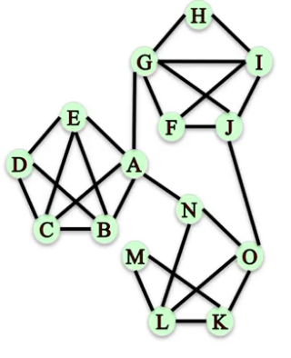

## Network Connectivity
**Triadic Closure**
Tendency for people who share lots of connections, to form a connection themselves to become connected.
  - What edges are likely to arrive?

**Clustering coefficient**
Measures the degree to which nodes in a network tend to cluster or form triangles.
- Local, node to node basis
  - Fraction of pairs of the node's friends that are friends with each other
- Global, for the hole network
  - Average
  - Transitivity, ratio of number of triangles and number of *open triads*. This puts larger weight on high degree nodes

### Local Clustering Coefficient
- Of a node:
  Fraction of pairs of the node's friends that are friends with each other
  $$  
  \text{# of Cs friends} = d_c = 4 \text{  degree/connections} \\
  \text{# of pairs of Cs friends who are friends} = 2 \\  
  \text{# of pairs of Cs friends} = \frac{d_c(d_c-1)}{2} = \frac{12}{2} = 6 \\
  \text{Local clustering coefficient of C} = \frac{\text{# of pairs of Cs friends who are friends}}{\text{# of pairs of Cs friends}} = \frac{2}{6}
  $$


The Local Clustering Coefficient of node C is two over six or one-third. That means that one-third of all the possible pairs of friends of C who could be friends, are actually friends.

> Assume that the local clustering coefficient of a node of degree less than 2 to be 0, like J

```Python
G = nx.Graph()
G.add_edges_from([
  ('A', 'K'), ..., ('I', 'J')
])
# Local Clustering Coefficient
nx.clustering(G, 'F')
```

### Global Clustering Coefficient
Measuring clustering on the whole network
- **Average Clustering Coefficient**, over all node s in the graph: `nx.average_clustering(G)`
- **Transitivity**: Ratio of number of triangles and number of *open triads* in a network: `nx.transitivity(G)`
  $$
  \frac{\text{3 Number of closed triads}}{\text{Number of open triads}}
  $$

*Open triads:* Three nodes that are connected by only two edges. A triangle actually contains three different open triads.


Average Clustering Coefficient vs. Transitivity:
- Both measure the tendency for the edges to form triangles
- Transitivity weights the nodes with a larger number of connections/degree higher


- Al the nodes that are on the outside of the wheel have a Local Clustering Coefficient of one. Each node has two connections (1 pair of friends) and that pair of friends is connected. So, most nodes have a high Local Clustering Coefficient.
- The central node, That one has a pretty high degree but it has a very low Clustering Coefficient. It has many connections in many pairs of connections and only a few of those are actually connected to each other.
- The average clustering coefficient is pretty high (0.93) because most nodes have a very high Local Clustering Coefficient, except for one (center).
- However, there's one node with a very high degree compared to the others that has a very small LCC compared to the others, and transitivity penalizes that.


- Each one of these outer nodes here has a LCC of zero because they either have only one friend or they have two friends but those two are not connected.
- The nodes inside have high degree, and then they have high LCC coefficient.

### Distance Measures
*How far nodes are away from each other?*
**Path:** A sequence of nodes connected by an edge
**Path length:** Number of steps it contains from beginning to end

**Distance between two nodes:**
The length of the shortest path between them
```Python
nx.shortest_path(G, 'A', 'H')
nx.shortest_path_length(G, 'A', 'H')
```

**Distance to all other nodes**
*Breadth-first search:*
- computes distance by *discovering* nodes in layer.


*Eccentricity*:
- The largest distance between node $n$ and all other nodes
- Maximum distance from node $n$ to every other node

```Python
T = nx.bfs_tree(G, 'A')
T.edges()
nx.shortest_path_length(G, 'A')
nx.eccentricity(G)
```

#### Characterizing distances in a network
*Average distance*
- between every pair of nodes

*Diameter:*
- Maximum distance between any pair of nodes
- The longest distance between any two nodes

*Radius:*
- Minimum eccentricity of a network

```Python
nx.average_shortest_path_length(G)
nx.diameter(G)
nx.radius(G)
```

#### Identifying central and peripheral nodes
*Periphery:*
- Set of nodes with eccentricity = diameter
- Which nodes are far away from all the other nodes.
- Set of nodes that have an eccentricity equals to the diameter

*Center*
- Set of nodes with eccentricity = radius
- Which nodes are close to all the other nodes
- Set of nodes that have eccentricity equal to the radius

```Python
nx.periphery(G)
nx.center(G)
```

### Connected Components
#### Undirected graphs
- The edges don't have a direction
- Connected if for every pair nodes, there is a path between them



```Python
nx.is_connected(G)
```

**Connected component**
A subset of nodes where each node is connected within and no nodes are connected across.
- Every node in the subset has a path to very other node
- No other node has a path to any node in the subset


```Python
nx.connected_components(G)
nx.number_connected_components(G)
nx.node_connected_component(G, 'M')
```

#### Directed Graphs
- The edges have direction (source and a destination)
- Strongly connected if, for every pair nodes (u, v), there is a directed path from u to v and a directed path from v to u.


```Python
nx.is_strongly_connected(G)
```

- Weakly connected if replacing all directed edges with undirected edges produces a connected undirected graph


```Python
nx.is_weakly_connected(G)
```

**Connectivity in Directed Graphs**
- Strongly connected component.
  A subset of nodes such as:
  - Every node in the subset has a directed path to every other node
  - No other node has a directed path to and from every node in the subset
- Weakly connected component
  The connected components of the graph after replacing all directed edges with undirected edges

```Python
nx.strongly_connected_components(G)
nx.weakly_connected_components(G) # sorted()
```

Example:

The network is not strongly connected since  some pair of nodes do not have a path connecting them, e.g. node C to D.

Is weakly connected because replacing all directed edges with undirected edges produces a connected undirected graph


### Network Robustness
Network robustness: ability of a network to maintain its general structure/functions when it faces failures or attacks

Type of attacks: removal of nodes or edges

Structural properties: connectivity

Node connectivity:
Minimum number of nodes needed to disconnect a graph of pair of nodes

Edge connectivity:
Minimum number of edges needed to disconnect a graph or pair of nodes

```Python
nx.node_connectivity(G, 'G', 'L')
nx.minimum_node_cut(G, 'G', 'L')
nx.edge_connectivity(G, 'G', 'L')
nx.minimum_edge_cut(G, 'G', 'L')
```

> Graphs with large node and edge connectivity are more robust to the loss of nodes and edges

**Disconnecting a Graph**
What is the smallest number of **nodes** that can be removed from this graph in order to disconnect it?
```Python
nx.node_connectivity(G)
nx.minimum_node_cut(G)
```

What is the smallest number of **edges** that can be removed from this graph in order to disconnect it?
```Python
nx.edge_connectivity(G)
nx.minimum_edge_cut(G)
```

> Robust networks have large minimum node and edge cuts

**Simple Paths**
$G \rightarrow L$, what options does $G$ have to deliver the message?
```Python
sorted(nx.all_simple_paths(G, 'G', 'L'))
```

To block $G \rightarrow L$ by **removing nodes**, how many we need to remove?
```Python
# how many?
nx.node_connectivity(G, 'G', 'L')
# which nodes?
nx.minimum_node_cut(G, 'G', 'L')
```

To block $G \rightarrow L$ by **removing edges**, how many we need to remove?


```Python
# how many?
nx.edge_connectivity(G, 'G', 'L')
# which nodes?
nx.minimum_edge_cut(G, 'G', 'L')
```
