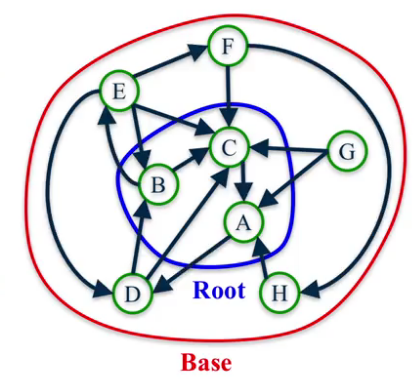

## Influence measures and network centralization
**Node Centrality/Importance**
- Influential nodes in a social network
- Hubs in a transportation network
- Nodes that disseminate information to many nodes or prevent epidemics
- Nodes that prevent the network from breaking up

**Centrality Measures**
- Degree
- Closeness
- Betweenness
- Load
- Page Rank
- Katz
- Percolation

### Degree Centrality
- Important nodes have many connections
- Number of neighbors
- For directed networks use in/or-degree

$$
\text{C}_\text{deg}(v) = \frac{d_v}{\vert N \vert -1}
$$

Where $d_v$ is the degree of node $v$ and $N$ is the set of nodes in the network.

> Centrality of one if it's connected to every single node in the network and a centrality of zero if it's not connected at all

```Python
# load
G = nx.karate_club_graph()
G = nx.convert_node_labels_to_integers(G, first_label=1)

# dict of centralities
degCent = nx.degree_centrality(G)
indegCent = nx.in_degree_centrality(G)
outdegCent = nx.out_degree_centrality(G)
```

### Closeness Centrality
- Important nodes are close to other nodes

$$
C_\text{close}(v) = \frac{\vert N \vert - 1}{\sum_{u \in N_v} d(v, u)}
$$

Ratio of the number of nodes in the network minus one divided by the sum over all the other nodes in the network, and the distance between node v and those nodes.

```Python
closeCent = nx.closeness_centrality(G)

# same as
len(G.nodes() - 1) / sum(nx.shortest_path_length(G, 32).values())
```

**Disconnected Nodes**
*How to measure the closeness centrality of a node when it cannot reach all other nodes?*

- Option 1: Consider only nodes that L can reach
$$
C_\text{close}(L) = \frac{\vert R(L) \vert}{\sum_{u \in R(L)} d(L, u)}
$$
> Problem: centrality of 1 is too high for a node that can only reach one other node

- Option 2: Consider only nodes that L can reach and normalize
$$
C_\text{close}(L) = \frac{\vert R(L)\vert}{\vert N-1\vert} \frac{\vert R(L) \vert}{\sum_{u \in R(L)} d(L, u)}
$$

```Python
coloseCent = nx.closeness_centrality(G, normalized=True)
```

Example:


$A$ has the highest closeness centrality (normalized) because it can reach all other nodes in the network; $B$ in 1 step, $C$ in 2 steps and $D$ in 3 steps hence:
$$
A_\text{CCnorm} = \frac{3}{3} \frac{3}{6} = \frac{1}{2}
$$

> Closeness centrality of nodes that cannot reach any other nodes is always zero

### Betweenness Centrality
- Important nodes connect other nodes
- Node v has high betweenness centrality if it shows up in many of the shortest paths of nodes s and t.
$$
C_\text{btw}(v) = \sum_{s, t \in N} \frac{\sigma_{s, t}(v)}{\sigma_{s, t}}
$$

Where $\sigma_{s, t}$ is the number of shortest paths between nodes s, t and $\sigma_{s, t}(v)$ is the number of shortest paths between s and t that contain node v


Endpoints: can either be included or excluded

Example:


> Distance between two nodes is the length of the shortest path between them

**Disconnected Nodes**

Node $D$ cannot be reached by any other node, hence $\sigma_{A, D} = 0$ making the definition undefined (no shortest path). Only consider nodes s, t such that there is at least one path between them

**Normalization**
Betwenness centrality values will be larger in graphs with many nodes. Normalize by the number of pairs of nodes in the graph excluding v.
- For undirected graphs
$$
\frac{1}{2} (\vert N \vert - 1)(\vert N \vert - 2)
$$
- For directed graphs
$$
(\vert N \vert - 1)(\vert N \vert - 2)
$$

```Python
btwnCent = nx.betweenness_centrality(G, normalized=True, endpoints=False)

# find the 5 largest
import operator
sorted(btwnCent.items(), key=operator.itemgetter(1), reverse=True)[:5]
```

**Complexity**
Depending on the algorithm, can take up to $O(\vert N \vert^3)$ time. Use k nodes for computation

```Python
btwnCent_approx = nx.betweenness_centrality(G, normalized=True, endpoints=False, k=10)
```

**Subsets**
```Python
btwnCent_subset = nx.betweenness_centrality_subset(G, [], [], normalized=True)
```
Where s: source nodes, t: target nodes

**Edges**
We can use betweenness centrality to find important edges instead of nodes

$$
C_\text{btw}(e) = \sum_{s, t \in N} \frac{\sigma_{s, t}(v)}{\sigma_{s, t}}
$$
$\sigma_{s, t}$ = the number of shortest paths between nodes s and t.
$\sigma_{s, t}(e)$ = the number of shortest paths between nodes s and t that pass through edge e.

```Python
btwnCent_edge = nx.edge_betweenness_centrality(G, normalized=True)

# find top 5 edges
sorted(btwnCent_edge.items(), key=operator.itemgetter(1), reverse=True)[:5]

# subset
btwnCent_edge_subset = nx.edge_betweenness_centrality_subset(G, [], [], normalized=True)
```

#### Betweenness Centrality Summary
Betweenness centrality assumption: important nodes connect other nodes

- Normalization: Divide by number of apirs of nodes
- Approximation: Take a suybset of nodes
- Subsets: of source and target to compute
- Edges: we can apply the same framework to find important edges instead of nodes

### PageRank
- Importance of webpages from the hyperlink network structure
- Important nodes are those with many in-links from important pages
- Can be used for any type of network, but mainly for directed networks

n = number of nodes in the network
k = number of steps

1. Assign all nodes a PageRank of 1/n
1. Perform the *basic PageRank update rule* k times:
    - Each node gives an equal share of its current PageRank to all the nodes it links to
1. The new PageRank of each node is the sum of all the PageRank it received from other nodes


> We use old values and update all at the end

These PageRank values will actually converge and that's the value that we think of as the PageRank of the nodes.

In directed networks, nodes with higher in-degree always have the lowest PageRank and nodes with fewer in-degrees may have a high PageRank when they are connected to a more import node.

### Scaled Page Rank
The PageRank of a node at step $k$ is the probability that a *random walker* lands on the node after taking $k$ steps.

*Random walk of $k$ steps:* Start on a random node, then choose an outgoing edge at random and follow it to the next node and repeat $k$ times.

**Damping parameter**
Random walk of $k$ steps with damping parameter $\alpha$: Start on a random node then:
- With probability $\alpha$: choose an outgoing edge at random and follow it at the next node (probability to follow the edges).
- With probability $1 - \alpha$: choose a node at random and go to it (unstuck)

> Now PageRank converges to an unique value, which depends on $\alpha$

```Python
pagerank(G, alpha=0.8)
```

### Hubs and Authorities
Given a query to a search engine:
- Root: set of highly relevant web pages, potential *authorities*
- Find all pages that link/point to a page in a root, potential *hubs*
- Base: root nodes and any node that links to anode in root.



> Consider all edges connecting nodes in the base set

**HITS Algorithm**
Computing $k$ iterations of the HITS algorithm to assign an *authority score* and *hub score* to each node
1. Assign each node an authority and hub score of 1
1. Apply the **Authority update rule**, each node's authority score is the sum of hub scores of each node that **points to it** (in degree)
1. Apply the **Hub update rule**, each node's hub score is the sum of authority scores of each node that **it points to** (out degree)
1. Normalize authority and hub scores
$$
\text{auth}(j) = \frac{\text{auth}(j)}{\sum_{i \in N}\text{auth}(i)}
$$


For most networks, as $k$ gets larger, authority and hub scores converge to a unique value

```Python
hits(G)
```

Nodes that have incoming edges from good hubs are thought to be good authorities, and then nodes that have outgoing edges to good authorities are thought to be good hubs.

### Centrality Examples
- Closeness: nodes who are central are a short distance away from all the other nodes in the network

- Betweenness: central nodes are those that show up in the shortest paths between different pairs of nodes in the network.

- PageRank: nodes who are central are the ones that, if you were to take a random walk on this network, then you would pass by them a lot or you would end up landing on them a lot.

- Auths & Hubs: HITS algorithm


> The centrality measure depends on the context of the network

### Summary
- Degree (mode):
  - number of edges connected to a node. Number of links connected to a node
  - exposure to the network, popular on the network
  $$
  C_{D_i} = \frac{\sum^N_{j=1}a_{ij}}{N - 1}
  $$
- Betweenness (mean)
  - extent to which a particular node lies on the shortest path between other nodes
  - control flow, informal power
  $$
  \text{denominator} = \frac{(n-1)(n-2)}{2}
  $$
- Closeness (mean/avg):
  - the average of the shortest distance to all other nodes in the graph
  - rapid diffusion
- Eigenvector (PageRank):
  - a measure of the extent to which a node is connected to influential other nodes
  - connecto to influetial nodes of high degree, *not what you know but who you know*
