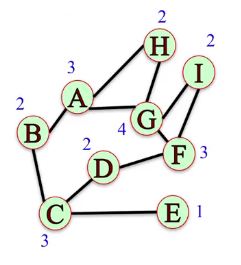
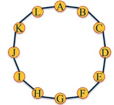
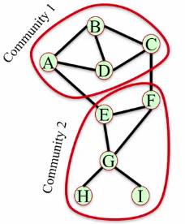

## Preferential Attachment Model
**Degree Distributions**
- The degree of a node in  an undirected graph is the number of neighbors it has
- The degree distributions $P(k)$ of a graph is the probability distribution of the degrees over the entire network


$$
P(1) = \frac{1}{9}, P(2) = \frac{4}{9}, P(3) = \frac{3}{9}, P(4) = \frac{1}{9}
$$

```Python
degrees = G.degree()
degree_values = sorted(set(degrees.values()))
histogram = [list(degrees.values()).count(i) / float(nx.number_of_nodes(G)) for i in degree_values]
```

**In-Degree Distributions**
- The in-degree of a node in a directed graph is the number of in-link it has.
- The in-degree distribution $P_{in}(k)$

```Python
in_degrees = G.in_degree()
```

**Degree Distributions in Real Networks**
- Degree distribution looks like a straight line when on a log-log scale.
- *Power law distribution*, have most of the nodes with very small degree and few nodes with large degree
$$
P(k) = Ck^{-\alpha}
$$

### Preferential Attachment Model
*Rich-Get-Richer model*

- Start with two nodes connected by and edge
- At each time step
  - Add a new node with an edge connecting it to an existing node
  - Choose the node to connect to at random with probability proportional to each node's degree.
  - The probability of connecting to a node $u$ is $k_u$ divided by the sum of all the degrees:
  $$
  P(k_u) = \frac{k_u}{\sum_j k_j}
  $$

The preferential attachment model produces networks with degree distributions similar to real networks and average shortest path property, but fails in high cluster coefficient.

> As the number of nodes increases, the degree distribution of the network approaches the power law: $P(k) = C k^{-3}$

```Python
# returns a network with n nodes, where new nodes attaches to m exissting nodes
# barabasi_albert_graph(n, m)
G = nx.barabasi_albert_graph(10 ** 6, 1)
degrees = G.degree()
degree_values = sorted(set(degrees.values()))
```

**Summary**
- The degree distribution of a graph is the probability distribution of the degrees over the entire network
- In many real networks, this degree distribution tends to the power law (straight line on a log-log scale); $P(k) = Ck^{-a}$
- The Preferential Attachment Model that produces these networks with power law degree distribution, where some nodes have a very high degrees (act as hubs)

## Small World Networks (Milgram)
- Suggests that the world is small (we're all connected by very short paths between each other)
- Social networks tend to have **high clustering coefficient** and **small average paths length**
  - *Clustering Coefficient:* Fraction of pair of the node's friends that are friends with each other

```Python
G = nx.barabasi_albert_graph(10 ** 3, 4)
nx.average_clustering(G)
nx.average_shortest_path_length(G)
```

### Small World model
Real networks exhibit high clustering coefficient and small average shortest paths.

- Start with a ring of $n$ nodes, where each node is connected to its $k$ nearest neighbors
- Fix a probability $p \in [0, 1]$ to re-wire
- Consider each edge $(u, v)$, with probability $p$ and select a node $w$ at random and rewire the edge so it becomes $(u, w)$



- Regular Lattice ($p=0$), no edge is rewired $\rightarrow$ distances are high and clustering is high
- Random Network $(p=1)$, all edges are rewired $\rightarrow$ distances are small and clustering is also small
- Small World Network $(0 \lt p \lt 1)$, some edges are rewired and the network conserves some local structure but has some randomness $\rightarrow$ has short distances and high clustering

As $p$ increases from 0 to 0.1:
- Average shortest path decreases rapidly
- Average clustering coefficient decreases slowly

```Python
# returns a small world network with n nodes, each node is connected to its k nearest neighbors and rewiring probability p
G = watts_strogatz_graph(n, k, p)
```

> The degree distribution of a small world network is not a power law because the degree of most nodes lie in the middle

Small world networks can get disconnected, use:
```Python
# up to t times, until returns a connected small world network
connected_watts_strogatz_graph(n, k, p, t)

# small world model but rather than rewiring edges it adds, so keep the old and add the new
newman_watts_strogatz_graph(n, k, p)
```

**Summary**
- Real social networks, small shortest paths and high clustering coefficient
- The preferential attachment model, small shortest path but also small clustering coefficient
- The small world model
  - for small $p$ have small average shortest path and high clustering coefficient
  - The degree distribution is not a power law

## Link Prediction (Recommender)
*Given a network, can we predict which edges are going to be formed in the future?*
### Common neighbors
#### Common neighbors
$$
\vert N(X) \cap N(Y) \vert
$$
```Python
# number of common neighbors that are not connected between them
common_neigh = (e[0], e[1], len(list(nx.common_neighbors(G, e[0], e[1])))) for e in nx.non_edges(G)]

sorted(common_neigh, key=operator.itemgetter(2), reverse=True)
```
#### Jaccard Coefficient
Number of common neighbors normalized by the total of neighbors
$$
\text{jacc_coeff}(X, Y) = \frac{\vert N(X) \cap N(Y) \vert}{\vert N(X) \cup N(Y) \vert}
$$
```Python
# returns non_edges
L = list(nx.jaccard_coefficient(G))
L.sort(key=operator.itemgetter(2), reverse=True)  
```
#### Resource Allocation Index
Fraction of a *resource* that a node can send to another through their common neighbors
$$
\text{res_alloc}(X, Y) = \sum_{u \in N(X) \cap N(Y)} \frac{1}{\vert N(u) \vert}
$$
Penalizes pairs of nodes that have common neighbors that themselves have lots of other neighbors.
```Python
# returns non_edges
L = list(nx.resource_allocation_index(G))
```
#### Adamic-Adar Index
Similar to resource allocation index, but with log in the denominator
$$
\text{res_alloc}(X, Y) = \sum_{u \in N(X) \cap N(Y)} \frac{1}{\log{\vert N(u) \vert}}
$$
```Python
# returns non_edges
L = list(nx.adamic_adar_index(G))
```
#### Preferential Attachment Score
Nodes with high degree get more neighbors. Uses the product of the node's degree
$$
\text{pref_attach}(X, Y) = \vert N(X) \vert \vert N(Y) \vert
$$
```Python
# returns non_edges
L = list(nx.preferential_attachment(G))
```
### Community Structure
- Assume the nodes in this network to belong to different communities (set of nodes)
- Pairs of nodes who belong to the same community and have many common neighbors in their community are likely to form and edge



#### Community Common Neighbors
Number of common neighbors with bonus for neighbors in same community (Soundarajan--Hopcroft score)
$$
\text{cn_soundarajan_hopcroft}(X, Y) = \vert N(X) \cap N(Y) \vert + \sum_{u \in N(X) \cap N(Y)}f(u)
$$
where $f(u) = 1$ when $u$ in same community as $X$ and $Y$, $0$ otherwise
```Python
# first add attribute
G.node['A']['community'] = 0
...
G.node['I']['community'] = 0

# community common neighbors
L = list(nx.cn_soundarajan_hopcroft(G))
```

#### Community Resource Allocation
Similar to resource allocation index, but only considering nodes in the same community (on-off community)
$$
\text{ra_soundarajan_hopcroft}(X, Y) = \sum_{u \in N(X) \cap N(Y)} \frac{f(u)}{\vert N(u) \vert}
$$
```Python
L = list(ra_soundarajan_hopcroft(G))
```

**Summary**
- Link Prediction problem: Given a network, predict which edges will be formed in the future
- 5 basic measures (neighbors)
  - Number of Common Neighbors
  - Jaccard Coefficient
    - takes the number of common neighbors, but normalizes by the total number of neighbors that the two nodes have
  - Resource Allocation Index
    - pass information to another node through their common neighbors, how much of that would actually get there
  - Adamic-Adar Index
    - similar to the Resource Allocation index, but it takes the log in the denominator
  - Preferential Attachment Score
    - nodes with high degree tend to accumulate more edges
- 2 community information
  - Common Neighbor Soundarajan-Hopcroft Score
    - takes the common neighbors and it gives a bonus for the common neighbors that are in the same community as the two nodes
  - Community Resource Allocation
    - only considers common neighbors that are in the same community as the two nodes

> To predict, you would use these measures as features to train a classifier.
