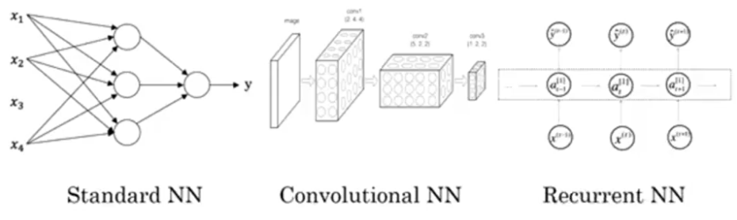

## Introduction to deep learning
### Welcome to the Deep Learning Specialization
#### Welcome
I think all of us have an opportunity to build an amazing world, amazing society, that is AI powers, and I hope that you will play a big role in the creation of this AI power society.

### Introduction to Deep Learning
#### What is a neural network
*Rectified Linear Unit (RELU):* function which goes to zero sometimes and then it'll takes of as a straight line.

*Density connected:* Every input feature is connected to every one of these circles in the middle layer.

> Given enough training examples with both x and y, neural networks are remarkably good at figuring out functions that accurately map from x to y.

#### Supervised Learning with Neural Networks
In supervised learning, you have some input x, and you want to learn a function mapping to some output y.

| Input (x)     | Output (y) | Application |
|---------------|------------|-------------|
| Home features | Price      | Real State  |

Neural Network Examples:
- Image: Convolution Neural Networks (CNN)
- Audio/sequence data: recurrent neural network (RNN)
- Autonomous driving: Custom/Hybrid

Types of data:
- Structured: Each of the features has a very well defined meaning
- Unstructured: Audio, Images (pixel), text

#### Why is Deep Learning taking off?
- Data
- Computation
- Algorithms

#### About this Course
- Week 1: Introduction
- Week 2: Basics of Neural Network programming
- Week 3: One hidden layer Neural Network
- Week 4: Deep Neural Network

### Heroes of Deep Learning
#### Geoffrey Hinton interview
*He was one of the first researchers who demonstrated the use of generalized backpropagation algorithm for training multi-layer neural nets.*

So this is advice I got from my advisor, which is very unlike what most people say. Most people say you should spend several years reading the literature and then you should start working on your own ideas. And that may be true for some researchers, but for creative researchers I think what you want to do is read a little bit of the literature. And notice something that you think everybody is doing wrong, I'm contrary in that sense. You look at it and it just doesn't feel right. And then figure out how to do it right.

Instead of programming them, we now show them, and they figure it out. That's a completely different way of using computers, and computer science departments are built around the idea of programming computers.

And so I think thoughts are just these great big vectors, and that big vectors have causal powers. They cause other big vectors, and that's utterly unlike the standard AI view that thoughts are symbolic expressions.

> But there is one thing, which is, if you think it's a really good idea, and other people tell you it's complete nonsense, then you know you're really on to something.
