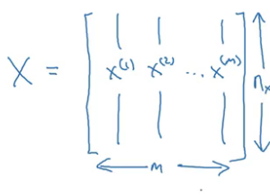
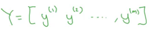
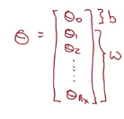
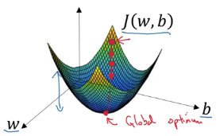
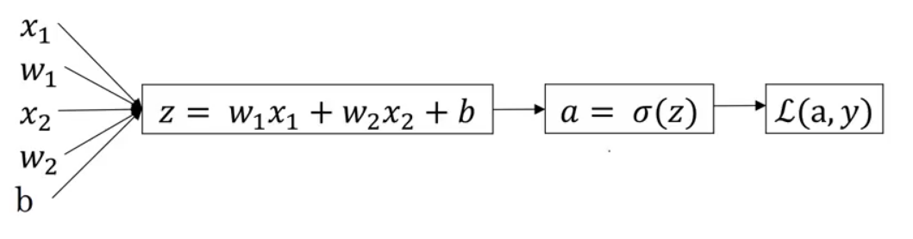
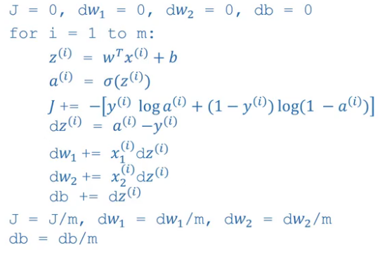
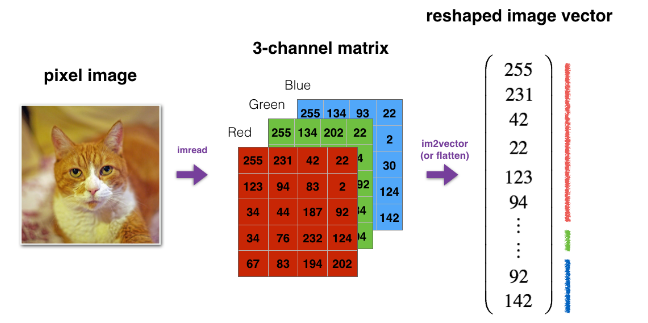

## Neural Networks Basics
### Logistic Regression as a Neural Network
#### Binary Classification
When the output labels Y in a supervised learning problem are all either zero or one.

$n$ or $n_x$: Represent the dimension of the input features $x$.

Single training example is represented by a pair $(x, y)$
$$
x \in \mathbb{R}^{n_x} \\ y \in \{0, 1\}
$$

$m$ or $M_{\text{train}}$: Training examples:
$$
\{(x^{(i)}, y^{(i)}), ..., (x^{(m)}, y^{(m)}) \}
$$

All training examples:
$$
X \ \in \mathbb{R}^{n_x \times m}
$$



$Y$: Output labels $\in \mathbb{R}^{1 \times m}$



#### Logistic Regression
Logistic regression is an algorithm for binary classification.

$\sigma$: Sigmoid function  
$w$: $n_x$ Dimensional vector
$b$: Real number

$$
\hat{y} = P(y = 1 \vert x) = \sigma(z) \\
\sigma(z) = \frac{1}{1+e^{-z}} \\
z = w^Tx + b; w \in \mathbb{R}^{n_x}, b \in \mathbb{R}
$$

##### We are not going to use
$$
X_0 = 1; X \in \mathbb{R}^{n_x+1}\\
\hat{y} = \sigma (\theta^Tx)
$$  



#### Logistic Regression Cost Function
The optimization problem is convex.

$(i)$: training example

Given $\{(x^{(i)}, y^{(i)}), ..., (x^{(m)}, y^{(m)}) \}$, want $\hat{y}^{(i)} \approx y^{(i)}$

Loss (error) function:  
Measures how good our output $\hat{y}$ is when the true label is $y$.

$$
L(\hat{y}, y) = - \left( y \ \log(\hat{y}) + (1 - y) \ \log(1 - \hat{y}) \right)
$$

> The loss function computes the error for a single training example.

Cost function:
Try to find parameters $w$ and $b$ that minimize the overall cost $J(w, b)$

$$
J(w, b) = \frac{1}{m} \sum_{i=1}^m L(\hat{y}^{(i)}, y^{(i)}) = - \frac{1}{m} \sum_{i=1}^m y^{(i)} \ \log(\hat{y}^{(i)}) + (1 - y^{(i)}) \ \log(1 - \hat{y}^{(i)})
$$

>  The cost function is the average of the loss functions of the entire training set.

#### Gradient Descent
Because the cost function $J(w, b)$ is convex, no matter where you initialize, you should get to the global optimum.

Gradient descent starts at some initial point and then takes a step in the steepest downhill direction to minimize J(w, b)$.  



$$
w := w - \alpha  \frac{\partial J(w, b)}{\partial w} \\
b := b - \alpha  \frac{\partial J(w, b)}{\partial b}
$$
$\alpha$: Learning rate

#### Derivatives
- The derivative of a function just means the slope of a function
- The slope of a function can be different at different points.

$$
\text{slope} = \frac{\text{height}}{\text{width}}
$$

#### Computation graph % derivatives
One step of *backward* propagation on a computation graph yields derivative of final output variable.



#### Logistic Regression Gradient Descent
In logistic regression, what we want to do is to modify the parameters, $w$ and $b$, in order to reduce $L$.

#### Gradient Descent on m Examples
$$
z = w^Tx + b \\
\hat{y} = a = P(y = 1 \vert x) = \sigma(z) \\
L(a, y) = - \left( y \ \log(a) + (1 - y) \ \log(1 - a) \right)
$$



> Vectorization allows you to get rid of for loops.

### Python and Vectorization
#### Vectorization Logistic Regression & Gradient Output
```python
Z = np.dot(w.T, x) + b
A = sigmoid(Z)
dZ = A - Y
dw = 1/m X * dZ.T
db = 1/m * np.sum(dZ)
w = w - alpha * dw
b = b - alpha * db
```
> Broadcasting in Python, expand vectors to matrices.

$$
sigmoid(x) = sigmoid\begin{pmatrix}
  x_1  \\
  x_2  \\
  ...  \\
  x_n  \\
\end{pmatrix} = \begin{pmatrix}
    \frac{1}{1+e^{-x_1}}  \\
    \frac{1}{1+e^{-x_2}}  \\
    ...  \\
    \frac{1}{1+e^{-x_n}}  \\
\end{pmatrix}
$$

An image is represented by a 3D array of shape $(length, height, depth = 3)$. However, when you read an image as the input of an algorithm you convert it to a vector of shape $(length*height*3, 1)$. In other words, you "unroll", or reshape, the 3D array into a 1D vector.



#### A note on python/numpy vectors
- Don't use rank 1 arrays $(n, )$.
- Use either column vectors $(m, 1)$ or row vectors $(1, n)$.

#### Explanation of logistic regression cost function (optional)
$$
\log{p(y \vert x)} = \log{\hat{y}^y(1-\hat{y})^{(1-y)}} \\ = y \log{\hat{y}} + (1-y)\log{(1-\hat{y})} = - L(\hat{y}, y)
$$
> Minimizing the loss corresponds with maximizing $\log{p(y \vert x)}$

#### Code
Common steps for pre-processing a new dataset are:
1. Figure out the dimensions and shapes of the problem (m_train, m_test, num_px, ...)
1. Reshape the datasets such that each example is now a vector of size (num_px * num_px * 3, 1) i.e pixels x pixels x (RGB), 1
1. "Standardize" the data, divide by 255 for images or substract the mean and divide by the standard deviation.

#### Heroes of Deep Learning - Pieter Abbeel
> I think a big part of what's important is to make sure you try things yourself. So, not just read things or watch videos but try things out.
