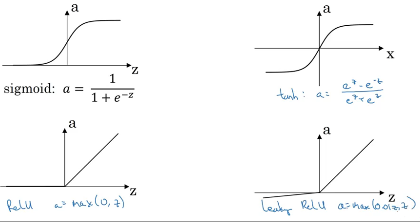

## Shallow neural networks
### Shallow Neural Network
#### Neural Networks
Layers
- Input: $a^{[0]} = X$
- Hidden: you don't see it in the training set
- Output: $a^{[2]} = \hat{y}$

> We don't count the input layer as an official layer.

A two layered neural network. That is a neural network with one hidden layer.

#### Computing a Neural Network's Output
$a^{[l]}_{i}$: $l$ layer, $i$ node in layer  

  

  

$$
\begin{bmatrix}
-w_1^{[1]^T}- \\
-w_2^{[1]^T}- \\
-w_3^{[1]^T}- \\
-w_4^{[1]^T}-
\end{bmatrix}
\begin{bmatrix}
x_1 \\
x_2 \\
x_3
\end{bmatrix}
+
\begin{bmatrix}
b_1^{[1]^T} \\
b_2^{[1]^T} \\
b_3^{[1]^T} \\
b_4^{[1]^T}
\end{bmatrix}
\ =
\begin{bmatrix}
w_1^{[1]^T} x + b_1^{[1]^T} \\
w_2^{[1]^T} x + b_2^{[1]^T} \\
w_3^{[1]^T} x + b_3^{[1]^T} \\
w_4^{[1]^T} x + b_4^{[1]^T}
\end{bmatrix}
\ =
\begin{bmatrix}
z_1^{[1]^T} \\
z_2^{[1]^T} \\
z_3^{[1]^T} \\
z_4^{[1]^T}
\end{bmatrix}
$$
Logistic Regression **hidden** layer:
$$
a^{[0]} = X \\
Z^{[1]}_{(4 \times 1)} = W^{[1]}_{(4 \times 3)} a^{[0]}_{(3 \times 1)} + b^{[1]}_{(4 \times 1)}\\
a^{[1]}_{(4 \times 1)} = \sigma(Z^{[1]}_{(4 \times 1)})
$$
Logistic Regression **output** layer:
$$
Z^{[2]}_{(1 \times 1)} = W^{[2]}_{(1 \times 4)} a^{[1]}_{(4 \times 1)} + b^{[2]}_{(1 \times 1)}\\
a^{[2]}_{(1 \times 1)} = \sigma(Z^{[2]}_{(1 \times 1)}) \\ \hat{y}_{(1 \times 1)} = a^{[2]}_{(1 \times 1)}
$$
Notation:
$a^{[l](i)}$: layer $l$, training example $i$.

#### Vectorizing across multiple examples
Horizontally: 1 to $m$ training example.
Vertically: 1 to $n_x$ hidden unit.  

  

Logistic Regression **hidden** layer:
$$
A^{[0]} = X \\
Z^{[1]} = W^{[1]} A^{[0]} +b^{[1]} \\
A^{[1]}= \sigma(Z^{[1]})
$$
Logistic Regression **output** layer:
$$
Z^{[2]} = W^{[2]} A^{[1]} +b^{[2]} \\
A^{[2]}= \sigma(Z^{[2]}) \\
\hat{Y} = A^{[2]}
$$

> Training examples stacked up horizontally in the matrix $X$, you can derive a vectorized implementation for propagation through your neural network.

#### Activation functions

##### tanh
Has the effect of centering your data so that the mean of the data is close to the zero rather than maybe a 0.5 and this actually makes learning for the next layer a little bit easier.

$$
a = \text{tanh}(z) = \frac{e^z - e^{-z}}{e^z+e^{-z}}
$$  


> Use the sigmoid activation function when you're using binary classification, so the output layer will be between 0 and 1.

if $z$ is either very large/small then the gradient of the derivative or the slope of the function ends up being close to zero and so this can slow down gradient descent.

##### ReLU
$$
a = \max{(0, z)}
$$  


The derivative is 1 so long as $z$ is positive and 0 when negative.

> Leaky RELU: derivative instead of it being zero when negative, it takes a slight slope.

#### Why do you need non-linear activation functions?
Two linear functions is itself a linear function so unless you throw a non-linearity in there then you're not computing more interesting functions even as you go deeper in the network.

> Maybe use a linear activation function in the output layer only.

#### Derivatives of activation functions
**Sigmoid**:
$$
g(z) = \sigma(z) = \frac{1}{1 + e^{-z}} \\
g'(z) = g(z)(1 - g(z))
$$
$$
a = g(z), \ g'(z) = a (1 - a)
$$

**tanh**:
$$
g(z) = \text{tanh}(z) = \frac{e^z - e^{-z}}{e^z+e^{-z}} \\
g'(z) = \frac{\partial}{\partial z} g(z) = 1 - (\text{tanh}(z))^2
$$
$$
a = g(z), \ g'(z) = 1 - a^2
$$

**ReLU**:
$$
g(z) = \max{(0, z)} \\
g'(z) = \begin{cases}
0, \ \text{if} \ z \lt 0 \\
1, \ \text{if} \ z \geq 0
\end{cases}
$$
> Technically not defined when $z = 0$, but in code is close to 0.

**Leaky ReLU**:
$$
g(z) = \max{(0.01, z)} \\
g'(z) = \begin{cases}
0.01, \ \text{if} \ z \lt 0 \\
1, \ \text{if} \ z \geq 0
\end{cases}
$$

> Technically not defined when $z = 0$, but in code is close to 0.

#### Gradient descent for Neural Networks
- Parameters
$$
w^{[1]}_{(n^{[1]} \times n^{[0]})}, b^{[1]}_{(n^{[1]} \times 1)} \\
w^{[2]}_{(n^{[2]} \times n^{[1]})}, b^{[2]}_{(n^{[2]} \times 1)}
$$
- Cost function:
$$
J(w^{[1]}, b^{[1]}, w^{[2]}, b^{[2]}) = \frac{1}{m} \sum^{m}_{i=1} L(\hat{y}, y)
$$
- Gradient Descent (repeat)
  1. Compute the predictions:
  $$
  \hat{Y} = A^{[2]}
  $$
  1. Compute the derivatives respect to the cost function:
  $$
  \partial w^{[1]}, \partial b^{[1]}, \partial w^{[2]}, \partial b^{[2]}
  $$
  1. Update the parameters:
  $$
  w^{[1]}, b^{[1]}, w^{[2]}, b^{[2]}
  $$

*Forward propagation:*
```python
# hidden layer
Z1 = np.dot(W1, X) + b1
A1 = np.tanh(Z1)
# output layer
Z2 = np.dot(W2, A1) + b2
A2 = np.tanh(Z2)
```

*Back propagation:*
```python
# output layer
dZ_2 = A_2 - Y
dW_2 = 1/m dZ_2 * A_1.T
db_2 = 1/m np.sum(dZ_2, axis=1, keepdims=True)
# hidden layer
dZ_1 = W_2.T dZ_2 * g'(Z_1)
dW_1 = 1/m dZ_1 X.T
db_1 = 1/m np.sum(dZ_1, axis=1, keepdims=True)
```

#### Random Initialization
When you change your neural network, it's important to initialize the weights randomly. For logistic regression, it was okay to initialize the weights to zero. But for a neural network of initialize the weights to parameters to all zero and then applied gradient descent, it won't work.

Activations will be the same, because both of these hidden units are computing exactly the same function, *symmetry breaking problem*.

```python
W_1 = np.random.randn((dim1, dim2)) * 0.01
W_2 = np.random.randn((dim1, dim2)) * 0.01
```
0.01 because if w is too large, you're more likely to end up even at the very start of training, with very large values of z (slow).

#### Heroes of Deep Learning - Ian Goodfellow
> For someone who wants to get involved in AI, maybe the hardest problem they face is choosing which path they want to go down.

> One way that you could get a lot of attention is to write good code and put it on GitHub. If you have an interesting project that solves a problem that someone working at the top level wanted to solve.

> It's really important to also work on a project at the same time, to either choose some way of applying machine learning to an area that you are already interested in.

#### Code
Neural networks are able to learn even highly non-linear decision boundaries, unlike logistic regression.

The general methodology to build a Neural Network is to:
1. Define the neural network structure ( # of input units,  # of hidden units, etc).
2. Initialize the model's parameters
3. Loop:
    - Implement forward propagation
    - Compute loss
    - Implement backward propagation to get the gradients
    - Update parameters (gradient descent)

For various hidden layer sizes:
- The larger models (with more hidden units) are able to fit the training set better, until eventually the largest models overfit the data.
- The best hidden layer size seems to be around n_h = 5. Indeed, a value around here seems to  fits the data well without also incurring noticable overfitting.
- You will also learn later about regularization, which lets you use very large models (such as n_h = 50) without much overfitting. 
