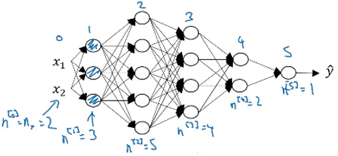
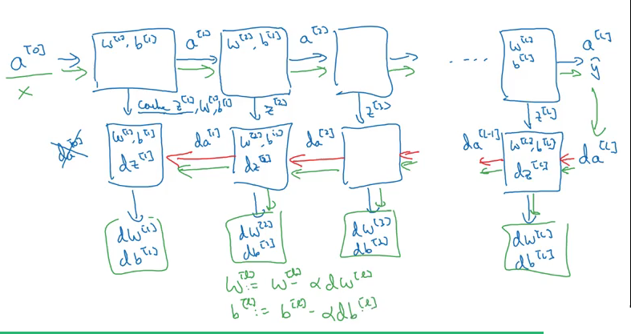

### Deep Neural Network
#### Deep L-layer Neural Network
Shallow versus depth is a matter of degree.

> Technically logistic regression is a one layer neural network.

$l$: layer $l$
$n^{[l]}$: units in layer $l$
> input layer: $n_x = n^{[0]}$
> output layer $n^{[l]}$

$a^{[l]}$: activation of layer $l$
> $X = a^{[0]}$
> $a^{[L]} = \hat{y}$

#### Forward Propagation in a Deep Network
$$
Z^{[l]} = W^{[l]} A^{[l-1]} + b^{[l]} \\
A^{[l]} = g^{[l]}(Z^{[l]})
$$
> Use a for to pass over the different units.

#### Getting your matrix dimensions right

$$
Z^{[l]}_{(n^{[l]} \times m)} = W^{[l]}_{(n^{[l]} \times n^{[l-1]})} A^{[l-1]}_{(n^{[l-1]} \times m)} + b^{[l]}_{(n^{[l]} \times m)} \\
A^{[l]}_{(n^{[l]} \times m)} = g^{[l]}(Z^{[l]})
$$
> in code $b$ is $b^{[l]}_{(n^{[l]} \times 1)}$, and expand through Python broadcasting,

Derivates $\partial Z$, $\partial A$ have the same dimension as $Z$ and $A$.

#### Why deep representations?
The earlier layers detect simple functions. And then composing them together in the later layers so that it can learn more and more complex functions.

Informally, there are functions you can compute with a relatively small number of hidden units in a deep neural network. But if you try to compute the same function with a shallow network, then you might require exponentially more hidden units to compute.

#### Building blocks of deep neural networks

Basic building blocks:
- Forward propagation (and cache)
- Backward propagation

#### Forward and Backward Propagation

Forward propagation for layer $l$:
- Input $A^{[l-1]}$
- Output $A^{[l]}$, cache: $Z^{[l]}$
$$
Z^{[l]} = W^{[l]}A^{[l-1]} +b^{[l]}\tag{4} \\
A^{[l]} = g(Z^{[l]}) = g(W^{[l]}A^{[l-1]} +b^{[l]})
$$

Backward propagation for layer $l$:
- Input $\partial A^{[l]}$
- Output $\partial A^{[l-1]}$, $\partial W^{[l]}$, $\partial b^{[l]}$

#### Parameters vs Hyperparameters

*Parameters*: $W^{[1]}$, $b^{[1]}$, ..., $W^{[3]}$, $b^{[3]}$, ...

*Hyperparameters*:
- Learning rate $\alpha$
- Number of iterations
- Number of layers L
- Number of units $n^{[1]}$, ...
- Choice of activation function

> parameters that determine the final value of the parameters W and B.

Deep Learning is a empirical process. It's very difficult to know in advance exactly what's the best value of the hyper parameters, see if it works and then iterate.

#### What does this have to do with the brain?
Deep Learning:
Very good at learning flexible and complex functions to input-output (X->Y) mappings in supervised learning.

> I tend not to use this analogy anymore.

#### Code
**Notation**:
- Superscript $[l]$ denotes a quantity associated with the $l^{th}$ layer.
    - Example: $a^{[L]}$ is the $L^{th}$ layer activation. $W^{[L]}$ and $b^{[L]}$ are the $L^{th}$ layer parameters.
- Superscript $(i)$ denotes a quantity associated with the $i^{th}$ example.
    - Example: $x^{(i)}$ is the $i^{th}$ training example.
- Lowerscript $i$ denotes the $i^{th}$ entry of a vector.
    - Example: $a^{[l]}_i$ denotes the $i^{th}$ entry of the $l^{th}$ layer's activations).

**General methodology:**
As usual you will follow the Deep Learning methodology to build the model:
1. Initialize parameters / Define hyperparameters
1. Loop for num_iterations:
    a. Forward propagation
    b. Compute cost function
    c. Backward propagation
    d. Update parameters (using parameters, and grads from backprop)
1. Use trained parameters to predict labels
