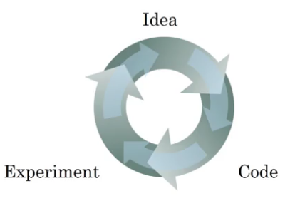
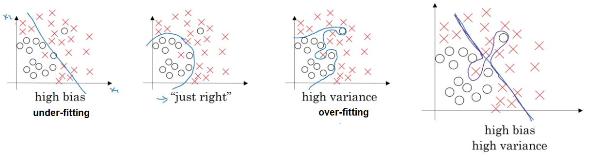
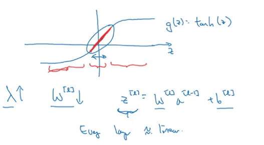
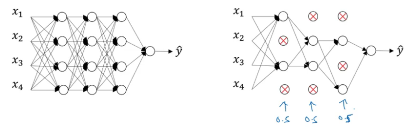
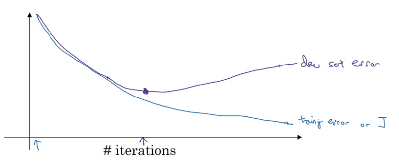
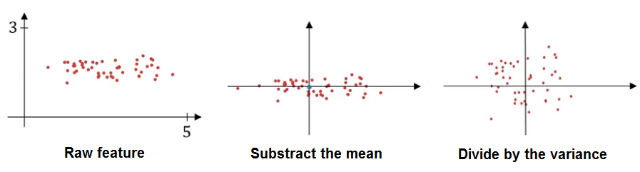
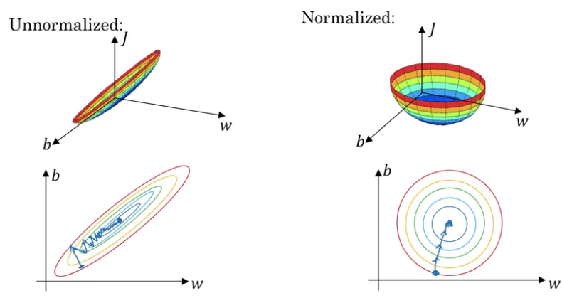

## Practical aspects of Deep Learning
### Setting up your Machine Learning Application
#### Train / Dev / Test sets
It almost impossible to correctly guess the best choice of *hyperparameters* the very first time, is a very iterative process; where you have to go around this cycle many times.  



The best choices may depend:
- On the amount of data you have
- The number of input features
- Whether you're training on GPUs or CPUs
- etc.

> And setting up your data sets well in terms of your train, development and test sets can make you much more efficient.

Separate the data into sets:
- Train
- Dev
- Test
> It will also allow you to more efficiently measure the bias and variance of your algorithm so you can more efficiently select ways to improve your algorithm.

Workflow:
1. Repeat training and validation
- Keep on **training** algorithms on your *training sets*.
- See which of many different models **performs best** using your *dev set* or *hold-out cross validation set*.
2. Evaluate
- Take the best model you have found and **evaluate** it on your *test set* to generalize.

> - With bigger datasets, the ratio will be more like 98% train, 1% dev, 1% test.
> - Make sure that the dev and test sets come from the same distribution.
> - The goal of the test set is to give you a unbiased estimate of the performance of your final network. But if you don't need that unbiased estimate, then it might be okay to not have a test set.

When you have just a train and a dev set but no separate test set. Most people will call this a training set and they will call the dev set the test set. But what they actually end up doing is using the test set as a hold-out cross validation set. Which maybe isn't completely a great use of terminology, because they're then overfitting to the test set.

#### Bias / Variance


Classifier with high bias because it was mostly linear and it has high variance, because it had too much flexibility to fit those two mislabel examples in the middle.

| Train set error |       1%      |      15%      |          15%         |
|:---------------:|:-------------:|:-------------:|:--------------------:|
|  Dev set error  |      11%      |      16%      |          30%         |
|                 | high variance |   high bias   | high bias & variance |
|                 |  over-fitting | under-fitting |                      |

- With training set error you can get a sense of how well you are fitting the training data, and so that tells you if you have a bias problem.
- And then looking at how much higher your error goes, when you go from the training set to the dev set, that gives you sense of your variance.

> Training and dev sets are drawn from the same distribution.

#### Basic Recipe for Machine Learning
High bias (training data performance):
- Bigger network
- Train longer

High variance (dev set performance):
- More data
- Regularization

> Maybe try to find a more appropriate neural network architecture.

### Regularizing your neural network
#### Regularization
- Regularization parameter $\lambda$

For Logistic regression:
$$
J(W, b) = \frac{1}{m} \sum^m_{i=1} L(\hat{y}^{(i)}, y^{(i)}) + \frac{\lambda}{2m} \Vert W \Vert^2_2 \\
L_2 \ \text{regularization}: \Vert W \Vert^2_2 = \sum^{n_X}_{j=1} W^2_j = W^T W \\
L_1 \ \text{regularization}: \frac{\lambda}{2m} \sum^{n_x}_{j=1} \vert W_j \vert = \frac{\lambda}{2m} \Vert W \Vert_1
$$

> - With L1 regularization, $w$ will end up being sparse; the $w$ vector will have a lot of zeros in it.
> - Regularizing $b$ won't make much of a difference, because b is just one parameter over a very large number of parameters.

For Neural Network:
$$
J(w^{[1]}, b^{[1]}, ..., w^{[L]}, b^{[L]}) = \frac{1}{m} \sum^m_{i=1} L(\hat{y}^{(i)}, y^{(i)}) + \frac{\lambda}{2m} \sum^L_{l=1} \Vert W^{[l]} \Vert^2_F \\
\text{Frobenius norm}: \Vert W^{[l]} \Vert^2_F = \sum^{n^{[l-1]}}_{i=1} \sum^{n^{[l]}}_{j=1} (W^{[l]}_{ij})^2
$$

With derivates, *weight decay*:
$$
\frac{\partial J}{\partial W^{[l]}} = \partial W^{[l]} = \text{(same as backprop)} + \frac{\lambda}{m} W^{[l]} \\
W^{[l]} = W^{[l]} (1 - \alpha \frac{\lambda}{m}) - \alpha  \text{(same as backprop)}
$$

#### Why regularization reduces overfitting?
The intuition is that by cranking up lambda you reduce the impact of a lot of the hidden units so you end up with a simpler/smaller network that is less prone to overfitting.



if the regularization becomes very large, the parameters W very small, so Z will be relatively small (takes on a small range of values).

So the activation function if is tanh, will be relatively linear. And so your whole neural network will be computing something not too far from a big linear function which is therefore pretty simple function rather than a very complex highly non-linear function. And so is also much less able to overfit.

> To debug gradient descent, make sure that you're plotting the new definition of $J$ that includes the regularization therm. Otherwise you might not see $J$ decrease monotonically on every single elevation.

#### Dropout Regularization
Drop out is a regularization technique that helps prevent over-fitting.

We're going to do is go through each of the layers of the network and set some probability of eliminating a node in neural network. And so for each training example, you would train it using one of these neural based networks.



Implementing *inverted dropout*:
```Python
# example in layer 3
keep_prob = 0.8 # 80% of keep probability
d3 = np.random.rand(a3.shape[0], a3.shape[1]) < keep_prob # 1 or 0 array
a3 *= d3 # zero out units
a3 /= keep_prob # scale up to meet the expected value of a3
```
If you make multiple passes through the same training set, then on different pauses through the training set, you should randomly zero out different hidden units.

Until you get to the last layer and that you make a prediction $\hat{y}$, **you don't really want your output to be random**. If you are implementing dropout at test time, that just add noise to your predictions.

#### Understanding Dropout
- Drop-out randomly knocks out units in your network. So it's as if on every iteration you're working with a smaller neural network (regularizing effect).
- Can't rely on any feature, so have to spread out weights and thus shrinks the weights and does some of those outer regularization that helps prevent over-fitting.

For layers where you're more worried about over-fitting, the layers with a lot of parameters, you can set the key prop to be smaller to apply a more powerful form of drop out.

Whereas for different layers where you might worry less about over-fitting, you could have a higher key prop, and if a layers we don't worry about over-fitting at all, you can have a key prop to 1.0. So you're keeping every unit and really not using drop out for that layer.

> It's kind of like cranking up the regularization parameter lambda of L2 regularization where you try to regularize some layers more than others.

The downside of drop out is that the cost function J is no longer well-defined. On every iteration, you are randomly killing off a bunch of nodes. And so, if you are double checking the performance of grade and dissent, it's actually harder to double check that you have a well defined cost function J that is going downhill on every iteration.

> Turn off drop out, and run the code and make sure that it is monotonically decreasing J, and then turn it on.

#### Other regularization methods
##### Data augmentation
Like Random crops/rotation/distortion/flips.

> This can be an inexpensive way to give your algorithm more data and therefore sort of regularize it and reduce over fitting.

##### Early stopping  
Run the gradient descent process just once, and try out values of $W$, without needing to try a lot of values of the L2 regularization hyperparameter $\lambda$.

And so similar to L2 regularization by picking a neural network with smaller norm for your parameters w, hopefully your neural network is over fitting less.



> Because by stopping gradient decent early, you're sort of breaking whatever you're doing to optimize cost function J. And then you also simultaneously trying to not over fit. So instead of using different tools to solve the two problems, you're using one that kind of mixes the two.

##### L2 regularization
Try different values of $\lambda$, assuming you can afford the computation to do so and train the neural network as long as possible.

I find that this makes the search space of hyper parameters easier to decompose, and easier to search over, this is called **orthogonality**.

> The downside of this though is that you might have to try a lot of values of the regularization parameter lambda. And so this makes searching over many values of lambda more computationally expensive.

### Setting up your optimization problem
#### Normalizing inputs


Substract the mean:
$$
\mu = \frac{1}{m} \sum^m_{i=1} X^{(i)} \\
X := X - \mu
$$
Now the training has zero mean.

Divide by the variance:
$$
\sigma^2 = \frac{1}{m} \sum^m_{i=1} (X^{(i)} - \mu)^2 \\
X := \frac{X}{\sigma^2}
$$
Now the variance of $X^{(i)}$ are equal to one.

> You want your data, both training and test examples, to go through the same transformation defined by the same $\mu$ and $\sigma^2$ calculated on your training data. Rather than estimating them separately.

##### Why normalize
  

> Gradient descent might need a lot of steps to oscillate back and forth before it finally finds its way to the minimum.

The cost function will be more round and easier to optimize when your features are all on similar scales.

#### Vanishing / Exploding gradients
Derivatives/slopes can sometimes get either very, very big or small and this makes training difficult.

With a deep neural network, if your activations or gradients increase or decrease exponentially as a function of L, then these values could get really big or really small. And this makes training difficult, especially if your gradients are exponentially smaller than L, then gradient descent will take tiny little steps. It will take a long time for gradient descent to learn anything.

> A partial solution to this, doesn't solve it entirely but helps a lot, is better or more careful choice of the random initialization for your neural network.

#### Weight Initialization for Deep Networks
So in order to make $Z$ not blow up and not become too small you notice that the larger n is, the smaller you want $W_i$ to be.

Trying to set each of the weight matrices $W$ you know so that it's not too much bigger than 1 and not too much less than 1 so it doesn't explode or vanish too quickly.

for ReLU activation function:
$$
\sqrt{\frac{2}{n^{[l - 1]}}}
$$

for tanh activation function:
$$
\sqrt{\frac{1}{n^{[l - 1]}}} \\
\text{or} \\
\sqrt{\frac{2}{n^{[l - 1]} n^{[l]}}}
$$

Use
```Pyhton
W_l = np.random.randn(shape) * ReLU/tanh
```

Hopefully that makes your weights not explode too quickly and not decay to zero too quickly so you can train a reasonably deep network without the weights or the gradients exploding or vanishing too much.

#### Numerical approximation of gradients
Rather than a one sided difference ($\epsilon$), you're taking a two sided difference ($2 \epsilon$):

$$
\frac{f(\theta + \epsilon) - f(\theta - \epsilon)}{2 \epsilon} \approx g(\theta)
$$

#### Gradient checking
Take all $W$, $b$ and reshape them into vectors and concatenate them to generate $\theta$:
$$
J(W^{[1]}, b^{[1]}, ..., W^{[L]}, b^{[L]}) = J(\theta)
$$

Take all $\partial W$, $\partial b$ and reshape them into vectors and concatenate them to generate $\partial \theta$:
$$
J(W^{[1]}, b^{[1]}, ..., W^{[L]}, b^{[L]}) = J(\theta)
$$

for each $i$:
$$
\partial \theta_\text{approx}[i] = \frac{J(\theta_1, ..., \theta_i + \epsilon, ...) - J(\theta_1, ..., \theta_i - \epsilon, ...)}{2 \epsilon} \\
\approx \partial \theta[i] = \frac{\partial J}{\partial \theta_i}
$$

and check:
$$
\frac{\Vert \partial \theta_\text{approx} - \partial \theta \Vert_2}{\Vert \partial \theta_\text{approx} \Vert^2 + \Vert \partial \theta \Vert^2} < 10^{-3}
$$

Take the norm 2 of this, the sum of squares of elements of the differences, and then you take a square root, as you get the Euclidean distance: $\Vert X \Vert_2 := \sqrt{x^2_1 + ... + x^2_n}$

#### Gradient Checking Implementation Notes
- Turn off the grad check in training only to debug.
- If algorithm fails grad check, look at the components $\partial W^{[l]}$, $\partial b^{[l]}$.
- Remember to include regularization in $\partial \theta$, included in $J$
- Turn off dropout (keep-prob = 1.0) to grad check and then turn on.
- Random initialization and then
run grad check after you've trained for some number of iterations, so that $W$ and $b$ have some time to wander away from 0, from your small random initial values.

### Heroes of Deep Learning - Yoshua Bengio
- Sometimes asking a simple question leads you to thinking about so many different things, and forces you to think about so many elements that you like to bring together like a big puzzle.

- So to really master a subject like deep learning, of course you have to read a lot. You have to practice programming the things yourself.

## Code
A well chosen initialization can:
- Speed up the convergence of gradient descent
- Increase the odds of gradient descent converging to a lower training (and generalization) error

There are two types of parameters to initialize in a neural network:
- the weight matrices $(W^{[1]}, W^{[2]}, W^{[3]}, ..., W^{[L-1]}, W^{[L]})$
- the bias vectors $(b^{[1]}, b^{[2]}, b^{[3]}, ..., b^{[L-1]}, b^{[L]})$

### Initializing with zeros
In general, initializing all the weights to zero results in the network failing to break symmetry. This means that every neuron in each layer will learn the same thing, and you might as well be training a neural network with $n^{[l]}=1$ for every layer, and the network is no more powerful than a linear classifier such as logistic regression.

**In summary**:
- The weights $W^{[l]}$ should be initialized randomly to break symmetry.
- It is however okay to initialize the biases $b^{[l]}$ to zeros. Symmetry is still broken so long as $W^{[l]}$ is initialized randomly.

### Initializing with large $W$ and $b$ with zeros
To break symmetry, lets intialize the weights randomly. Following random initialization, each neuron can then proceed to learn a different function of its inputs.

The cost starts very high. This is because with large random-valued weights, the last activation (sigmoid) outputs results that are very close to 0 or 1 for some examples, and when it gets that example wrong it incurs a very high loss for that example. Indeed, when $\log(a^{[3]}) = \log(0)$, the loss goes to infinity.
- Poor initialization can lead to vanishing/exploding gradients, which also slows down the optimization algorithm.
- If you train this network longer you will see better results, but initializing with overly large random numbers slows down the optimization.

**In summary**:
- Initializing weights to very large random values does not work well.
- Hopefully intializing with small random values does better. The important question is: how small should be these random values be?

### He initialization
He initialization uses:
$$
W^{[l]} =  \sqrt{\frac{2}{\text{layers_dims}[l-1]}}
$$

Xavier initialization uses:
$$
W^{[l]} = \sqrt{\frac{1}{\text{layers_dims}[l-1]}}
$$

**What to remember**:
- Different initializations lead to different results
- Random initialization is used to break symmetry and make sure different hidden units can learn different things
- Don't intialize to values that are too large
- He initialization works well for networks with ReLU activations.

### Regularization
Overfitting can be a serious problem if the training dataset is not big enough, i.e doesn't generalize to new examples.

#### L2 Regularization
Appropriately modifying your cost function:
$$J_{regularized} = \small \underbrace{-\frac{1}{m} \sum\limits_{i = 1}^{m} \large{(}\small y^{(i)}\log\left(a^{[L](i)}\right) + (1-y^{(i)})\log\left(1- a^{[L](i)}\right) \large{)} }_\text{cross-entropy cost} + \underbrace{\frac{1}{m} \frac{\lambda}{2} \sum\limits_l\sum\limits_k\sum\limits_j W_{k,j}^{[l]2} }_\text{L2 regularization cost}$$

All the gradients have to be computed with respect to the new cost, *backward propagation*.
Add the regularization term's gradient: $\frac{d}{dW} ( \frac{1}{2}\frac{\lambda}{m}  W^2) = \frac{\lambda}{m} W$

**Observations**:
- The value of $\lambda$ is a hyperparameter that you can tune using a dev set.
- L2 regularization makes your decision boundary smoother. If $\lambda$ is too large, it is also possible to "oversmooth", resulting in a model with high bias.

**What is L2-regularization actually doing?**:

L2-regularization relies on the assumption that a model with small weights is simpler than a model with large weights. Thus, by penalizing the square values of the weights in the cost function you drive all the weights to smaller values. It becomes too costly for the cost to have large weights! This leads to a smoother model in which the output changes more slowly as the input changes.

**What you should remember** -- the implications of L2-regularization on:
- The cost computation:
    - A regularization term is added to the cost
- The backpropagation function:
    - There are extra terms in the gradients with respect to weight matrices
- Weights end up smaller ("weight decay"):
    - Weights are pushed to smaller values.

### Dropout
*Randomly shuts down some neurons in each iteration.*

When you shut some neurons down, you actually modify your model. The idea behind drop-out is that at each iteration, you train a different model that uses only a subset of your neurons. With dropout, your neurons thus become less sensitive to the activation of one other specific neuron, because that other neuron might be shut down at any time.

Remember to divide the new $A$ by keep_prob. By doing this you are assuring that the result of the cost will still have the same expected value as without drop-out. (This technique is also called inverted dropout.)

**What you should remember:**
- A **common mistake** when using dropout is to use it both in training and testing. You should use dropout (randomly eliminate nodes) only in training.
- Deep learning frameworks like [tensorflow](https://www.tensorflow.org/api_docs/python/tf/nn/dropout), [PaddlePaddle](http://doc.paddlepaddle.org/release_doc/0.9.0/doc/ui/api/trainer_config_helpers/attrs.html), [keras](https://keras.io/layers/core/#dropout) or [caffe](http://caffe.berkeleyvision.org/tutorial/layers/dropout.html) come with a dropout layer implementation. Don't stress - you will soon learn some of these frameworks.

**What you should remember about dropout:**
- Dropout is a regularization technique.
- You only use dropout during training. Don't use dropout (randomly eliminate nodes) during test time.
- Apply dropout both during forward and backward propagation.
- During training time, divide each dropout layer by keep_prob to keep the same expected value for the activations. For example, if keep_prob is 0.5, then we will on average shut down half the nodes, so the output will be scaled by 0.5 since only the remaining half are contributing to the solution. Dividing by 0.5 is equivalent to multiplying by 2. Hence, the output now has the same expected value. You can check that this works even when keep_prob is other values than 0.5.  

> Note that regularization hurts training set performance! This is because it limits the ability of the network to overfit to the training set. But since it ultimately gives better test accuracy, it is helping your system.

### Gradient Checking
*Make sure that your backpropagation implementation is correct.*

#### How does gradient checking work
Backpropagation computes the gradients $\frac{\partial J}{\partial \theta}$, where $\theta$ denotes the parameters of the model. $J$ is computed using forward propagation and your loss function.

Make sure you're computing correctly:
$$ \frac{\partial J}{\partial \theta} = \lim_{\varepsilon \to 0} \frac{J(\theta + \varepsilon) - J(\theta - \varepsilon)}{2 \varepsilon} \approx \frac {\mid\mid grad - gradapprox \mid\mid_2}{\mid\mid grad \mid\mid_2 + \mid\mid gradapprox \mid\mid_2} \\
gradapprox = \frac{J(\theta + \varepsilon) - J(\theta - \varepsilon)}{2  \varepsilon}
$$

**What you should remember:**
- Gradient checking verifies closeness between the gradients from backpropagation and the numerical approximation of the gradient (computed using forward propagation).
- Gradient checking is slow, so we don't run it in every iteration of training. You would usually run it only to make sure your code is correct, then turn it off and use backprop for the actual learning process.
- Gradient Checking, at least as we've presented it, doesn't work with dropout. You would usually run the gradient check algorithm without dropout to make sure your backprop is correct, then add dropout.
