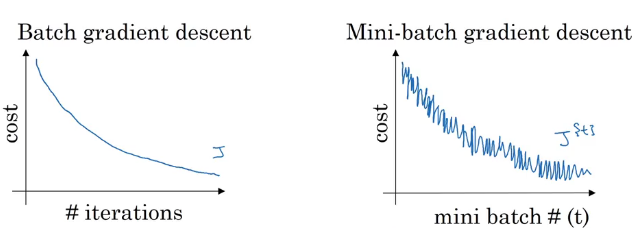
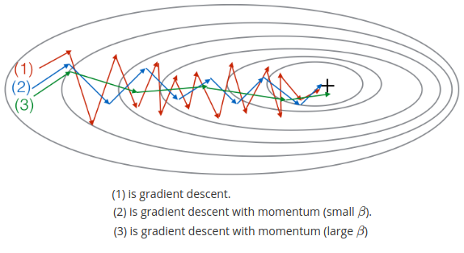
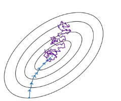

## Optimization algorithms
### Optimization algorithms
*Enable you to train your neural network much faster.*

#### Mini-batch gradient descent
Slice the batch into mini-batches, and loop over them
$$
\text{mini-batch } t: X^{\{t\}}, Y^{\{t\}}
$$  

1 *epoch:* 1 pass through the training set.

#### Understanding mini-batch gradient descent
**Choosing the mini-batch size:**
- size = m
  - Batch gradient descent
  - Too much time per iteration
- size = 1
  - Stochastic gradient descent
  - Lose speedup from vectorization
- 1 $\lt$ size $\lt$ m
  - Mini-batch
  - Progress without wait waiting for the entire training set.

> stochastic doesn't converge, it oscillates around the region of the minimum.

#### Exponentially weighted averages (moving)
$$
V_t = \beta \ V_{t-1} + (1 - \beta) \ \theta_t
$$

Bigger window $\beta$:
- Adapts more slowly to changes
- More latency

Smaller window $\beta$:
- Adapts more quickly to changes.
- More noisy (susceptible to outliers)

#### Bias correction in exponentially weighted averages
Fix the initial phase learning, while your exponentially weighted moving average is still warming up
$$
V_t = \frac{V_t}{1-\beta^t}
$$

#### Gradient descent with momentum
1. Compute an exponentially weighted average of your gradients
$$
V_{\partial W} = \beta V_{\partial W} + (1 -\beta) \partial W \\
V_{\partial b} = \beta V_{\partial b} + (1 -\beta) \partial b
$$
1. Update your weights
$$
W = W - \alpha V_{\partial W} \\
b = b - \alpha V_{\partial b}
$$

Gradient descent with momentum ends up eventually just taking steps that are much smaller oscillations in the vertical direction, but are more directed to just moving quickly in the horizontal direction.
- Algorithm to take a more straightforward path
- Damp out the oscillations in this path to the minimum.  

#### Root Mean Square prop (RMSprop)
1. Compute the derivates
$$
S_{\partial W} = \beta S_{\partial W} + (1 -\beta) \partial W^2 \\
S_{\partial b} = \beta S_{\partial b} + (1 -\beta) \partial b^2
$$
1. Update your weights
$$
W = W - \alpha \frac{\partial W}{\sqrt{S_{\partial W}} + \varepsilon} \\
b = b - \alpha \frac{\partial b}{\sqrt{S_{\partial b}} + \varepsilon}
$$

- $\varepsilon$ ensures numerical stability, so that you don't end up dividing by a very, very small number.
- You can therefore use a larger learning rate alpha, and get faster learning without diverging in the vertical direction.

#### Adaptive Moment Estimation (Adam)
*Momentum and RMSprop together.*

1. Calculate the derivates
$$
V_{\partial W} = V_{\partial W} + (1 -\beta_1) \partial W \ ,
V_{\partial b} = V_{\partial b} + (1 -\beta_1) \partial b \\
S_{\partial W} = \beta_2 S_{\partial W} + (1 -\beta_2) \partial W^2 \ ,
S_{\partial b} = \beta_2 S_{\partial b} + (1 -\beta_2) \partial b^2
$$
1. Bias correction
$$
V_{\partial W} = \frac{V_{\partial W}}{1 - \beta_1^t} \ ,
V_{\partial b} = \frac{V_{\partial b}}{1 - \beta_1^t} \\
S_{\partial W} = \frac{S_{\partial W}}{1 - \beta_2^t} \ ,
S_{\partial b} = \frac{S_{\partial b}}{1 - \beta_2^t}
$$
1. Update the weights
$$
W = W - \alpha \frac{V_{\partial W}}{\sqrt{S_{\partial W}} + \varepsilon} \\
b = b - \alpha \frac{V_{\partial b}}{\sqrt{S_{\partial b}} + \varepsilon}
$$

*Hyperparameters*:
$\alpha$: learning rate
$\beta_1$ = 0.9, *first moment* (for momentum)
$\beta_2$ = 0.999, *second moment* (for RMSprop)
$\varepsilon$ = $10^{-8}$, numerical stability

#### Learning rate decay
Slowly reduce your learning rate $\alpha$ over time, then during the initial phases, while your learning rate alpha is still large, you can still have relatively fast learning.

But then as alpha gets smaller, your steps you take will be slower and smaller. And so you end up oscillating in a tighter region around the minimum, rather than wandering far away as training goes on.

$$
\alpha = \frac{\alpha_0}{1 + \text{decay_rate} * \text{epoch_num}}
$$

#### The problem of local optima
*A plateau is a region where the derivative is close to zero for a long time.*

- Unlikely to get stuck in a bad local optima
- Plateaus can make learning slow, algorithms like momentum or RmsProp or Adam can really help

### Heroes of Deep Learning - Yuanqing Lin
> I feel like it's good to start with lots of open source, and those are extremely powerful resource. I will also suggest that you also do learn those basic things about machine learning.

### Code
#### Optimization Methods
Can speed up learning and perhaps even get you to a better final value for the cost function.

**Gradient Descent**
When you take gradient steps with respect to all $m$ examples on each step, it is also called Batch Gradient Descent.

**Stochastic Gradient Descent (SGD)**
Mini-batch with 1 example, so computing gradients on just one training example at a time, rather than on the whole training set.

-  When the training set is large, SGD can be faster. But the parameters will *oscillate* toward the minimum rather than converge smoothly.

**What you should remember**:
- The difference between gradient descent, mini-batch gradient descent and stochastic gradient descent is the number of examples you use to perform one update step.
- You have to tune a learning rate hyperparameter $\alpha$.
- With a well-turned mini-batch size, usually it outperforms either gradient descent or stochastic gradient descent (particularly when the training set is large).

**Mini-Batch Gradient descent**
- Shuffle, random shuffling is done synchronously between $X$ and $Y$.
- Partition, the shuffled $(X, Y)$ into mini-batches of power of two, e.g., 16, 32, 64, 128

#### Momentum
Mini-batch gradient descent will "oscillate" toward convergence. Using momentum can reduce these oscillations.

- Momentum takes into account the past gradients to smooth out the update.

**Note** that:
- The velocity is initialized with zeros. So the algorithm will take a few iterations to "build up" velocity and start to take bigger steps.
- If $\beta = 0$, then this just becomes standard gradient descent without momentum.

**How do you choose $\beta$?**
- The larger the momentum $\beta$ is, the smoother the update because the more we take the past gradients into account. But if $\beta$ is too big, it could also smooth out the updates too much.
- Common values for $\beta$ range from 0.8 to 0.999. If you don't feel inclined to tune this, $\beta = 0.9$ is often a reasonable default.
- Tuning the optimal $\beta$ for your model might need trying several values to see what works best in term of reducing the value of the cost function $J$.

**What you should remember**:
- Momentum takes past gradients into account to smooth out the steps of gradient descent. It can be applied with batch gradient descent, mini-batch gradient descent or stochastic gradient descent.
- You have to tune a momentum hyperparameter $\beta$ and a learning rate $\alpha$.

#### Adam
1. It calculates an exponentially weighted average of past gradients, and stores it in variables $v$ (before bias correction) and $v^{corrected}$ (with bias correction).
2. It calculates an exponentially weighted average of the squares of the past gradients, and  stores it in variables $s$ (before bias correction) and $s^{corrected}$ (with bias correction).
3. It updates parameters in a direction based on combining information from "1" and "2".

The update rule is, for $l = 1, ..., L$:

$$\begin{cases}
v_{dW^{[l]}} = \beta_1 v_{dW^{[l]}} + (1 - \beta_1) \frac{\partial \mathcal{J} }{ \partial W^{[l]} } \\
v^{corrected}_{dW^{[l]}} = \frac{v_{dW^{[l]}}}{1 - (\beta_1)^t} \\
s_{dW^{[l]}} = \beta_2 s_{dW^{[l]}} + (1 - \beta_2) (\frac{\partial \mathcal{J} }{\partial W^{[l]} })^2 \\
s^{corrected}_{dW^{[l]}} = \frac{s_{dW^{[l]}}}{1 - (\beta_1)^t} \\
W^{[l]} = W^{[l]} - \alpha \frac{v^{corrected}_{dW^{[l]}}}{\sqrt{s^{corrected}_{dW^{[l]}}} + \varepsilon}
\end{cases}$$
where:
- t counts the number of steps taken of Adam
- L is the number of layers
- $\beta_1$ and $\beta_2$ are hyperparameters that control the two exponentially weighted averages.
- $\alpha$ is the learning rate
- $\varepsilon$ is a very small number to avoid dividing by zero

Some advantages of Adam include:
- Relatively low memory requirements (though higher than gradient descent and gradient descent with momentum)
- Usually works well even with little tuning of hyperparameters (except $\alpha$)
