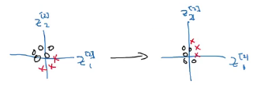
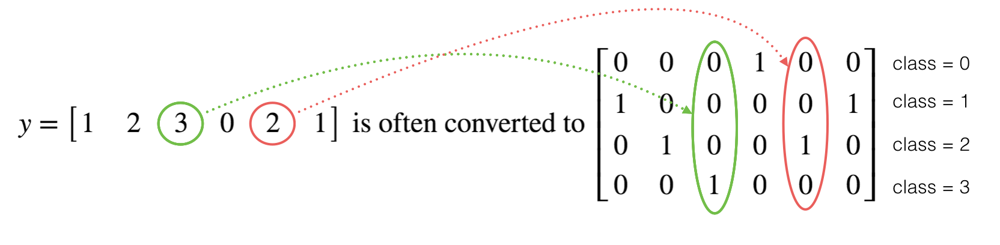

## Hyperparameter tuning, Batch Normalization and Programming Frameworks
### Hyperparameter tuning
#### Tuning process
**Hyperparameters**
- $\alpha$
- $\beta$
- $\beta_1$, $\beta_2$, $\varepsilon$
- \# layers
- \# hidden units
- learning rate decay
- Mini-batch size

> Try out the hyperparameters randomly and consider implementing a coarse to fine search process.

#### Using an appropriate scale to pick hyperparameters
It's important to pick the appropriate scale on which to explore the hyperparamaters, not uniformly at random.

#### Hyperparameters tuning in practice: Pandas vs. Caviar
*Reevaluate your hyperparameters.*

- Babysitting one model (Pandas)
- Training many models in parallel (Caviar)

> Depends on the computational resources you have.

### Batch Normalization
#### Normalizing activations in a network
What batch norm does is it applies that normalization process not just to the input layer, but to the values even deep in some hidden layer in the neural network.

The hidden units have standardized mean and variance controlled by two explicit parameters $\gamma$ and $\beta$.

Given some intermediate values $Z^{(i)}$, ..., $Z^{(m)}$
$$
\mu = \frac{1}{m}\sum_i z^{(i)} \\
\sigma^2 = \frac{1}{m} \sum_i (z_i - \mu)^2 \\
z_{\text{norm}} = \frac{z^{(i)}-\mu}{\sqrt{\sigma^2 + \varepsilon}}
$$

> Every component of $z$ has mean 0 and variance 1.

Set the variance and mean with $\gamma$ and $\beta$
$$
\tilde{z}^{(i)} = \gamma z_{\text{norm}} + \beta
$$

#### Fitting Batch Norm into a neural network
Happens between after computing $Z$ and used to compute $A$


When you subtract the mean adding any constant doesn't change anything. So you can eliminate $b$ in $Z^{[l]}$ and $\partial b$ in backprop
$$
Z^{[l]} = W^{[l]} a^{[l-1]}
$$

Instead is sort of replaced by $\beta^{[l]}$ with the same dimensionas of $b$ $\in (n^{[l]}, m)$ in $\tilde{Z}^{(i)}$, which is the parameter that controls that ends up affecting the shift or the biased terms.

**Implementing gradient descent**
for $t = 1$ ... num_Mini_Batches:
1. forward prop on $X^{\{t\}}$  
  in each hidden layer use Batch normalization to replace $Z^{[l]}$ with $\tilde{Z}^{(i)}$
1. backprop
$$
\partial W^{{[l]}} \ ,
\partial \beta^{{[l]}} \ ,
\partial \gamma^{{[l]}}
$$
1. update the parameters
$$
W^{[l]} := W^{[l]} - \alpha \partial W^{{[l]}} \\
\beta^{[l]} := \beta^{[l]} - \alpha \partial \beta^{{[l]}} \\
\gamma^{[l]} := \gamma^{[l]} - \alpha \partial \gamma^{{[l]}} \\
$$

> Use the updates given by momentum, RMSprop, or Adam in backprop.

#### Why does Batch Norm work?
*Batch norm reduces the problem of the input values changing.*



**covariate shift**
If you've learned some $X$ to $Y$ mapping, if the distribution of $X$ changes, then you might need to retrain your learning algorithm.

So what batch norm does, is it reduces the amount that the distribution of the hidden units values shifts around. The earlier layers don't get to shift around as much, because they're constrained to have the same mean and variance, so limits the amount to which updating the parameters in the earlier layers can affect the distribution of values that the third layer now sees and therefore has to learn on.

> Batch Norm speed up learning.

##### Batch Norm as regularization
Similar to *dropout*, batch norm adds noise to the hidden units, so it's forcing the downstream hidden units not to rely too much on any one hidden unit.

> If you use a bigger mini-batch size, you're reducing this noise and therefore also reducing this regularization effect.

**Don't turn to batch norm as a regularization**. Use it as a way to normalize your hidden units activations and therefore speed up learning. And I think the regularization is an almost unintended side effect.

#### Batch Norm at test time
During training time $\mu$ and $\sigma^2$ are computed on an entire mini batch. But at test time, you might need to process a single example at a time.

Estimate using exponentially weighted average (running average) across the mini-batch for both parameters, and then you use those values to do the scaling for $z_{\text{norm}}^{(i)}$ and $\tilde{z}^{(i)}$ at test time.

### Multi-class classification
#### Softmax Regression
*Softmax regression generalizes logistic regression to $C$ classes.*

**Softmax layer**
$$
t = e^{(z^{[l]})} \\
a^{[l]}_i = \frac{t_i}{\sum^{n_x}_{j=1} t_i}
$$

The Softmax activation function $a^{[l]}$ takes a vector and outputs a normalized vector
$$
a^{[l]} = \hat{y} = g(z^{[l]})
$$

#### Training a softmax classifier
backprop:
$$
\frac{\partial J}{\partial z^{[L]}} = \partial z^{[L]} = \hat{y} - y
$$

### Introduction to programming frameworks
Programming frameworks provide a higher level of abstraction than just a numerical linear algebra library, making you more efficient as you develop machine learning applications.

#### Deep learning frameworks
- Caffe/Caffe2
- Keras
- Lasagne
- PaddlePaddle
- TensorFlow
- Theano
- Torch

**Choosing deep learning frameworks**
- Ease of programming (development and deployment)
- Running speed
- Truly open (open source with good governance)

#### TensorFlow
```Python
import tensorflow as tf
w = tf.Variable(0, dtype=tf.float32)
cost = tf.add(tf.add(w ** 2, tf.multiply(-10., w)), 25)
#or
cost = w ** 2 - 10 * w + 25

# learning algorithm
train = tf.train.GradientDescentOptimizer(0.01).minimize(cost)

init = tf.global_variables_initializer()
with tf.Session() as session:
    session.run(init)
    # one step
    session.run(train)
    print(session.run(w))

```

The function you want to minimize as the function of your training set:
```Python
coefficients = np.array([[1.], [-10.], [25.]])
x = tf.placeholder(tf.float32, [3, 1])
cost = x[0][0] * w ** 2 + x[1][0] * w + x[2][0]
session.run(train, feed_dict={x:coefficients})
```

### Code
Writing and running programs in TensorFlow has the following steps:

1. Create Tensors (variables) that are not yet executed/evaluated.
1. Write operations between those Tensors.
1. Initialize your Tensors.
1. Create a Session.
1. Run the Session. This will run the operations you'd written above.

> Remember to initialize your variables, create a session and run the operations inside the session.

**Placeholder**
A placeholder is simply a variable that you will assign data to only later, when running the session.

- To specify values for a placeholder, you can pass in values by using a "feed dictionary" (feed_dict variable)

```Python
x = tf.placeholder(tf.int64, name = 'x')
X = tf.placeholder(shape=[n_x, None], dtype=tf.float32)
session.run(2 * x, feed_dict = {x: 3})
```

> We say that you feed data to these placeholders when running the session.  

When you specify the operations needed for a computation, you are telling TensorFlow how to construct a computation graph. The computation graph can have some placeholders whose values you will specify only later. Finally, when you run the session, you are telling TensorFlow to execute the computation graph.

**Cross entropy loss**
$$
\frac{1}{m}  \sum_{i = 1}^m  \large ( \small y^{(i)} \log \sigma(z^{[2](i)}) + (1-y^{(i)})\log (1-\sigma(z^{[2](i)})\large )\small
$$

```Python
"""
Computes the cost using the sigmoid cross entropy
    
    Arguments:
    logits -- vector containing z, output of the last linear unit (before the final sigmoid activation)
    labels -- vector of labels y (1 or 0)

    Note: What we've been calling "z" and "y" in this class are respectively called "logits" and "labels"
    in the TensorFlow documentation. So logits will feed into z, and labels into y.
"""
tf.nn.sigmoid_cross_entropy_with_logits(logits = ...,  labels = ...)


```

**One Hot encodings**
This is called a "one hot" encoding, because in the converted representation exactly one element of each column is "hot" (meaning set to 1).  


```Python
"""
Arguments:
labels -- vector containing the labels
C -- number of classes, the depth of the one hot dimension
"""
labels = np.array([1,2,3,0,2,1])
depth = tf.constant(4, name='y_hat')
tf.one_hot(labels, depth, axis=1)
```

#### Building your first neural network in tensorflow
1. Create the computation graph
1. Run the graph

**process**
1. Flatten the image dataset (reshape =  pixels x pixels x RGB (3))
1. Normalize it by dividing by 255
1. Convert each label to a one-hot vector
