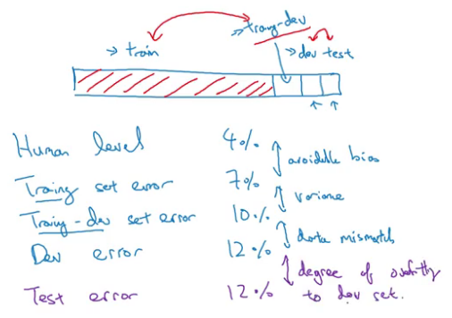
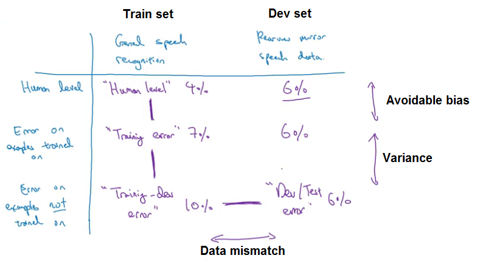
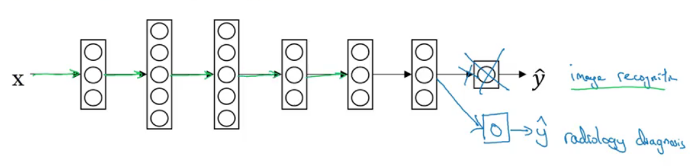

## ML Strategy
### Error Analysis
*During error analysis, you're just looking at dev set examples that your algorithm has misrecognized.*

#### Carrying out error analysis
*Error Analysis: Ceiling*
- Find/Look at the mislabeled dev set examples for false positives and false negatives
- Count the number of errors that fall into various different categories.

|    Image   | Cat | Blurry | Comments |
|:----------:|:---:|:------:|:--------:|
|      1     |  x  |        | Grey cat |
|      2     |     |    x   |          |
|     ...    |     |    x   |          |
| % of total |  8% |   43%  |          |
0
> By counting up the fraction of examples that are mislabeled in different ways, often this will help you prioritize.

#### Cleaning up incorrectly labeled data
*Label assigned to this piece of data $y$ is incorrect.*

During error analysis, add one extra column so that you can also count up the number of examples where the label $y$ was incorrect.

> Deep learning algorithms are robust to random errors. They are less robust to systematic errors.

When a high fraction of your mistakes as measured on your dev set are due to incorrect labels, then it maybe seems much more worthwhile to fix up the incorrect labels in your dev set.

|    Overall dev set error    |  10% |          2%          |
|:---------------------------:|:----:|:--------------------:|
| Errors due incorrect labels | 0.6% |         0.6%         |
|  Errors due to other causes | 9.4% |         1.4%         |
|                             |      | Fix incorrect labels |

- On the left  
  - The percentage impact is smaller

- On the right  
  - Large impact on the overall assessment of the errors of the algorithm

> Examine examples that your algorithm got right as well as ones it got wrong, double check.

**Train set** may now come from slightly different distribution, but **dev set** and **training set** must come from the same.

#### Build your first system quickly, then iterate
Start to see and understand how well you're doing against your dev/test: set and your values and metric.
- Set up dev/test set and metric
- Build initial system quickly and iterate
- Use Bias/Variance & Error analysis to prioritize next steps

> Look at some mistakes, to figure out all the different directions you can go in, which ones are actually the most worthwhile.

### Mismatched training and dev/test set
#### Training and testing on different distributions
*Remember that setting up your dev set is telling your team where to aim the target.*

**Option 1**
Randomly shuffle them into a train, dev, and test set, all come from the same distribution.

> This is setting up the dev set to tell your team to optimize for a different distribution of data than what you actually care about.

**Option 2**
Training distribution is different from your dev and test set distributions.

> Will get better performance over the long term.

#### Bias and Variance with mismatched data distributions
The problem is that when you went from the training error to the dev error, two things changed at a time.

- The algorithm saw data in the training set but not in the dev set.
- The distribution of data in the dev set is different.

**Training-dev set**
- Randomly shuffle the training set to create subset of data that should have the same distribution as training sets.
- Don't explicitly train in your network on this.

|   Human error   |        0%        |       0%      |       0%       |               0%               |
|:---------------:|:----------------:|:-------------:|:--------------:|:------------------------------:|
|  Training error |        1%        |       1%      |       10%      |               10%              |
| Train-dev error |        9%        |      1.5%     |       11%      |               11%              |
|    Dev error    |        10%       |      10%      |       12%      |               20%              |
|                 | Variance problem | Data mismatch | Avoidable bias | Avoidable bias & data mismatch |

> Depending on the differences between these errors, you can get a sense of how big is the avoidable bias, the variance, the data mismatch problems.

#### Addressing data mismatch
- Carry out manual error analysis to try to understand difference between training and dev/test sets.
  - Noise/Misrecognized data
- Make training data more similar to dev/test data
  - Artificial data synthesis
- Collect more data similar to dev/test sets
  - Simulate noisy data

> Simulating data only from a tiny subset of the space of all possible examples, you might overfit.

### Learning from multiple tasks
#### Transfer learning
*Learn from one task and try to transfer to a different task.*

- Task $A$ and $B$ have the same input $x$, e.g image, voice.
- You have a lot more data for Task $A$ (*pre-training*) than task $B$ (*fine tuning*)
- Low level features from $A$ could be helpful for learning $B$, e.g image borders, curves.

With a relatively small data set and a related problem with a much bigger data set, you can train in your neural network from there and then transfer it to the problem where we have very low data.

> If you have a small data set, then initialize/retrain that last one or two layers. But if you have a lot of data, then maybe you can retrain all the parameters in the network.  

#### Multi-task learning
*Try to learn from multiple tasks at the same time.*

- Training on a set of task that could benefit form having shared lower-level features
- Train one big neural network to do many tasks can give you better performance than if you were to do the tasks in isolation

> The amount of data you have for each task is quite similar

**One image can have multiple labels**
Unlike softmax regression, which assigned a single label to single example. This one image can have multiple labels, you're going through the different classes and asking for each of the classes does that class, does that type of object appear in the image?

**Train one big neural network**
Train four separate neural networks, instead of train one network to do four things. But if some of the earlier features in neural network can be shared between these different types of objects, then you find that training one neural network to do four things results in better performance than training four completely separate neural networks to do the four tasks separately.

### End-to-end deep learning
Learning a direct mapping from one end of the system all the way to the other end of the system.

#### What is end-to-end deep learning?
Learning systems that require multiple stages of processing. And what end-to-end deep learning does, is it can take all those multiple stages, and replace it usually with just a single neural network.

Two sub-problem approach works better when:
- Each of the two problems you're solving is actually much simpler.
- You have a lot of data for each of the two sub-tasks.

An end-to-end deep can really simplify the system and not require you to build so many hand-designed individual components.

#### Whether to use end-to-end deep learning
Pros:
- Let the data speak
- Less hand-designed of components needed

Cons:
- May need large amount of data
- Exclude potentially useful hand-designed components

> Key question: Do you have sufficient data to learn a function of the complexity needed to map x to y

### Heroes of Deep Learning - Ruslan Salakhutdinov
 > Try different things and not be afraid to try new things, and not be afraid to try to innovate.

> I'm asking people to actually code backpropogation algorithms for convolutional neural networks. And it's painful, but at the same time, if you do it once, you'll really understand how these systems operate, and how they work.
