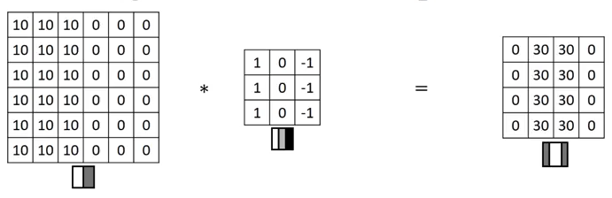
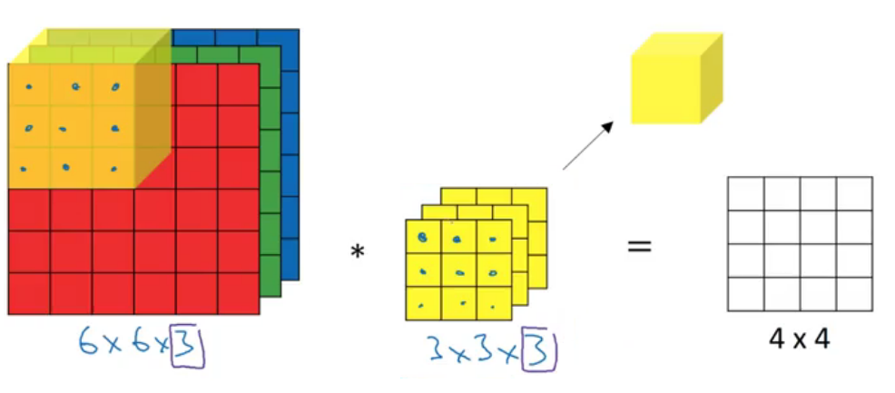
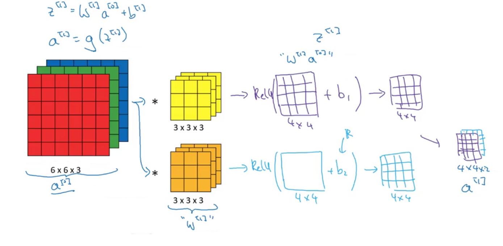
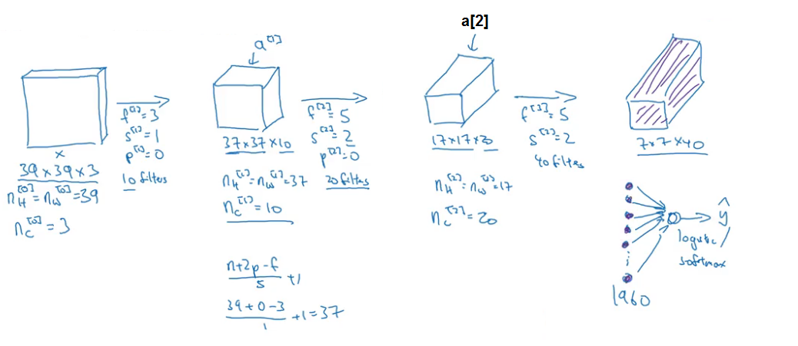
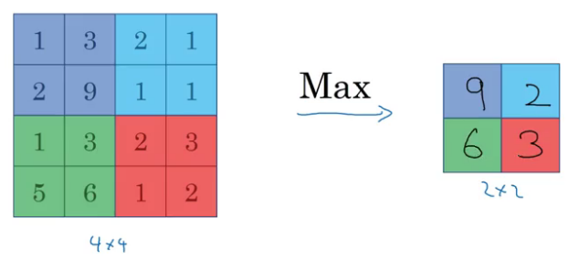
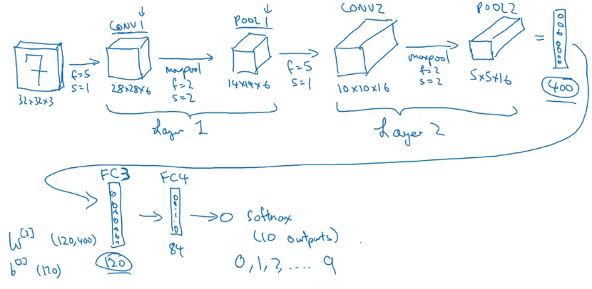
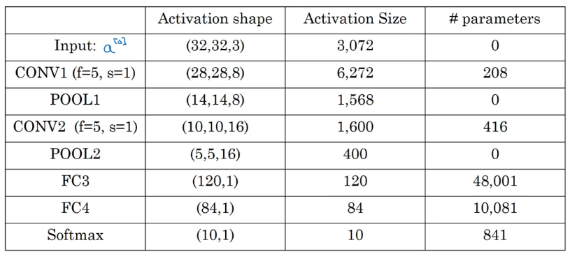

## Foundations of Convolutional Neural Networks
### Convolutional Neural Networks
#### Computer Vision
Computer Vision Problems:
- Image classification
- Object detection

#### Edge Detection Example
the convolution operation allows you to implement a vertical edge detector with a *filter or kernel*.



This filter is a 3 by 3 region where the pixels are relatively bright on the left part (1), and relatively dark on the right part (-1).

```Python
conv_foward
tf.nn.conv2d # tensor flow
```

#### More Edge Detection
positive edges, the difference between light to dark edge transitions
negative edges, the difference between dark to light edge transitions

If you flip the vertical edge detection 90 degrees clockwise, you get an horizontal edge detection.

Treat filter/kernel matrix (nine numbers) as parameters to be learn by backpropagation.

#### Padding
An $n \times n$ image, with an $f \times f$ filter results in $n-f+1 \times n-f+1$ matrix.

Padding solves:
- *Shrinking output*, the output will be a very small image.
- Throwing away information from the edges of the image.

The image results in a $n+2p-f+1 \times n+2p-f+1$ matrix, where $p$ is the number of padding border pixels with zeros.

*Same* padding: Pad so that output size i the same as the input size:
$$
p = \frac{f - 1}{2}
$$

> Use odd-numbered f

#### Strided Convolutions
Stepping/jumping $s$ steps, the output dimension will be
$$
\frac{n + 2p - f}{s} + 1
$$
> floor if necessary, i.e. rounding down to the nearest integer.

This operation is maybe better called cross-correlation, but most of the deep learning literature just calls this the convolution operator.

#### Convolutions Over Volume
- Image dimension: Height, width, and the number of channels
- Filter dimension: Height, Width, and the number of channels that must match the number of channels the image.



Is possible to have a filter that maybe only looks at the red or green or blue channel.

**Multiple filters**
Stack the filters as dimensions, so the resulting volume is
$$
n - f + 1 \times n - f + 1 \times n_c
$$
$n_c$: number of  filters used.

#### One Layer of a Convolutional Network
How one layer of the compositional neural network works, and the computations involved in taking the activations of one layer and mapping that to the activations of the next layer.



10 filters of 3x3x3 dimensions in one layer will have 27 parameters + 1 bias parameter (= 28) per filter, so 280 parameters in total.

*Notation:*
if layer $l$ is a convolution layer:
$f^{[l]}$ = filter size
$p^{[l]}$ = padding
$s^{[l]}$ = stride
$n^{[l]}_c$ = number of filters, $f^{[l]} \times f^{[l]} \times n^{[l-1]}_c$
Input: $n^{[l-1]}_{H} \times n^{[l-1]}_{W} \times n^{[l-1]}_{c}$
Output: $n^{[l]}_{H} \times n^{[l]}_{W} \times n^{[l]}_{c}$
$n^{[l]}_{H} = \lfloor \frac{n^{[l-1]}_{H} +2p^{[l]}-f^{[l]}}{s^{[l]}}+1\rfloor$
$n^{[l]}_{W} = \lfloor \frac{n^{[l-1]}_{W} +2p^{[l]}-f^{[l]}}{s^{[l]}}+1\rfloor$
Activations:
$$a^{[l]} \rightarrow n^{[l]}_{H} \times n^{[l]}_{W} \times n^{[l]}_c \\
A^{[l]} \rightarrow m \times n^{[l]}_{H} \times n^{[l]}_{W} \times n^{[l]}_c
$$
Weights: $f^{[l]} \times f^{[l]} \times n^{[l-1]}_c \times n^{[l]}_c$
> Weights: each filter $\times$ how many filters in layer $l$

bias: $n^{[l]}_c$

#### Simple Convolutional Network Example
Typically you start out with larger images and gradually trend down as you go deeper in your networks.

*Hyperparameters:*
- Filter size
- Stride number
- Padding number
- Number of filters



> The last step is just taking all of these numbers and unrolling them into a very long vector to feed into soft max, until it's just a regression, in order to make a prediction for the final output.

**Types of layers in a CN**
- Convolution (CONV)
- Pooling (POOL)
- Fully connected (FC)

#### Pooling Layers
- It helps reduce computation, as well as helps make feature detectors more invariant to its position in the input.

- Reduces the height and width of the input but keeps the number of $n_c$ channel dimension, because max pooling computation is done independently.

- It has no parameters to learn, it's just a fixed function.

**Max Pooling**
*Hyperparameters:*
- Filter size $f$ = 2
- Stride number $s$ = 2


> Reduce the height and width of the representation by a factor of 2 with this values of $f$ and $s$.

**Average Pooling**
Same as max pooling but taking the average.

#### CNN Example *(LeNet-5)*


So as yo go deeper in the neural network, usually the height and width will decrease, whereas, the number of channels will increase.
$$
n_H \ , n_W \downarrow \\
n_c \uparrow
$$

**Fully connected unit**
Each of the input units is connected to each of output units
> Just like the single neural network.

**Parameters**

- Input as $a^{[0]}$
- Pooling layers don't have any parameters.
- CONV layers tend to have relatively few parameters
- Fully connected layers have a lot of parameters
- Activation size tends to  go down gradually as you go deeper in the neural network.

> If activations drops too quickly, that's usually not great for performance.

#### Why Convolutions?
A neural network has a lot fewer parameters, which allows it to be trained with **smaller training sets**, and it's **less** prone to be **over-fitting**.

**Parameter sharing**
A feature detector, e.g. vertical edge detector, that's useful in one part of the image is probably useful in another part of the image

**Sparsity of connections**
In each layer, each output value depends only on a small number of inputs.

**Translation invariance**
They capture this desirable property of translation and variance.

An image shifted a few pixels should result in pretty similar features, and should probably be assigned the same output.

##### Putting it tohether
1. Convolution layer
1. Pulling layers
1. Fully connected layers
1. Soft max output $\rightarrow \hat{y}$

### Code
