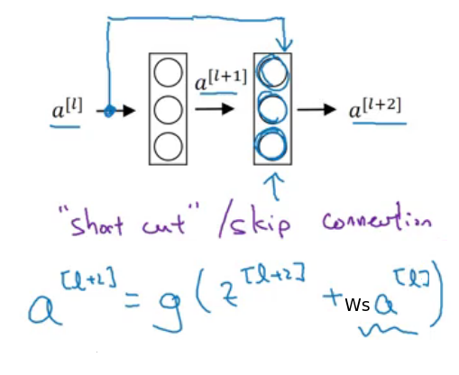
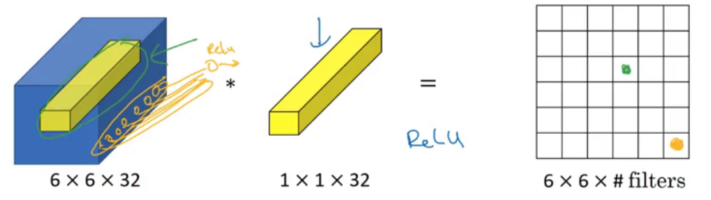
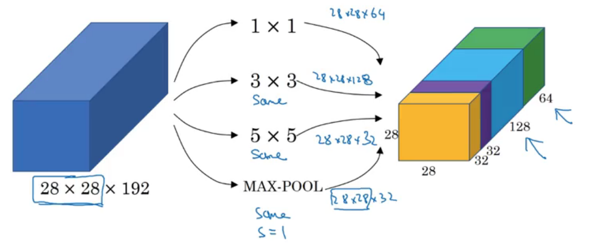
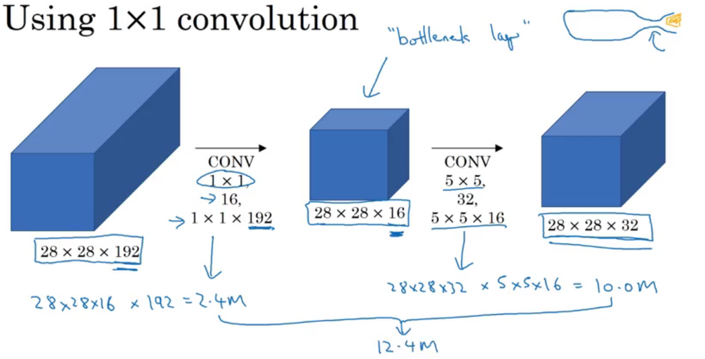
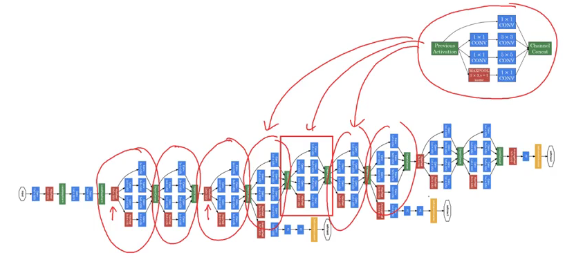

## Deep convolutional models: case studies
### Case studies
#### Why look at case studies?
A neural network architecture that works well on one, computer vision task often works well on other tasks as well.

- Classic networks:
  - LeNet-5
  - AlexNet
  - VGG
- ResNet
- Inception

#### Classic Networks
**LeNet-5**
- Recognize handwritten digits.
- Trained on grayscale images.
 - $n_H, n_W \downarrow \ n_c\uparrow$

 **AlexNet**
 - Similar to LeNet-5, but much bigger
- ReLu
- Local Response Normalization (LRN),  
  Look at one position of the height and width, and across all the channels and normalize them.

**VGG - 16**
- Simplified neural network architectures
- 16 Layers

#### ResNets

*Skip connections:* Allows you to take the activation from one layer and feed it to another layer much deeper in the neural network.

This really helps with the vanishing and exploding gradient problems and allows you to train much deeper neural networks without really appreciable loss in performance.

#### Why ResNets Work
What goes wrong in very deep plain nets without this residual or the skip connections is that, when you make the network deeper and deeper, it's actually very difficult for it to choose parameters that learn, which is why a lot of layers end up making your result worse rather than making your result better.

I think the main reason the residual network works is that it's so easy for these extra layers to learn the identity function that you are kind of guaranteed that it doesn't hurt performance.

#### Networks in Networks and 1x1 Convolutions
It will take the element wise product and then applying a ReLU nonlinearity.

1 x 1 convolutions allows
- To shrink the number of channels $n_c$.
- Just add nonlinearity

#### Inception Network Motivation
The inception module, let's you say, let's do them all. And let's concatenate the results.

A 1 x 1 convolution, can create this bottleneck layer thereby reducing the computational cost significantly.

#### Inception Network
If you understand the Inception module, then you understand the Inception network, which is largely the Inception module repeated a bunch of times throughout the network.

The side branch take some hidden layer, and it tries to use that to make a prediction, so this is actually a softmax output.

What it does is it helps ensure that the features computed even in the hidden units/intermediate layers that they're not too bad for predicting the output cause of a image.

> This appears to have a regularizing effect on the Inception network and helps prevent this network from overfitting.

### Practical advices for using ConvNets
Often starting with open-source implementations is a better/faster way to get started on a new project.

Sometimes these networks take a long time to train and someone else might have used multiple GPUs in a very largely data set to pre-trained some of these networks. And that allows you to do transfer learning using these networks.

#### Using Open-Source Implementation
Sometimes this training takes several weeks, and might take many, many GPUs. You can often download open source weights and use that as a very good initialization for your own neural network.

#### Transfer Learning
I recommend you go online and download some open source implementation of a neural network. And download not just the code, but also the weights.

Then get rid of the softmax layer, and create your own softmax unit that outputs Tigger, or Misty, or neither. So, train only the softmax layer's weights, but freeze all of the earlier layers' weights.

The advantage of the save to disk or the pre-compute method of save to disk method is that you don't need to recompute those activations every time you take an epoch, or take a pass through your training set.

> If you have a larger training set, then freeze fewer layers and then the number of layers you train on top could be greater. In the extreme case, you could use the weights you download just as initialization, so they will replace random initialization.

#### Data Augmentation
*To get more data.*
- Mirroring
- Random Cropping
- Rotation
- Shearing/Warping
- Color shifting (PCA)

#### State of Computer Vision
When you have a lot data, you tend to find people getting away with using simpler algorithms as well as less hand engineering.

**User open source code**
- Use architectures of Networks published in the literature
- Use open source implementations if possible
- Use pretrained models and fine-tune on your dataset

## Code
- Keras is a tool we recommend for rapid prototyping. It allows you to quickly try out different model architectures. Are there any applications of deep learning to your daily life that you'd like to implement using Keras?
- Remember how to code a model in Keras and the four steps leading to the evaluation of your model on the test set.
1. Create
1. Compile  
  model.compile(optimizer = "...", loss = "...", metrics = ["accuracy"])
1. Train the model on train data  
  model.fit(x = ..., y = ..., epochs = ..., batch_size = ...)
1. Test the model on test data  
  model.evaluate(x = ..., y = ...)

Two other basic features of Keras that you'll find useful are:
- `model.summary()`: prints the details of your layers in a table with the sizes of its inputs/outputs
- `plot_model()`: plots your graph in a nice layout.

## Code
The **benefit** of very deep neural networks:
- It can represent very complex functions.
- It can also learn features at many different levels of abstraction, from edges (at the lower layers) to very complex features (at the deeper layers).

The **problem** of very deep neural networks:
- Vanishing gradients: Gradient signal that goes to zero quickly, thus making gradient descent unbearably slow.

> During training, you might therefore see the magnitude (or norm) of the gradient for the earlier layers descrease to zero very rapidly as training proceeds:

### Residual Network
In ResNets, a "shortcut" or a "skip connection" allows the gradient to be directly backpropagated to earlier layers

Having ResNet blocks with the shortcut also makes it very easy for one of the blocks to learn an identity function. This means that you can stack on additional ResNet blocks with little risk of harming training set performance.

**The identity block**
The identity block is the standard block used in ResNets, and corresponds to the case where the input activation (say  $a^{[l]}$ ) has the same dimension as the output activation (say  $a^{[l+2]}$)

The CONV2D layer in the shortcut path is used to resize the input  $x$  to a different dimension, so that the dimensions match up in the final addition needed to add the shortcut value back to the main path. (This plays a similar role as the matrix  $W_s$  discussed in lecture.)

Its main role is to just apply a (learned) linear function that reduces the dimension of the input, so that the dimensions match up for the later addition step.

**What you should remember:**
- Very deep "plain" networks don't work in practice because they are hard to train due to vanishing gradients.  
- The skip-connections help to address the Vanishing Gradient problem. They also make it easy for a ResNet block to learn an identity function.
- There are two main type of blocks: The identity block and the convolutional block.
- Very deep Residual Networks are built by stacking these blocks together.
