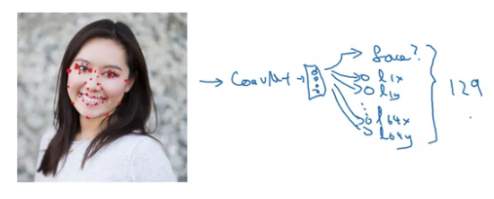

## Object detection
### Detection algorithms
#### Object Localization
- Image classification
- Classification with localization
- Detection (multiple objects)

**Classification with localization**
- Construct X (input image) as well as Y (class label).

- PC will be equal to 1 if there is an object.

- Bounding box of the object you detected.

- If PC is equal to 1, output c1 c2 and c3 to tell the class of the object. If PC equal to 0, all classes = ? (don't care)

- Loss function ($y - \hat{y}$)

#### Landmark Detection
*Coordinates of important points in image.*

> Must be consistent across different images like maybe landmark one is always the corner of the eye.

#### Object Detection
*Sliding window detection*

Basically go through every region of  a size and pass lots of little cropped images into the classifier and have it classify 0 or 1. Then repeat it but now use a larger window.

If you use a very fine granularity/small stride then there's a very high computational cost.

#### Convolutional Implementation of Sliding
**Turning FC layer into convolutional layers**

A 5 by 5 filter is implemented as 5 by 5 by 16 because our convention is that the filter looks like cross all 16 channels, so channel number must match and the output will be 1 by 1 by 400 if you have 400 of these 5 by 5 by 16 filters.

**Convolution implementation of sliding windows**
Instead of doing it independently and sequentially with this convolutional implementation you can make predictions at the same time.

#### Bounding Box Predictions
**You Only Look Once (YOLO)**
YOLO ("you only look once") is a popular algoritm because it achieves high accuracy while also being able to run in real-time. This algorithm "only looks once" at the image in the sense that it requires only one forward propagation pass through the network to make predictions. After non-max suppression, it then outputs recognized objects together with the bounding boxes.

The way you assign an object to grid cell is you look at the mid point of an object and then you assign that object to whichever one grid cell contains the mid point of the object.  

$b_x$, $b_y$: midpoints relative to grid cell.
$b_h$, $b_w$: fraction of the overall width of the red box to the grid cell.  

#### Intersection Over Union (IOU)
*A measure of the overlap between two bounding boxes. To evaluate your object detection algorithm.*

> This is also a way of measuring how similar two boxes are to each other.

#### Non-max Suppression
*So that your algorithm detects each object only once.*

1. Dicard all boxes with $p_c \leq 0.6$
1. While there are any remaining boxes:  
    1. Pick the box with the largest $p_c$. Output that as a prediction (Highlight).
    1. Discard any remaining box with IoU $\geq$ 0.5 with the box output in the previous step (Darken).

If you actually try to detect three objects then the output vector will have three additional components and  independently carry out non-max suppression three times, one on each of the outputs classes.

#### Anchor Boxes
*Detect multiple objects with predefined boxes.*

Previously:
Each object in training image is **assigned** to a grid **cell** that contains that object's midpoint.

With two anchor boxes:
Each object in training image is **assigned** to a grid **cell** that contains the object's midpoint **and anchor** box for the grid cell with **highest *IoU*** (Grid cell and anchor box Pair).

> Vertical concatenation.

Some of the outputs can specialize in detecting wide/fat objects like cars and some of the upper units can  specialize in detecting tall skinny objects like pedestrians.

> Use a k-means algorithm to group.

#### YOLO Algorithm
Example:
1. For each grid call, get 2 predicted bounding boxes.
1. Get rid of low probability predictions.
1. For each class (pedestrian, car, motorcycle) use non-max suppression to generate final predictions.

#### (Optional) Region Proposals
**R-CNN**
Propose regions. Classify proposed regions one at a time. Output label and bounding box.

Called a segmentation algorithm and what you do is you find maybe two thousand  blobs and place bounding boxes around about two thousand blobs and run your classifier on just those two thousand blobs which.

**Fast R-CNN**
Propose regions. Use convolution implementation of sliding windows to classify all the proposed regions.

**Faster R-CNN**
Use convolutional network to propose regions.

## Code
**Summary for YOLO**:
- Input image (608, 608, 3)
- The input image goes through a CNN, resulting in a (19,19,5,85) dimensional output.
- After flattening the last two dimensions, the output is a volume of shape (19, 19, 425):
    - Each cell in a 19x19 grid over the input image gives 425 numbers.
    - 425 = 5 x 85 because each cell contains predictions for 5 boxes, corresponding to 5 anchor boxes, as seen in lecture.
    - 85 = 5 + 80 where 5 is because $(p_c, b_x, b_y, b_h, b_w)$ has 5 numbers, and and 80 is the number of classes we'd like to detect
- You then select only few boxes based on:
    - Score-thresholding: throw away boxes that have detected a class with a score less than the threshold
    - Non-max suppression: Compute the Intersection over Union and avoid selecting overlapping boxes
- This gives you YOLO's final output.

**What you should remember**:
- YOLO is a state-of-the-art object detection model that is fast and accurate
- It runs an input image through a CNN which outputs a 19x19x5x85 dimensional volume.
- The encoding can be seen as a grid where each of the 19x19 cells contains information about 5 boxes.
- You filter through all the boxes using non-max suppression. Specifically:
    - Score thresholding on the probability of detecting a class to keep only accurate (high probability) boxes
    - Intersection over Union (IoU) thresholding to eliminate overlapping boxes
- Because training a YOLO model from randomly initialized weights is non-trivial and requires a large dataset as well as lot of computation, we used previously trained model parameters in this exercise. If you wish, you can also try fine-tuning the YOLO model with your own dataset, though this would be a fairly non-trivial exercise. 
