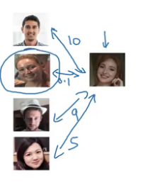
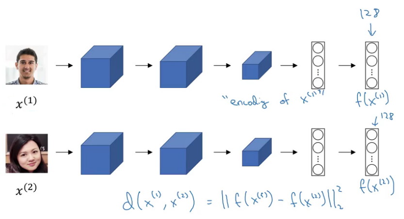
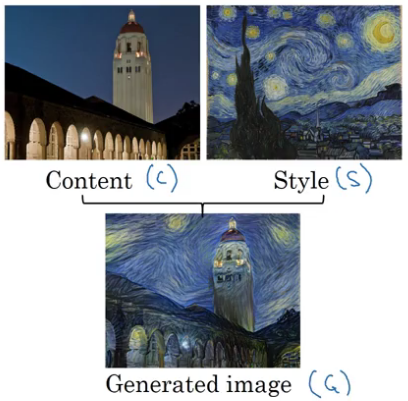

## Special applications: Face recognition & Neural style transfer
### Face Recognition
#### What is face recognition?
**Face verification vs. face recognition**
Verification:
- Input image, name/ID (1 to 1 problem)
- Output whether the input image is that of the claimed person

Recognition:
- Has a database of $K$ persons.
- Get an input image
- Output ID if the image is any of the $K$ persons or "not recognized"

#### One Shot Learning
*Given just one example/single image of a person face.*
Inputs two images and it outputs the degree of difference.

**Learning a *similarity* function (Verification)**
d(img1, img2) = degree of difference between images
- If d(img1, img2) $\leq \tau$: "same person"
- If d(img1, img2) $\gt \tau$: "different person"

> If they are the same person our output is a very small number.

#### Siamese Network
The idea of running two identical  convolutional neural networks on two different inputs and then comparing them.  

- Parameters of NN define an encoding:
$$
f(x^{(i)})
$$
- Lear parameters so that, if $x^{(i)}, x^{(j)}$
    - Are the same person if small
$$
\Vert f(x^{(i)}) - f(x^{(j)}) \Vert^2
$$
    - Are the different persons if large
$$
\Vert f(x^{(i)}) - f(x^{(j)}) \Vert^2
$$

$f()$: encoding

Then use back propagation to vary all the parameters in order to make sure the conditions are satisfied.

#### Triplet Loss
**Learning Objective**
Look at one anchor image and then you want the distance between the anchor and a **positive** image (same person) to be **similar** whereas you want the anchor when pairs are compared to the **negative** example for their distances to be much  further **apart**.

*Triplet Loss:* Always be looking at three images at a time; an anchor, a positive and a negative image.

**Want**
$$
d(A, P)= \Vert f(A) - f(P) \Vert^2 + \alpha \leq \Vert f(A) - f(N) \Vert^2 = d(A, N) \\
\Vert f(A) - f(P) \Vert^2 - \Vert f(A) - f(N) \Vert^2 + \alpha \leq 0
$$
*Margin* $\alpha$: Hyper parameter that prevents the network from outputting the trivial solution; it pushes the anchor positive pair and the anchor negative pair further away from each other.

**Loss function (FaceNet)**
Given 3 images $A, P, N$
$$
L(A, P, N) = \max(\Vert f(A) - f(P) \Vert^2 - \Vert f(A) - f(N) \Vert^2 + \alpha, 0) \\
I = \sum_{i=1}^{m}L(A^{(i)}, P^{(i)}, N^{(i)})
$$
$I$: Overall cost function.

>In the training set you need to have multiple images of the same person so that you can have pairs of anchor and positive images.

If you choose the triplets randomly then too many triplets would be really easy and so gradient descent won't do anything because your Network will just get them right pretty much all the time and it's only by choosing hard triplets that the gradient descent procedure has to do some work to try to push $d(A, P) \downarrow \approx d(A, N) \uparrow$ further away.

> Choose triplets that are *hard* to train on, not at random.

#### Face Verification and Binary Classification
*Absolute difference between encodings.*

As before your training a Siamese network and the output will be 1 if both persons are the same and 0 if both are of different.

$$
\hat{y} = \sigma(\sum_{k=1}^{128} w_i \vert f_k(x^{(i)}) - f_k(x^{(j)}) \vert + b)
$$

> Store/precomute the encondings.

### Neural Style Transfer
#### What is neural style transfer?

$C$: Content
$S$: Style
$G$: Generated

#### What are deep ConvNets learning?
1. Pick a unit in layer 1. Find the nine image patches that maximize the unit's activation (shade, borders, etc).
1. Repeat for other hidden units

In the deeper layers a hidden unit will see a larger region of the image where at the extreme end you know each pixel could hypothetically affect the output of the later FC layers of the neural network.

#### Cost Function
The content cost is a function of the content image (C) and of the generated image (G) and what it does is it measures how similar they are, same for images S and G.
$$
J(G) = \alpha \  J_{\text{content}}(C, G) + \beta \  J_{\text{style}}(S, G)
$$
$\alpha, \beta$: hyper parameters that specify the relative weighting.

**Find the generated image G**
1. Initiate $G$ randomly
$$
G: 100 \times 100 \times 3 \ \text{(rgb)}
$$
1. Use gradient descent to minimize $J(G)$
$$
G := G - \frac{\alpha}{\partial G} J (G)
$$

> Define a cost function for the generated image G and minimize it.

#### Content Cost Function
Layer $l$ chosen to be somewhere in  the middle of the layers of the neural network neither too shallow nor too deep.

- Use hidden layer $l$ to compute content cost
- Use pre-trained ConvNet (e.g. VGG network), measure how similar are
- Let $a^{[l](C)}$ and $a^{[l](G)}$ be the activation of layer $l$ on the images.
    - If are similar, both images have similar content

$$
J_{\text{content}}(C, G) = \frac{1}{2} \Vert a^{[l](C)} - a^{[l](G)} \Vert^2
$$

The element-wise sum of squared differences between the activations as vectors.

#### Style Cost Function
*Define style as the correlation between activations across channels.*

The correlation measures how often the different high level features such as vertical texture, or this orange tint occur together. This gives you a measure of how similar is the style of the generated image to the style of the input style in each.

**Style/Gran Matrix**
Let $a^{[l]}_{i,j,k}$ equals activation at $(i, j, k)$ height, width and channels. $G^{[l]}$ is $n_c^{[l]} \times n^{[l]}_c$. For the style and the generated image:
$$
G^{[l]}_{kk'} = \sum_i^{n^{[l]}_h} \sum_j^{n^{[l]}_w} a^{[l]}_{i,j,k} \ a^{[l]}_{i,j,k'} \ , k,k' = 1, ..., n^{[l]}_c
$$
Frobenius norm between:
$$
J^{[l]}_{\text{style}}(S, G) = \frac{1}{(2 n_h^{[l]} n^{[l]}_w n^{[l]}_c)^2} \Vert G^{[l](S)}_{kk'} - G^{[l](G)}_{kk'} \Vert^2_F \\
= \frac{1}{(2 n_h^{[l]} n^{[l]}_w n^{[l]}_c)^2} \sum_k \sum_{k'} (G^{[l](S)}_{kk'} - G^{[l](G)}_{kk'})
$$

$\lambda$: Allows you to use different layers in the neural network, both the earlier ones which measure relatively simpler low level features like edges. As well as some later layers which measure high level features. So a neural network can take both low level and high level correlations into account.

$$
J_{\text{style}}(S, G) = \sum_l \lambda^{[l]} J^{[l]}_{\text{style}}(S, G)
$$

#### 1D and 3D Generalizations
These conv ideas apply to 1D and 3D.

## Code
In Neural Style Transfer, you'll optimize a cost function to get pixel values

### Transfer Learning
Neural Style Transfer (NST) uses a previously trained convolutional network, and builds on top of that.

Recognize a variety of low level features (at the earlier layers) and high level features (at the deeper layers).

#### Neural Style Transfer
1. Build the content cost function $J_{content}(C,G)$
1. Build the style cost function $J_{style}(S,G)$
1. Put it together to get $J(G) = \alpha J_{content}(C,G) + \beta J_{style}(S,G)$.

In practice, you'll get the most visually pleasing results if you choose a layer in the middle of the network--neither too shallow nor too deep.

Let $a^{(C)}$ be the hidden layer activations in the layer you had chosen. This will be a $n_H \times n_W \times n_C$ tensor. Now, set the image C as the input to the pretrained VGG network, and run forward propagation.

Repeat this process with the image G: Set G as the input, and run forward propagation.

We will define as the content cost function as:
$$
J_{content}(C,G) =  \frac{1}{4 \times n_H \times n_W \times n_C}\sum_{ \text{all entries}} (a^{(C)} - a^{(G)})^2
$$

Where $n_H, n_W$ and $n_C$ are the height, width and number of channels of the hidden layer you have chosen.
$a^{(C)}$ and $a^{(G)}$ are the volumes corresponding to a hidden layer's activations.

**What you should remember**:
- The content cost takes a hidden layer activation of the neural network, and measures how different $a^{(C)}$ and $a^{(G)}$ are.
- When we minimize the content cost later, this will help make sure $G$ has similar content as $C$.

#### Style matrix
The style matrix is also called a "Gram matrix." The gram matrix of A is $G_A = AA^T$

The value $G_{ij}$ measures how similar the activations of filter $i$ are to the activations of filter $j$.

One important part of the gram matrix is that the diagonal elements such as $G_{ii}$ also measures how active filter $i$ is.

By capturing the prevalence of different types of features ($G_{ii}$), as well as how much different features occur together ($G_{ij}$), the Style matrix $G$ measures the style of an image.

#### Style Cost
Minimize the distance between the Gram matrix of the "style" image S and that of the "generated" image G

$$
J_{style}^{[l]}(S,G) = \frac{1}{4 \times {n_C}^2 \times (n_H \times n_W)^2} \sum_{i=1}^{n_C}\sum_{j=1}^{n_C}(G^{(S)}_{ij} - G^{(G)}_{ij})^2
$$

where $G^{(S)}$ and $G^{(G)}$ are respectively the Gram matrices of the "style" image and the "generated" image, computed using the hidden layer activations for a particular hidden layer in the network.  

#### Style Weights
We'll get better results if we "merge" style costs from several different layers.

$$
J_{style}(S,G) = \sum_{l} \lambda^{[l]} J^{[l]}_{style}(S,G)
$$

$\lambda^{[l]}$: values are given in STYLE_LAYERS.

**What you should remember**:
- The style of an image can be represented using the Gram matrix of a hidden layer's activations. However, we get even better results combining this representation from multiple different layers. This is in contrast to the content representation, where usually using just a single hidden layer is sufficient.
- Minimizing the style cost will cause the image $G$ to follow the style of the image $S$.

#### Total cost to optimize
A cost function that minimizes both the style and the content cost
$$
J(G) = \alpha J_{content}(C,G) + \beta J_{style}(S,G)
$$

**What you should remember**:
- The total cost is a linear combination of the content cost $J_{content}(C,G)$ and the style cost $J_{style}(S,G)$
- $\alpha$ and $\beta$ are hyperparameters that control the relative weighting between content and style

Tune your hyperparameters:
- Which layers are responsible for representing the style? STYLE_LAYERS
- How many iterations do you want to run the algorithm? num_iterations
- What is the relative weighting between content and style? alpha/beta

#### Conclusion
What you should remember:
- Neural Style Transfer is an algorithm that given a content image C and a style image S can generate an artistic image
- It uses representations (hidden layer activations) based on a pretrained ConvNet.
- The content cost function is computed using one hidden layer's activations.
- The style cost function for one layer is computed using the Gram matrix of that layer's activations. The overall style cost function is obtained using several hidden layers.
- Optimizing the total cost function results in synthesizing new images.

### Face Recognition for the Happy House
**Face Verification**
*is this the claimed person?*
> This is a 1:1 matching problem

**Face Recognition**
*who is this person?.*
> This is a 1:K matching problem

By computing a distance between two encodings and thresholding, you can determine if the two pictures represent the same person

So, an encoding is a good one if:
- The encodings of two images of the same person are quite similar to each other
- The encodings of two images of different persons are very different

The **triplet loss** function formalizes this, and tries to "push" the encodings of two images of the same person (Anchor and Positive) closer together, while "pulling" the encodings of two images of different persons (Anchor, Negative) further apart. raining will use triplets of images $(A, P, N)$.

You'd like to make sure that an image $A^{(i)}$ of an individual is closer to the Positive $P^{(i)}$ than to the Negative image $N^{(i)}$ by at least a margin $\alpha$:

$$\mid \mid f(A^{(i)}) - f(P^{(i)}) \mid \mid_2^2 + \alpha < \mid \mid f(A^{(i)}) - f(N^{(i)}) \mid \mid_2^2$$

You would thus like to minimize the following "triplet cost":

$$\mathcal{J} = \sum^{N}_{i=1} \large[ \small \underbrace{\mid \mid f(A^{(i)}) - f(P^{(i)}) \mid \mid_2^2}_\text{(1)} - \underbrace{\mid \mid f(A^{(i)}) - f(N^{(i)}) \mid \mid_2^2}_\text{(2)} + \alpha \large ] \small_+ \tag{3}$$

Here, we are using $max(z,0)$.  

Notes:
- The term (1) is the squared distance between the anchor "A" and the positive "P" for a given triplet; you want this to be small.
- The term (2) is the squared distance between the anchor "A" and the negative "N" for a given triplet, you want this to be relatively large, so it thus makes sense to have a minus sign preceding it.
- $\alpha$ is called the margin. It is a hyperparameter that you should pick manually. We will use $\alpha = 0.2$.

**What you should remember**:
- Face verification solves an easier 1:1 matching problem; face recognition addresses a harder 1:K matching problem.
- The triplet loss is an effective loss function for training a neural network to learn an encoding of a face image.
- The same encoding can be used for verification and recognition. Measuring distances between two images' encodings allows you to determine whether they are pictures of the same person. 
