## Sequence Models
*Recurrent neural networks (RNNs)*

- Speech recognition:
    - input: sequence data
    - output: sequence data
- Music generation:
    - input: empty set or single integer
        - referring to the genre of music
        - or the first few notes of the piece of music you want.
    - output: sequence data
- Sentiment classification
    - input: sequence data
        - phrase
    - output: empty set or single integer
- Others:
    - DNA sequence
    - Machine translation
    - Video activity recognition
    - Name entity recognition

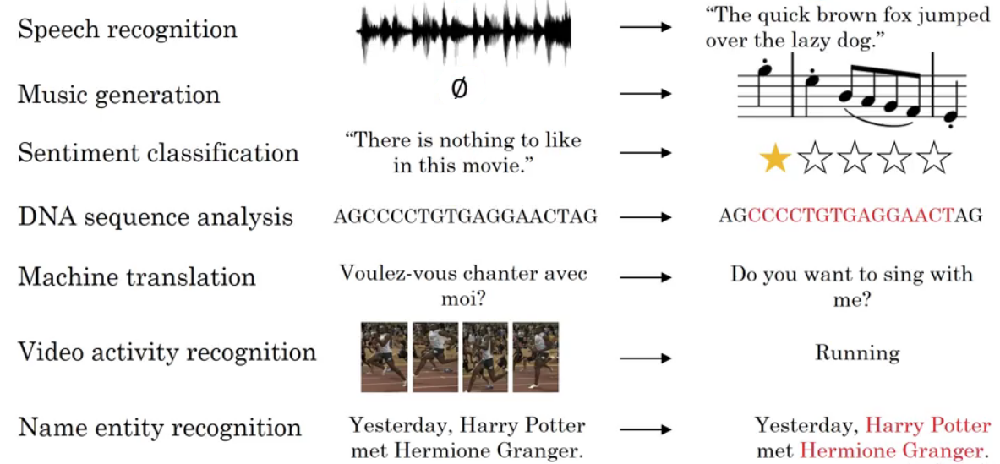

> Sometimes X and Y can have different lengths and sometimes only either X or only the opposite Y is a sequence.

### Notation & Example
**Named-entity recognition**
*Where are the peoples names in a sentence.*

$T_x$: length of the input sequence
$T_y$: length of the output sequence

> can be different

$x^{(i)<t>}$: TIF element in the input sequence for training example $i$
$T_x^{(i)}$: length of the input sequence for training example $i$

> similar for $y$, the output sequence

**NLP**
*How to represent a word?*

- to represent a word in the sentence use a  *vocabulary/dictionary* (list of the most frequent words)
- then use one hot encoding to represent each of these words

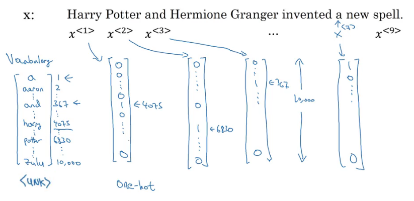

Given this representation for $x$, learn a mapping using a sequence model to then target output $y$.

So $x^{<t>}$ is 10,000 dimensional vector

> *Unknown Word (UNK)*: represent words not in the vocabulary

### Recurrent Neural Network Model (RNN)
**Why not a standard network**
- Input/output can be different lengths in different examples
- Doesn't share features learned across different positions of text
    - we want things learned for one to generalize quickly to other parts

**Recurrent Neural Network**
- Fake zero activation
- Then, at each time-step
    - input $x$ and output $\hat{y}$
    - the recurrent neural network passes on this activation to the next time-step for it to use.
    - *WAX*: the parameters governing the connection from $x^{<1>}$ to the hidden layer, (the same for every time-step)
    - *WAA*: the activation parameters WAA,  (the same for every time-step)
    - *WYA*: output prediction parameters, , (the same for every time-step)

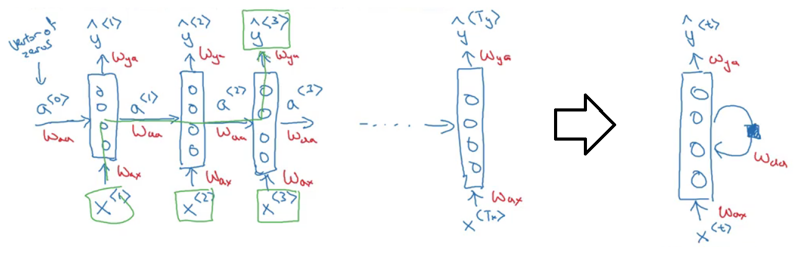

One limitation of this particular neural network structure is that the prediction at a certain time uses inputs or uses information from the inputs earlier in the sequence but not information later in the sequence, i.e uses the past not the future context. Solved in Bi-directional RNN (BRNN)

###### Forward Propagation
*Carry out for propagation going from the left to the right.*

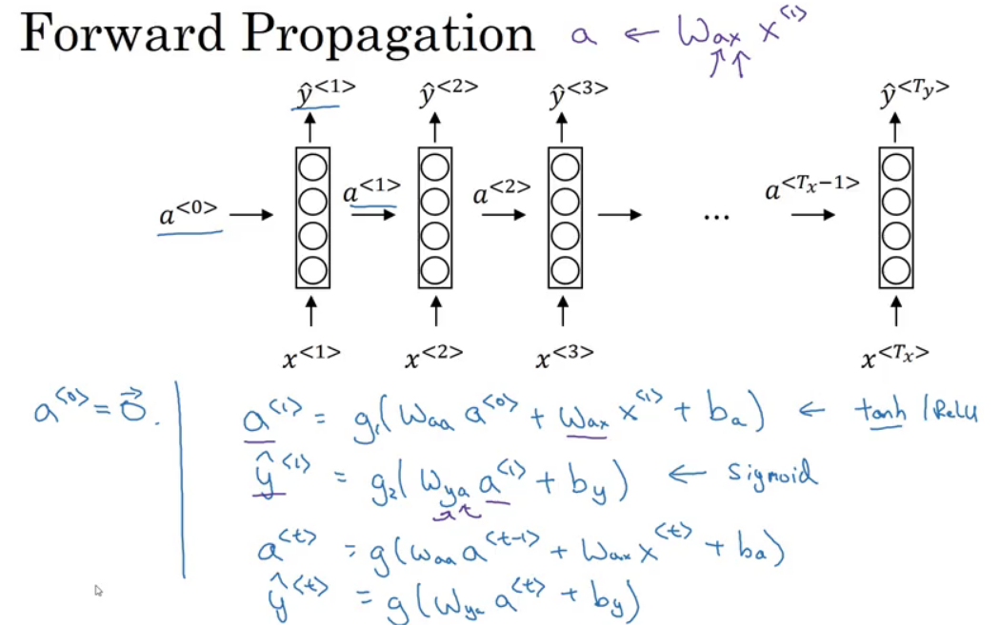
> $\hat{y}$ may have a different activation function than $g()$, depends on what type of output you have.

$$
\hat{y}^{<1>} = g(W_{ya} a^{<1>} + b_y)
$$

- Indices $W_{ya}$
    - first index: compute $\hat{y}$
    - second index: multiplying by $a}$

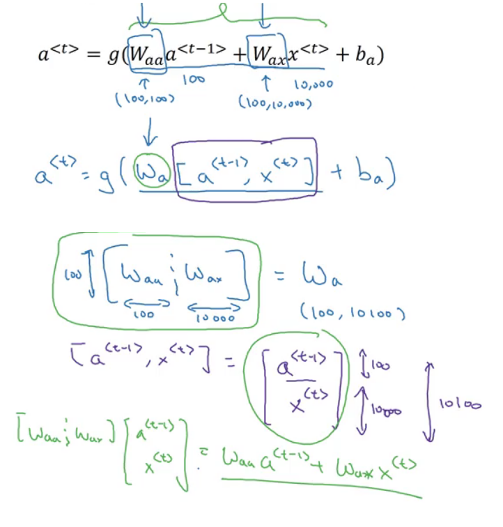

Define $W_a$ as $W_{a a}$ and $W_{a x}$ stacked horizontally. Now:

$$
\hat{y}^{<t>} = g(W_y a^{<t>}+b_y)
$$

> Subscripts in the notation denotes what type of output quantity we're computing.

###### Backpropagation through time
*Calculation goes from right to left*

That phrase really makes it sound like you need a time machine to implement this output; just one of the coolest names for an algorithm.

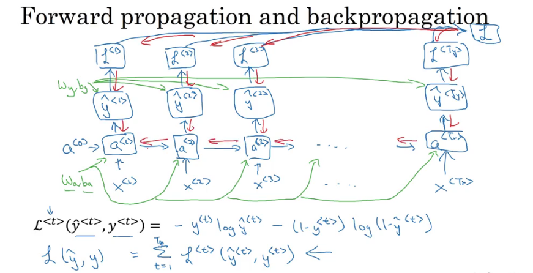

In order to compute backpropagation, we need a loss function. Standard logistic regression loss, also called the cross entropy loss.

**Different types of RNNs**
*$T_x$ and $T_y$ may not always be the same*

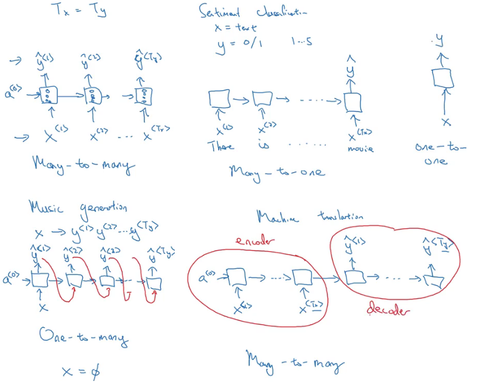
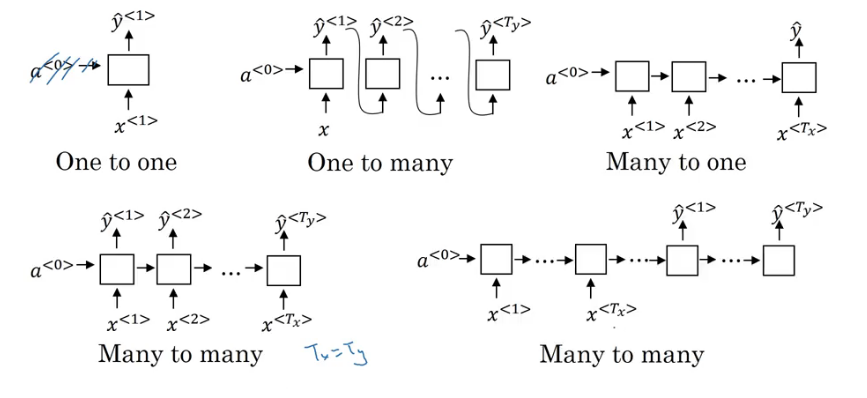

###### RNN architectures
- one-to-one:
    - standard generic neural network, you don't need an RNN for this.
- one-to-many:
    - music generation or sequenced generation example
- many-to-one:
    - sentiment classification. Where you might want to read as input all the text with a movie review and try to figure out that they liked the movie or not
- many-to-many:
    - name entity recognition
    - for applications like machine translation, $T_x$ and $T_y$ no longer have to be the same

**Language model and sequence generation**
*The language model estimates the probability of a particular sequence of words.*

*Corpus*: NLP terminology that means a large body/set of English text/sentences.

*Tokenize*: form a vocabulary

1. Training set: large corpus of English text
1. Tokenize
    - Add an extra token called a EOS. That stands for End Of Sentence that can help you figure out when a sentence ends.
    - Add an extra token called a UNK.
    That stands for unknown words.
1. Map each of these words to one-hot encoding

###### RNN model
*First activation*: soft max that tries to predict what is the probability of any word in the dictionary?

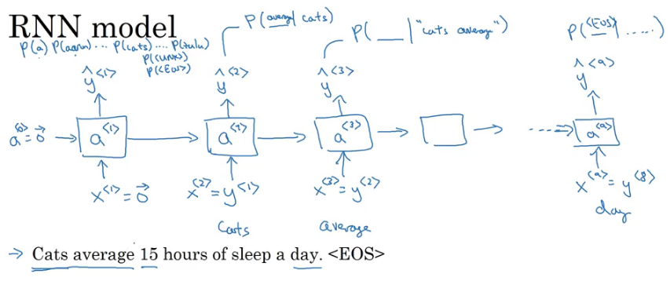

Each step in the RNN will look at some set of preceding words such as given n-words, what is the distribution over the next word?

> RNN learns to predict one word at a time going from left to right.

$L$: the overall loss is as the sum overall time steps of the loss associated with the individual predictions.

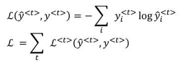

So, given any initial set of words, such as *cats average 15*, it can predict what is the chance of the next word.
$$
P(y^{<1>},y^{<2>},y^{<3>}) = P(y^{<1>}) \ P(y^{<2>} \vert y^{<1>}) \ P(y^{<3>} \vert y^{<1>}, y^{<2>})
$$

### Sampling novel sequences
*Get a sense of what is learned.*

A sequence model, models the chance of any particular sequence of words

$$
P(y^{<1>}, ..., y^{<T_x>})
$$

> Sample from this distribution to generate noble sequences of words.

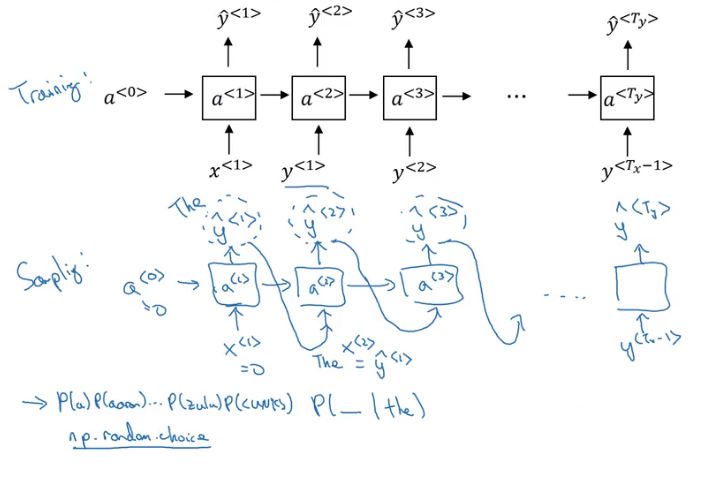

**To sample**
1. What is the first word
    - $\hat{y}^{<1>}$: first time stamp will have some max probability over possible outputs
1. Take $\hat{y}^{<1>}$ that you just sampled and pass that in here as the input to the next timestep
    - Keep sampling until
        - EOS token
        - Until a number of time steps/words

> If UNK token, reject and resample until known word.

###### Character-level language model
The output sequence would be the individual characters in your training data, rather than the individual words in your training data.

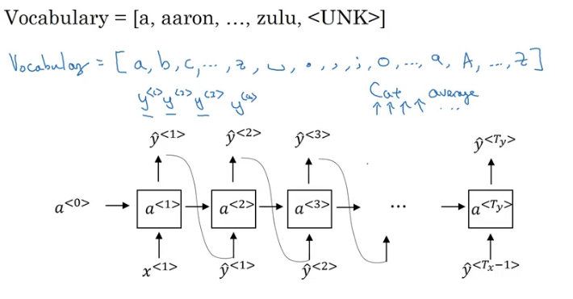

**Pros**
- Don't ever have to worry about unknown word tokens

**Cons**
- End up with much longer sequences
- Much more computationally expensive to train

> Character language models are not as good as word level language models at capturing long range dependencies between how the earlier parts of the sentence also affect the later part of the sentence.

### Vanishing and Exploding radients with RNNs
**Vanishing gradients**
Language can have very long-term dependencies, where a word at is much earlier can affect what needs to come much later in the sentence.

> Basics RNN are not very good at capturing very long-term dependencies, i.e. has many local influences. Apply GRU.

**Exploding gradients**
The derivative, either decreases exponentially or grows exponentially as a function of the number of layers

> Apply gradient clipping

#### Gated Recurrent Unit (GRU)
*Modification of the RNN hidden layer.*

Captures long range connections and helps with the vanishing gradient problem.

$$
a^{<t>} = g(W_a[a^{<t-1>}, x^{<t>}] + b_a)
$$

$g$: activation function applied to
$W_a$: weight parameter times
$a^{<t-1>}$: the activations in the previous time set and
$x^{<t>}$: the current input plus
$b_a$: bias

**RNN Unit of the hidden unit**
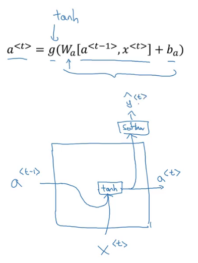

###### Papers
- [On the Properties of Neural Machine Translation: Encoder-Decoder Approaches][1]
- [Empirical Evaluation of Gated Recurrent Neural Networks on Sequence Modeling][2]

[1]:https://arxiv.org/abs/1409.1259
[2]:https://arxiv.org/abs/1412.3555

**Memory Cell**
- $C^{<t>}$

The GRU unit will actually output an activation value:
$$
C^{<t>} = a^{<t>}
$$

At every time-step, we're going to consider overwriting the memory cell with a candidate:
$$
\tilde{C}^{<t>} = \text{tanh}(W_c[\Gamma_r * C^{<t-1>}, x^{<t>}] + b_c)
$$

**Gate**
*_u stands for update gate, _r for relevance.*

The GRU unit would memorize the value of the $C^{<t>}$ all the way until used.

$\sigma$: Sigmoid function
$$
\Gamma_u \in \{0, 1\} \\
\Gamma_u = \sigma(W_u[C^{<t-1>}, x^{<t>}] + b_u) \\
\Gamma_r = \sigma(W_r[C^{<t-1>}, x^{<t>}] + b_r)
$$

$\Gamma_r$: how relevant is $C^{<t-1>}$ to computing the next candidate for $C^{<t>}$.

###### Example

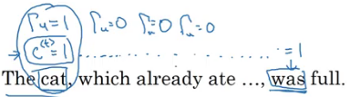

$$
C^{<t>} = \Gamma_u \cdot \tilde{C}^{<t>} + (1 - \Gamma_u)  \cdot C^{<t-1>}
$$

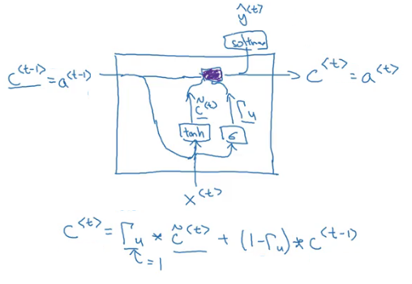

> $\Gamma_u = 0$, don't update, just hang onto the old value.

### Long Short Term Memory (LSTM)
*Even slightly more powerful and more general version of the GRU.*

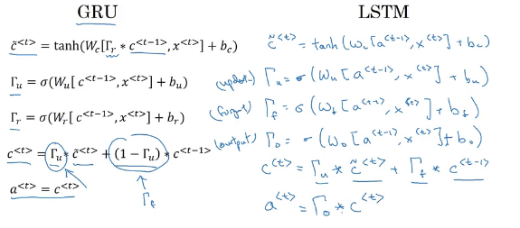

$$
a^{<t>} \neq c^{<t>}
$$

> We now use a separate gates

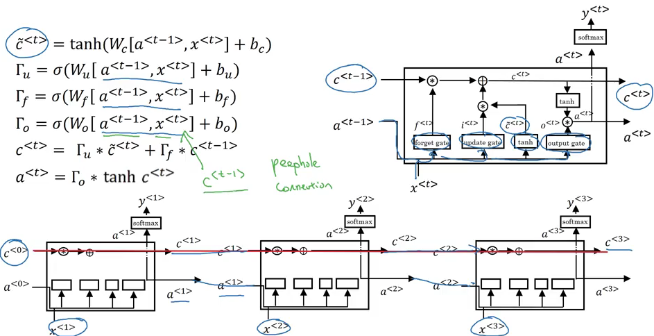

*Peephole connection:*
$c^{<t-1>}$ one is used to affect the gates value as well.

###### Papers
- [Long Short-term Memory](https://www.researchgate.net/publication/13853244_Long_Short-term_Memory)

###### Links
- [Understanding LSTM Networks](http://colah.github.io/posts/2015-08-Understanding-LSTMs/), Christopher Olah

### Bidirectional RNN
*To compute hidden layer activations, take information from both earlier and later in the sequence.*

*Acyclic graph:* the forward prop has part of the computation going from left to right and part of computation going from right to left in this diagram.

> This is not backward this is forward prop.

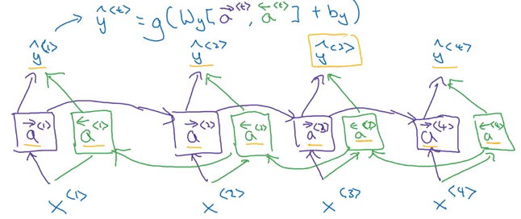

> Add left arrow to denote a backward connection.

The disadvantage of the bidirectional RNN is that you do need the entire sequence of data before you can make predictions anywhere.

### Deep RNNs
*Stack multiple layers of RNNs together.*

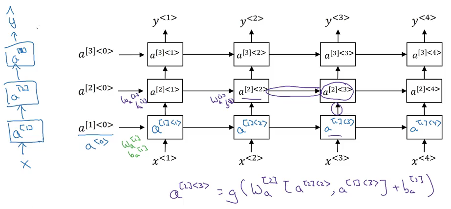

$a^{[l]<t>}$: layer $l$, time $t$
