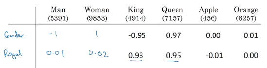
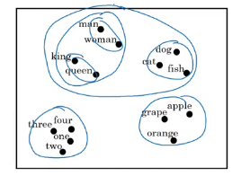
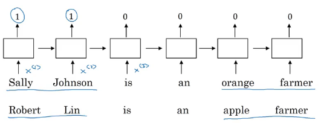
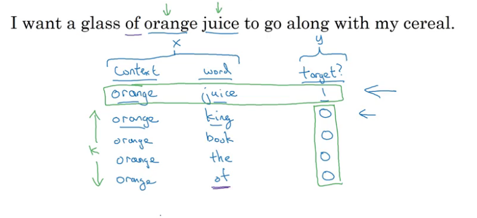
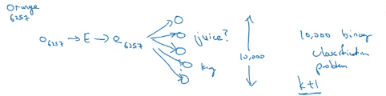
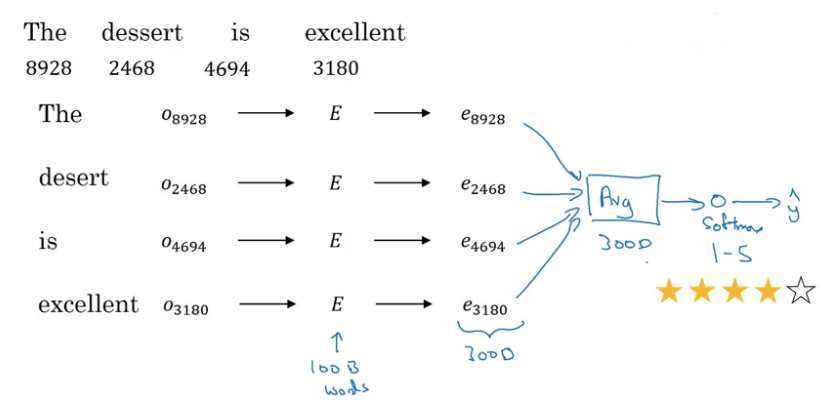
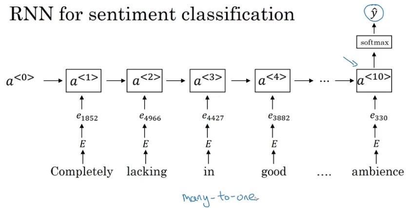
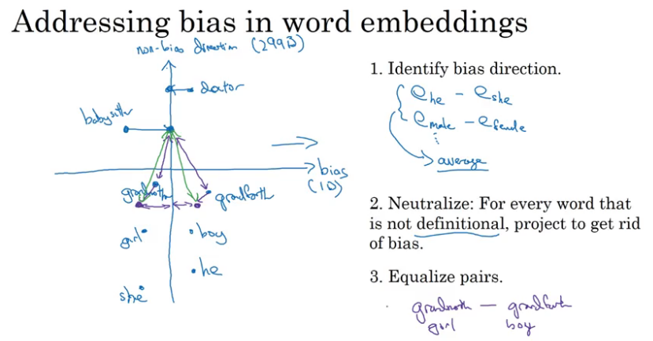

## Natural Language Processing & Word Embeddings
### Introduction to Word Embeddings
*Representation of words to automatically understand analogies.*

**Word Representation**
- One-hot vector
    - has a one in position and zeros elsewhere $O_\text{idx}$
    - one weaknesses is that it treats each word as a thing unto itself, and it doesn't allow an algorithm to easily generalize the cross words.
        - because the any product between any two different one-hot vector is zero.
        - doesn't know that somehow apple and orange are much more similar than king and orange.
- Feature representation
    - Vector to represent one word $e_\text{idx}$
    - Ranging from, what is the size of this? What is the cost?
    
    - difficult to have an easy interpretation, use *t-SNE* to map to a much lower dimensional space
    

**Using word embeddings**
*Named entity recognition example.*

> Use B-RNN

**Transfer learning and word embeddings**
1. Learn word embeddings from large text corpus
    - or download pre-trained embedding online
1. Transfer embedding to new task with smaller training set
1. Optional: Continue to fine-tune the word embeddings with new data
    - only if this task 2 has a pretty big data set.

**Relation to face encoding**
A difference in how we need to use these algorithms in face recognition, where there's unlimited sea of pictures you could see in the future. Versus natural language processing, where there might be just a fixed vocabulary, and everything else like that we'll just declare as an unknown word.

> Learns a fixed encoding/embedding for each of the words in our vocabulary.

#### Properties of word embeddings
*Can also help with analogy reasoning.*

Vector difference between man and woman is very similar to the vector difference between king and queen.

$$
e_\text{man} - e_\text{woman} \approx e_\text{king} - e_\text{queen} \approx
\left[
\begin{array}{c}
-2\\
0\\
0\\
0\\
\end{array}
\right]
$$

**Cosine similarity**
Basically the inner product between $u$ and $v$

$$
\text{sim}(u, v) = \frac{u^Tv}{\Vert u \Vert_2 \Vert v \Vert_2}
$$

If $u$ and $v$ are very similar, their inner product will tend to be large.

#### Embedding matrix
Embedding matrix $\cdot$ One-hot vector = Embedding vector $\rightarrow$ (300, 1)

It's actually not efficient to use a matrix vector multiplication to implement this because if we multiply a whole bunch of things by zeros and so the practice, you would actually use a specialized function to just look up a column of the Matrix E.

### Learning Word Embeddings: Word2vec & GloVe
#### Learning word embeddings
*Learn a neural language model in order to get good word embeddings.*

This is one of the earlier and pretty successful algorithms for learning word embeddings, for learning this matrix E.

Its common to have a fixed historical window. So for example, you might decide that you always want to predict the next word given say the previous four words.

> You can use that crop to perform gradient to sent to maximize the likelihood of your training.

**Other context/target pairs**
- Last words
    - or on the left and right, *CBow*, the continuous backwards model.
 - Nearby 1 word

 > Skip gram

If you really want to build a language model, it's natural to use the last few words as a context.

But if your main goal is really to learn a word embedding, then you can use all of these other contexts and they will result in very meaningful work embeddings as well.

#### Word2Vec
*Simple and efficient way to learn embeddings.*

Context to target errors to create our supervised learning problem, choose at random.

$$
O_c \rightarrow E \rightarrow e_c \rightarrow O_\text{softmax} \rightarrow \hat{y}
$$

$$
e_c = E \cdot O_c
$$

$O_c$: one hot vector for the context words
$E$: embedding matrix
$e_c$: embedding vector for the input context word

Take the $e_c$ vector and feed it to a softmax unit to output $\hat{y}$.

**Model**
*Skip-gram:* trying to predict some words skipping a few words from the left or the right side. To predict what comes little bit before little bit after the context words.

$$
P(t \vert c) = \frac{e^{O_t^Te_c}}{\sum_{j=1}^{10,000}e^{O_j^Te_c}}
$$

$P(t \vert c)$: probability of different target words given the input context word
$\sum_{j=1}^{10,000}$: Sum of all words
$O_t$: parameter associated with output $t$, i.e. chance of a particular word $t$ being the label.

> Left off the biased term to solve mass but we could include that too if we wish.

Loss function: softmax
$$
L(\hat{y}, y) = -\sum_{i=1}^{10,000} y_i \log{\hat{y}_i}
$$
> Target $y$ and $\hat{y}$ as One-hot representation

**How to sample the context c**
Once you sample the context C, the target T can be sampled within, say, a plus minus ten word window of the context C, but how do you choose the context C?

- Sample uniformly, at random, from your training corpus
    - training site to be dominated by these extremely frequently or current words, because then you spend almost all the effort updating $e_c$, for those frequently occurring words. But you want to make sure that you spend some time updating the embedding, even for these less common words.

> Instead there are different heuristics that you could use in order to balance out something from the common words together with the less common words.

**Cons**
*Computation speed for summation.*

The key problem with (skip-gram model) as presented so far is that the softmax step is very expensive to calculate because needing to sum over your entire vocabulary size into the denominator of the soft packs.

Use hierarchical softmax classifier:
  - down the tree until leaf
  - common words tend to be on top, whereas the less common words can be buried much deeper in the tree.

#### Negative Sampling
*Efficient Skip-Gram model.*

**Generate the training set**
1. Pick a context word
1. Pick a target word (look around a window of say, plus-minus ten words) and that is the first row of this table (positive example) with label 1
1. for $k$ times take the same context word and pick random words from the dictionary and label all of those 0 (negative examples)
    - $k$ 5-20 for smaller datasets
    - $k$ 2-5 for larger datasets
1. create a supervised learning problem where the learning algorithm inputs x, inputs this pair of words, and it has to predict the target label to predict the output y
    - So the problem is really given a pair of words like orange and juice, do you think they appear together or at random?

> Notice that all of these are labeled as 0 even though the word of actually appears next to orange as well.

**Supervised Learning Model**
*For learning a mapping from x to y.*
$c$: context word
$t$: target word
$y$: context target pair
$theta_c$: theta vector, for each possible target word.
$e_c$: embedding vector, for each possible context  word

Define a logistic regression model:
$$
P(y=1 \vert c, t) = \sigma(\theta_c^T e_c)
$$

So for every positive examples, you have $k$ negative examples with which to train this logistic regression-like model.

So think of this as having 10,000 binary logistic regression classifiers, but instead of training all 10,000 of them on every iteration, we're only going to train five of them ($k+1$). We're going to train the one responding to the actual target word we got and then train four randomly chosen negative examples. And this is for the case where $k$ is equal to 4.

And this is why the computation cost of this algorithm is much lower because you're updating $k + 1$ binary classification problems. Which is relatively cheap to do on every iteration rather than updating a 10,000 way Softmax classifier.

> On every iteration, you choose four different random negative words with which to train your algorithm on.

With a bunch of binary classification problems, you can very efficiently learn words vectors.

**how do you sample these words to generate the negative examples?**

- sample according to the empirical frequency of words in your corpus
    - very high representation of words like the, of
- sample uniformly at random
    - non-representative of the distribution of English

Use this heuristic value
$$
P(w_i) = \frac{f(w_i)^{3/4}}{\sum_{j=1}^{10,000}f(w_j)^{3/4}}
$$
$f(w_i)$: observed frequency of a particular word in the English language or in your training set corpus.

> sample proportional to the frequency of a word to the power of three-fourths.

#### GloVe word vectors
*Global Vectors for word representation.*

Previously, we were sampling pairs of words, context and target words ($c, t$), by picking two words that appear in close proximity to each other in our text corpus.

$X_{ij}$: number of times that the word $i$ (word $t$) appears in the context of $j$ (word $c$)

> count that captures how often do words $i$ and $j$ appear with each other, or close to each other.

if you're defining context and target in terms of whether or not they appear within plus minus 10 words of each other, then it would be a symmetric relationship, $X_{ij} = X_{ji}$.

> if your context is always the word immediately before the target word, then may not be symmetric.

**Model**
*How related are words $i$ and $j$ as measured by how often they occur with each other?*

Solve for parameters $\theta$ and $e$ using gradient descent to minimize the sum over i equals one to 10,000 sum over j from one to 10,000 of this difference.

$$
\min\sum_{i=1}^{10,000}\sum_{j=1}^{10,000} f(X_{ij}) (\theta^T_i e_j + b_i + b_j - \log X_{ij})
$$

note that:
- $0 \log 0 = 0$, for us.
- from previous notation
    - word $i$ = word $t$
    - word $j$ = word $c$

$f(X_{ij})$: weighting term, which is zero if $X_{ij}$ is zero. This means the sum is sum only over the pairs of words that have co-occurred at least once in that context-target relationship.

> There are various heuristics for choosing this weighting function $f$ that neither or gives these words too much weight nor gives the infrequent words too little weight.

For a given words w, you can have $e$ final to be equal to the embedding that was trained through this gradient descent procedure, plus theta trained through this gradient descent procedure divided by two, because theta and e in this particular formulation play symmetric roles unlike the earlier models.

$$
e_w^{(\text{final})} = \frac{e_w + \theta_w}{2}
$$

> you cannot guarantee that the individual components of the embeddings are interpretable.

### Applications using Word Embeddings
#### Sentiment classification
*Is the task of looking at a piece of text and telling if someone likes or dislikes the thing they're talking about.*

One of the challenges of sentiment classification is you might not have a huge label training set for it.

But with word embeddings, you're able to build good sentiment classifiers even with only modest-size label training sets.

**Model**
1. Look up the one-hot vector $o$
1. Multiply by the embedding matrix $E$
    - which we can learn from a much larger text corpus.
    - if this was trained on a very large data set, like a hundred billion words, then this allows you to take a lot of knowledge even from infrequent words and apply them to your problem, even words that weren't in your labeled training set.
1. Use that to extract out the embedding vector $e$ for the words

**Build a classifier**
Sum or average; this gives you a 300-dimensional feature vector that you then pass to a softmax classifier which then outputs $\hat{y}$, i.e the probabilities of the five possible outcomes from one-star up to five-star.

> One of the problems with this algorithm is it ignores word order, use an RNN.

**RNN for sentiment classification**
Feed the embedding vectors to an RNN to then compute the representation at the last time step that allows you to predict $\hat{y}$

Word embeddings can be trained from a much larger data set, this will do a better job generalizing to maybe even new words now that you'll see in your training set.

#### Debiasing word embeddings
*Free of undesirable forms of bias, such as gender bias, ethnicity bias and so on in word embeddings.*

Word embeddings can reflect gender, ethnicity, age, sexual orientation, and other biases to the text used to train the model.

> I think humanity has made progress in reducing these types of bias. And I think maybe fortunately for AI, I think we actually have better ideas for quickly reducing the bias in AI than for quickly reducing the bias in the human race.

**Addressing bias in word embeddings**
1. Identify bias direction
    - how do you identify the **direction** corresponding to the bias? $\rightarrow$ take a few of these differences and basically average them.
    $$
    e_\text{he} - e_\text{she} \\
    e_\text{male} - e_\text{female}
    $$
1. Neutralize
    - For every word that is not definitional (e.g. mother), project to get rid of bias (e.g. doctor).
        - eliminate their component in the bias direction (horizontal direction)
1. Equalize pairs
    - exactly the same distance, from words that should be gender neutral
    - basically do is move grandmother and grandfather to a pair of points that are equidistant from this axis in the middle. And so the effect of that is that now the distance between babysitter, compared to these two words, will be exactly the same.
    - for pairs of words like this grandmother-grandfather, boy-girl, sorority-fraternity, girlhood-boyhood, sister-brother, niece-nephew, daughter-son, etc.

**What word to neutralize?**
The authors train a classifier to try to figure out what words are definitional, what words should be gender-specific and what words should not be.

> A relatively small subset of words like grandmother-grandfather, girl-boy, sorority-fraternity, and so on that should not be neutralized.

#### Links
**References**:

- The debiasing algorithm is from Bolukbasi et al., 2016, [Man is to Computer Programmer as Woman is to
Homemaker? Debiasing Word Embeddings](https://papers.nips.cc/paper/6228-man-is-to-computer-programmer-as-woman-is-to-homemaker-debiasing-word-embeddings.pdf)
- The GloVe word embeddings were due to Jeffrey Pennington, Richard Socher, and Christopher D. Manning. (https://nlp.stanford.edu/projects/glove/)
