## Sequence models & Attention mechanism
### Various sequence to sequence architectures
**sequence to sequence model**
*Useful for everything from machine translation to speech recognition.*

Encoder-Decoder architecture for machine translation. Where one RNN reads in a sentence and then different one outputs a sentence.

**Machine Tranlation**
$x^{<t>}$: words in the input sequence
$x^{<t>}$: words in the output sequence

1. build the encoder network as an RNN
    - GRU
    - LSTM
1. feed in the input words one word at a time, then the RNN offers a vector that represents the input sentence.
1. build the decoder network as an RNN trained to output the translation one word at a time.

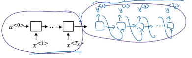

This model simply uses an encoder network, whose job it is to find an encoding of the input French sentence and then use a decoder network to then generate the corresponding English translation.

> e.g. train the model to input a French sentence and output the corresponding English translation.

**Image captioning**
*Input an image and output a caption.*

1. input an image into a convolutional network, maybe a pre-trained AlexNet, and have that learn an encoding or learn a set of features of the input image.
1. get rid of the final Softmax, so the pre-trained AlexNet can give you a 4096-dimensional feature vector of which to represent this picture, **encoder**.
1. take the enconder and feed it to an RNN, whose job it is to generate the caption one word at a time.

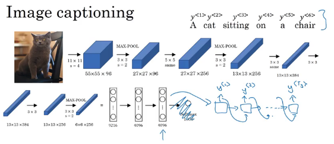

### Picking the most likely sentence
- Language model
    - estimates the probability of a sentence $P(y^{<1>}, ..., y^{<T_y>})$  
- Machine Translation
    - builds a conditional language model
        - notice that the decoded network looks pretty much identical to the language model
        - instead of always starting along with the vector of all zeros, it instead has an encoded network that figures out some representation for the input sentence, and it takes that input sentence and starts off the decoded network.
        - this is really the probability of an English sentence conditions on an input French sentence which is why it is a conditional language model.

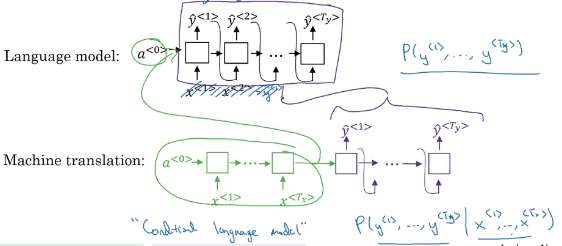

$P(y^{<1>}, ..., y^{<T_y>})$: probability of different English translations
$x$: input French sentence

$$
\text{arg} \max_{y^{<1>}, ..., y^{<T_y>}} P(y^{<1>}, ..., y^{<T_y>} \vert x)
$$

> Do not sample outputs at random. Instead, find the English sentence $y$, that maximizes that conditional probability (beam search).

**Why not a greedy search**
After having picked the first most likely word, you then pick whatever is the second word that seems most likely, etc.

What you would really like is to pick the entire sequence of words $y^{<1>}, ..., y^{<T_y>}$ that maximizes the joint probability of that whole thing.

### Beam Search
Whereas greedy search will pick only the one most likely words and move on, Beam Search instead can consider multiple alternatives (beam with, $B$) at the time.

If the beam width parameter was 10, then we keep track of not just three but of the ten, most likely possible choices for the first word.

1. Run the input French sentence through this encoder network
1. decode the network
    - softmax output overall 10,000 possibilities.
    - Then you would take those 10,000 possible outputs and keep in memory which were the top $B = 3$.
1. for each of these $B$ choices consider what should be the second word
    - probability of the second word $y^{<2>}$ given the input French sentence $x$ and that the first words of the translation has been the word "in" $\hat{y}^{<1>}$
    - So find the pair of the first and second words that is most likely
    $$
    P(y^{<1>}, y^{<2>} \vert x) = P(y^{<1>} \vert x) P(y^{<2>} \vert x, y^{<1>})
    $$
    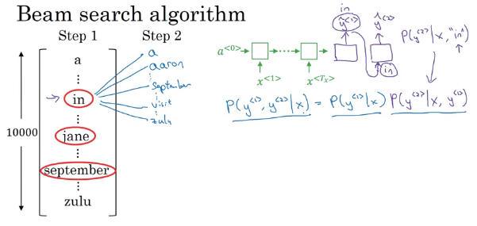

1. So with a cut down, these 30,000 possibilities down to three again down the beam width rounded again
    - that's what Beam's search would memorize away and take on to the next step.

      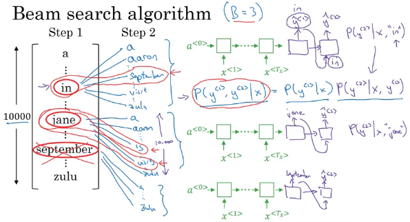
    - So just don't instantiate 30,000 copies of the network or use three copies of the network to very quickly evaluate all 10,000 possible outputs.
1. Keep going
    - until completion
    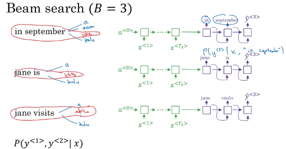

> $B = 1$ equals the greedy search

### Refinements to Beam Search
*Beam search is maximizing the probability.*

These probabilities are all numbers less than 1. And multiplying a lot of numbers less than 1 will result in a tiny, tiny, tiny number, which can result in numerical underflow.

Meaning that it's too small for the floating part representation in your computer to store accurately.

So in practice, instead of maximizing this product, we will take logs (strictly monotonically increasing function) then maximizing log P(y) given x should give you the same result as maximizing P(y) given x.

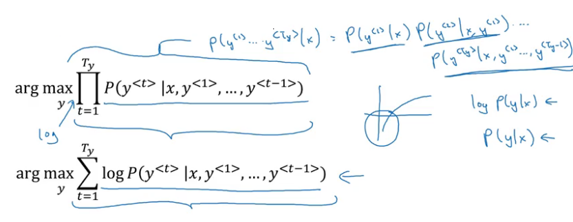

> You keep track of the sum of logs of the probabilities rather than the product of probabilities.

**Length Normalization**
if you have a very long sentence, and if you multiply all the numbers that are less than 1 together, you just tend to end up with a smaller probability.

And so this objective function has an undesirable effect, that maybe it unnaturally tends to prefer very short translations. It tends to prefer very short outputs.

> normalize by the number of words in your translation. Normalized log likelihood objective.

$\alpha$: softer approach
    - $\alpha = 1$ completely normalized
    - $\alpha = 0$ not normalized

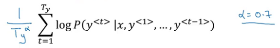

> Hyper parameter that you can tune to try to get the best results.

**How do you choose the beam width B?**
- Large B
    - more possibilities
    - better the sentence you probably find.
    - more computationally expensive
    - slower

Unlike exact search algorithms like BFS (Breadth First Search) or DFS (Depth First Search), Beam Search runs faster but is not guaranteed to find exact maximum for arg $\max_y P(y \vert x)$.

> Beam search runs much faster but does not guarantee to find the exact maximum.

### Error analysis in beam search
*Heuristic search algorithm, so it doesn't always output the most likely sentence.*

$y'$: human output, better in this example
$\hat{y}$: algorithm output

Compute $P(y' \vert x)$ and $P(\hat{y} \vert x)$ and see which of these two is bigger
- Case 1: $P(y' \vert x) \gt P(\hat{y} \vert x)$
    - Beam search chose $\hat{y}$. But $y'$ attains higher $P(y \vert x)$
    - Conclusion: Beam search is at fault
- Case 1: $P(y' \vert x) \leq P(\hat{y} \vert x)$
    - $y'$ is a better translation than $\hat{y}$, but RNN predicted the contrary
    - Conclusion: RNN is at fault

**Error analysis process**
Go through the development set and find the mistakes that the algorithm made in the development set.

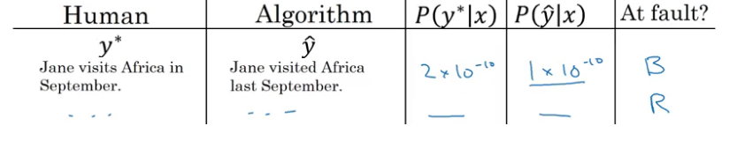

> What fraction of errors are due to beam search versus the RNN model.

if beam search is responsible for a lot of errors, then maybe increase the beam width.

Whereas in contrast, if you find that the RNN model is at fault, then you could do a deeper layer of analysis to try to figure out if you want to add regularization, or get more training data, or try a different network architecture.

### Bleu Score (Bilingual Evaluation Understudy)
*How do you evaluate a machine translation system if there are multiple equally good answers?*

BLEU score is an understudy, could be a substitute for having humans evaluate every output of a machine translation system.

*Bigram:* pairs of words appearing next to each other.

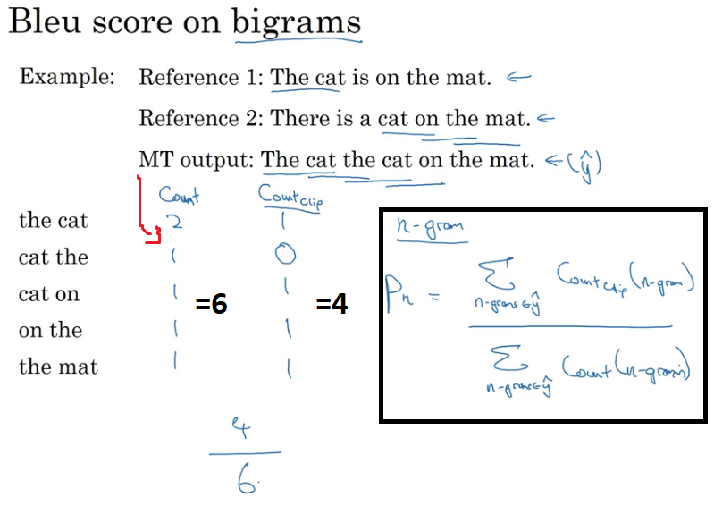

These modified precision scores allows you to measure the degree to which the machine translation output is similar or maybe overlaps with the references.

> To get a modified precision of 1.0, you just have to be exactly equal to one of the references.

**Bleu details**
$p_n$: Bleu/modified precision score on n-grams only.

Combined Bleu score:
$$
BP \exp \bigg(\frac{1}{n}\sum_{n=1}^n p_n\bigg)
$$

- $BP$: Brevity Penalty
    - problem: if you output very short translations, it's easier to get high precision.
    - if MT_output_length $\gt$ reference_output_length
        - $BP = 1$
    - else
        - $BP =$ exp(1-MT_output_length/reference_output_length)

The importance of having a single real number evaluation metric; allows you to try out two ideas, see which one achieves a higher score, and then try to stick with the one that achieved the higher score.

### Attention Model Intuition
*Translates maybe a bit more like humans might, looking at part of the sentence at a time.*

Before, with long sentences, it doesn't do well on because it's just difficult to get in your network to memorize a super long sentence.

In this model there are these attention weights $\alpha$ that tell the model to look only maybe within a local window of the input sentence to pay attention to, when generating a specific output word.

**Intuition**
By using a bidirectional RNN, for each of the five positions into sentence, you can compute a very rich set of features about the words in the sentence and maybe surrounding words in every position.

We're going to use another RMN to generate the English translations.

when you're trying to generate this first output, what part of the input French sentence should you be looking at?

We're going to use *attention weights* $\alpha$
    - $\alpha_{12}$: first output, second input

All attention weights combined will tell us the context $C$ that we should be paying attention to. Then input to the other RNN unit to then try to generate the first words.

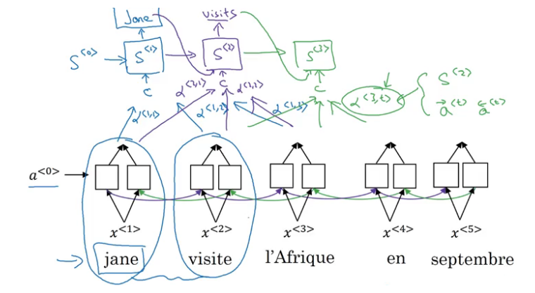

- The attention weights depends on
    - the activations of the bidirectional RNN at time $t$
    - on the state from the previous steps $S$

> Things together will influence, how much you pay attention to a specific word in the input sentence.

### Attention Model
*Allows a neural network to pay attention to only part of an input sentence while it's generating a translation, much like a human translator might.*

Let's assume you have an input sentence and you use a bidirectional LSTM or GRU, or RNN to compute features on every word.

For the forward occurrence, you have
- $\overset{\leftarrow}{a}^{<1>}$: forward: occurrence first time step.
- $\overset{\rightarrow}{a}^{<1>}$: activation backward occurrence, first time step

Represent both of these concatenated:
$$
a^{<t>} = (\overset{\leftarrow}{a}^{<t>}, \overset{\rightarrow}{a}^{<t>})
$$

> Represents a feature vector for time step $t$

To generate the translation, we use a single direction (foward only) RNN with state $S$.

For the first time step:
- generates $y^{<1>}$
- with context input $C$
    - depends on the attention parameters, weighted sum.
    - How much the context would depend on the features/activations we're getting from the different time steps.

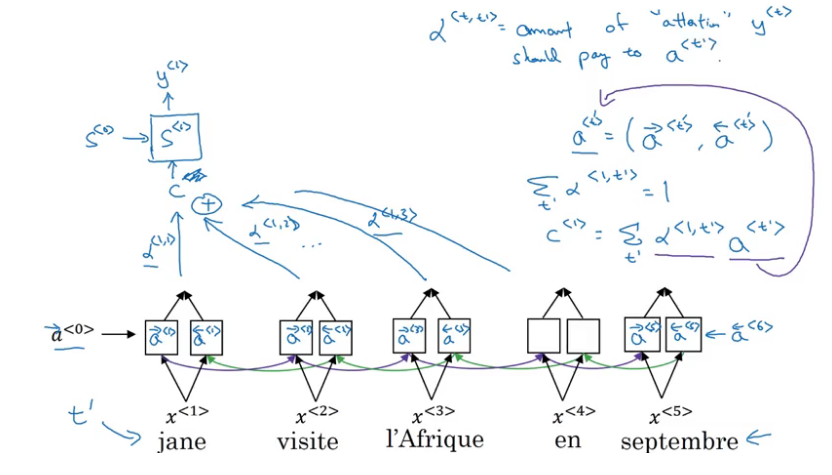

$$
\sum_t \alpha^{<1, t>} = 1 \\
c^{<1>} = \sum_t \alpha^{<1, t>} a^{<t>}
$$

So using these context vectors; this network up here looks like a pretty standard RNN sequence with the context vectors as output and we can just generate the translation one word at a time.

**How to compute attention weights**
$a^{<t, t'>}$: amount of attention $y^{<t>}$ you should pay to $a^{<t'>}$ when trying to generate the $t$ words in the output translation

$$
a^{<t, t'>} = \frac{\exp(e^{<t, t'>})}{\sum_{t'=1}^{T_x}\exp(e^{<t, t'>})}
$$

> essentially a softmax parametrization

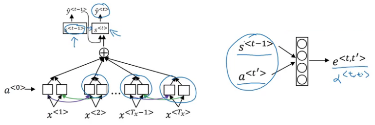

$S^{<t-1>}$: neural network state from the previous time step

> You don't have the current state activation $S^{<t>}$ yet because of context feeds into this so you haven't computed that.

If you're trying to generate $\hat{y}^{<t>}$ then $S^{<t-1>}$ was the hidden state from the previous step that just fell into $S^{<t>}$ and that's one input to very small neural network.

And then $a^{<t'>}$ is the features from time step $t'$ as the other inputs.

> So learns to actually pay attention to the right parts of the input sentence that learns all of this automatically using gradient descent.

### Speech recognition - Audio data
#### Speech recognition
*Sequence-to-sequence models applied to audio data.*

You can build systems that input an audio clip and directly output a transcript.

A common pre-processing step for audio data is to run your raw audio clip and generate a spectrogram.
    - horizontal axis is time
    - vertical axis is frequency

> Intensity of different colors shows the amount of energy. So, how loud is the sound at different frequencies and times.

**CTC cost for speech recognition**
*Connectionist temporal classification.*

The basic rule for the CTC cost function is to collapse repeated characters not separated by *blank*.

**Trigger Word Detection**
Take an audio clip maybe compute spectrogram features and that generates features x1 x2 x3 audio features that you pass through an RNN.

Set the target label to 1 if the trigger word was said.

> Creates a very imbalanced training set; a lot more zeros than ones.

Instead of setting only a single time step to output one you can actually make an output a few ones for several times.
