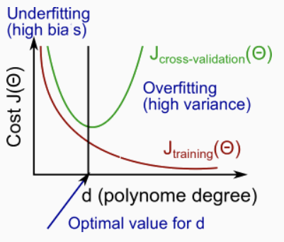
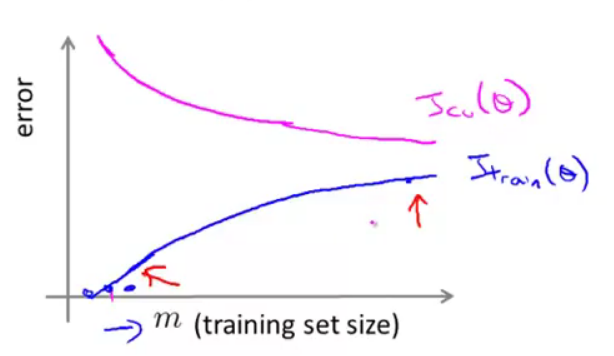
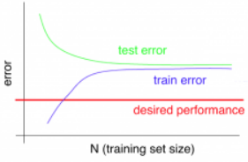
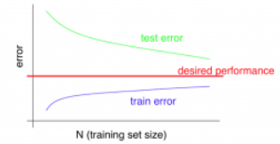
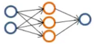
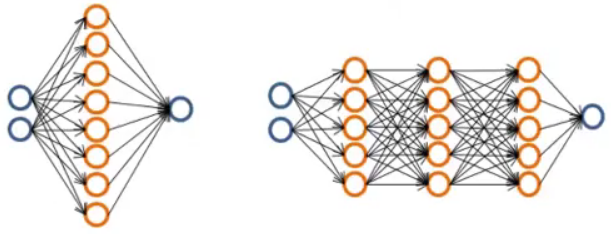
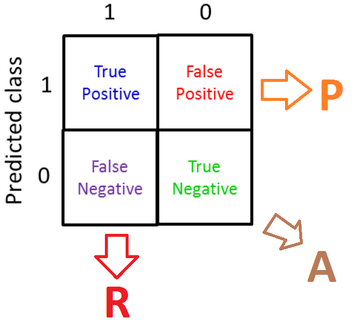
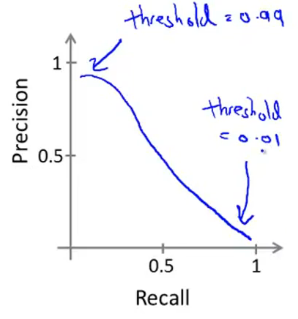

## Advice for Applying Machine Learning
### Evaluating a Learning Algorithm
#### Deciding What to Try Next
*Machine learning diagnostic*:  
* Test to learn what is/isn't working with a learning algorithm, a guideline.

* Cant take time to implement and try, but is time good used.

* Can rule out certain changes of the learning algorithm as being unlikely to improve its performance significantly.

#### Evaluating a Hypothesis
A hypothesis may have a low error for the training examples but still be inaccurate (overfitting). We can split up the data into two sets.

*Train-Split:*  
* Learn $\theta$ and minimize $J_{train}(\Theta)$ using the training set.
* Compute the test set error $J_{test}(\Theta)$.

*The test set error*:
Computes the objective function using test set, the *error*:

* For linear regression:
$$
J_{test}(\Theta) = \dfrac{1}{2m_{test}} \sum_{i=1}^{m_{test}}(h_\Theta(x^{(i)}_{test}) - y^{(i)}_{test})^2
$$
* For classification ~ Misclassification error (aka 0/1 misclassification error):
$$
err(h_\Theta(x),y) = \begin{matrix} 1 & \mbox{if } h_\Theta(x) \geq 0.5\ and\ y = 0\ or\ h_\Theta(x) < 0.5\ and\ y = 1\newline 0 & \mbox otherwise \end{matrix} \\
\text{Test Error} = \dfrac{1}{m_{test}} \sum^{m_{test}}_{i=1} err(h_\Theta(x^{(i)}_{test}), y^{(i)}_{test})
$$
The average gives us proportion of the test data that was misclassified from the binary 0 or 1 error.

#### Model Selection and Train/Validation/Test Sets
A learning algorithm that fits a training set well, does not mean a good hypothesis, it could be overfitting.

The error of your hypothesis as measured on the data set with which you trained the parameters will be lower than the error on any other data set.

We  break down our dataset into three sets:  
* Training set: 60%
* Cross validation set: 20%
* Test set: 20%

We calculate three separate error values:  
1. Optimize the parameters in $\theta$ using the training set for each polynomial degree.
1. Find the polynomial degree $d$ with the least error using the cross validation set.
1. Estimate the generalization error using the test set with $J_{test}(\Theta^{(d)})$, from polynomial with lower error. This way, the degree of the polynomial $d$ has not been trained using the test set.

We might generally expect $J_{CV}(\theta)$ to be lower than $J_{\text{test}}(\theta)$, because an extra parameter ($d$, the degree of the polynomial) has been fit to the cross validation set.

### Bias vs. Variance
#### Diagnosing Bias vs. Variance
*High bias (underfitting):*  
* $J_{train}(\Theta)$ will be high
* $J_{CV}(\Theta) \approx J_{train}(\Theta)$, both high

*High variance (overfitting):*
* $J_{train}(\Theta)$ will be low
* $J_{CV}(\Theta) \gg J_{train}(\Theta)$

The training error will tend to decrease as we increase the degree d of the polynomial.

At the same time, the cross validation error will tend to decrease as we increase d up to a point, and then it will increase as d is increased, forming a convex curve.

#### Regularization and Bias/Variance
* Large $\lambda$, High Bias, underfitting
* Small $\lambda$, High Variance, overfitting
* $J_{\text{train}}$, $J_{\text{cv}}$, $J_{\text{test}}$, are just the average of the square errors, with the extra regularization term

Parameter $\lambda$ to get it *just right*:  
1. Create a list of lambdas
1. Create a set of models with different degrees
1. Iterate through the $\lambda$s and for each go through all the models to learn $\theta$.
1. Compute the cross validation error using the learned $\theta$ (computed with $\lambda$) on the $J_{CV}(\Theta)$ without regularization ($\lambda = 0$).
1. Select the best combo that produces the lowest error on the cross validation set.
1. Apply it on $J_{test}(\Theta)$ to see if it has a good generalization of the problem.

#### Learning Curves
Plot *training error* $J_{\text{train}}(\theta)$ and *cross validation error* $J_{\text{cv}}(\theta)$ vs training set size $m$.  

* Low training set size: causes  $J_{\text{cv}}(\theta)$ to be high and $J_{\text{train}}(\theta)$ to be low.

Learning algorithm has high bias:  

* Large training set size: causes both $J_{\text{cv}}(\theta)$ and $J_{\text{train}}(\theta)$ to be high,
and about the same.
> Getting more training data will not (by itself) help much.

Learning algorithm has high variance:  

* Large training set size: $J_{\text{cv}}(\theta)$ is much larger than $J_{\text{train}}(\theta)$ and the difference between them remains significant.
> Getting more training data is likely to help.

#### Deciding What to Do Next Revisited
Fixes **high bias** (underfitting):
* Try getting additional features/units
* Try adding polynomial features
* Try decreasing $\lambda$

Fixes **high variance** (overfitting):
* Get more training examples
* Try smaller sets of features
* Try increasing $\lambda$

###### Diagnosing Neural Networks
Fit a *small* neural network:  

* few hidden units or few hidden layers.
> More prone to underfitting, few parameters

Fit a *large* neural network:  

* More hidden units or more hidden layers.
* Computationally more expensive
> More prone to overfitting, more parameters. Use regularization $\lambda$.

Using a single hidden layer is a good starting default. You can train your neural network on a number of hidden layers using your cross validation set. You can then select the one that performs best

###### Model Complexity Effects
* Lower-order polynomials (low model complexity) have high bias and low variance. In this case, the model fits poorly consistently.
* Higher-order polynomials (high model complexity) fit the training data extremely well and the test data extremely poorly. These have low bias on the training data, but very high variance.
> In reality, we would want to choose a model somewhere in between, that can generalize well but also fits the data reasonably well.

Models with high bias are not complex enough for the data and tend to underfit, while models with high variance overfit to the training data.

## Machine Learning System Design
### Building a Spam Classifier
#### Prioritizing What to Work On
Given a data set of emails, we construct a vector that represents the most frequently used words in our data set. If a word is to be found in the email, we would assign its respective entry a 1, else if it is not found, that entry would be a 0.

Once we have all our x vectors ready, we train our algorithm and finally, we could use it to classify if an email is a spam or not.

High accuracy, low error:
- Collect lots of data (for example *honeypot* project).
- Develop sophisticated features (for example: using email header data in spam emails).
- Develop algorithms to process your input in different ways (recognizing misspellings in spam).

###### Recommended approach
1. Start with a simple algorithm, implement it quickly, and test it early on your cross validation data.
1. Plot learning curves, training vs. test errors, to decide if more data, features, etc. are necessary.
1. Error analysis: manually examine the errors on examples in the cross validation set and try to spot a trend where most of the errors were made and categorize them based on:
    - What type of email it is.
    - What cues, what additional features would have helped the algorithm classify them correctly.

#### Error Analysis
It is very important to get error results as a single, numerical value. How well your learning algorithm is doing.

*Stemming* is the process of reducing inflected (or sometimes derived) words to their word stem, base or root form, e.g. (univer-se/univer-sity)

### Handling Skewed Data
#### Error Metrics for Skewed Classes
Skewed datasets: When there are much more of one classes (positive/negative) than the other (e.g. spam, cancer)

> Always predicting $y=1/0$ get very high accuracy and low error.

###### Precision and Recall
$y=1$, in presence of rare class that we want to detect

**Accuracy:**
How close to the correct/true result, i.e. n° of samples predicted correctly vs. total n° of samples:
$$
A =
\frac{\text{True Positive} + \text{True Negative}}{\text{Total examples}}
$$

**Precision:**
Of the classified, how many are actually (accounting for predicted):
$$
P =
\frac{\text{True Positive}}{\text{True Positive} + \text{False Positive}}
$$

**Recall:**
What fraction did we detect really (accounting for actual/true):
$$
R =
\frac{\text{True Positive}}{\text{True Positive} + \text{False Negative}}
$$

> A good classifier should have both a high precision and high recall on the cross-validation set.

#### Trading Off Precision and Recall
Predict 1 if $h_\theta(x) \geq$ threshold

* Predict only if very confident, threshold = 0.7
> Higher precision, lower recall

* Avoid missing too many cases of cancer (false negatives), threshold = 0.3
> Higher recall, lower precision

###### $F_1$ Score (F score)
Single metric. Measure precision (P) and recall (R) on the **cross validation set** and choose the value of threshold which maximizes:
$$
F_1 = 2 \frac{PR}{P + R}
$$

Cases:
* P = 0 or R = 0, F-score = 0
* P = 1 and R = 1, F-score = 1

### Using Large Data Sets
#### Data For Machine Learning
*Large data rationale:*
Use a learning algorithm to fix very complex functions:
* Logistic/Linear regression with many features
* Neural Network with many hidden units

$J_{\text{train}}(\theta)$ will be small.

> Low bias algorithm.

* Use a very large training set (Unlikely to overfit)

$J_{\text{train}}(\theta) \approx J_{\text{test}}(\theta)$

> Low variance algorithm.

The large training set is **unlikely** to help when the features $X$ do not contain enough information to predict accurately.
