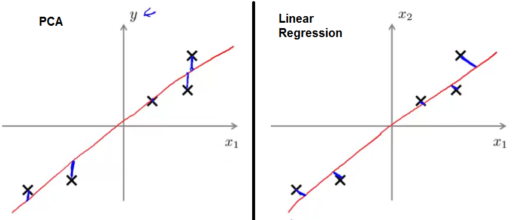

## Unsupervised Learning
### Clustering
#### Unsupervised Learning: Introduction
In unsupervised Learning:
- The training set is of the form $\{x^{(1)},x^{(2)},\dots,x^{(m)}\}$ without labels $y^{(i)}$.
- You are given unlabeled data and asked to find a structure.

> Clustering is one example.

#### K-Means Algorithm
The K-means algorithm is a method to automatically cluster similar data examples together.

Input:
- $K$, number of cluster to find in the data.
- Training set $\{x^{(1)},x^{(2)},\dots,x^{(m)}\}$

> convention: drop $x_0 = 1$

Process:
1. Randomly initialize $K$ cluster centroids $\mu_1$, ..., $\mu_K$.
1. Repeat
    - Cluster assignment, for $i = 1$ to $m$ assign $c^{(i)} =$ index (1 to $K$) of cluster centroid closest to $x^{(i)}$.
    $$
    \min_k \Vert x^{(i)} - \mu_k \Vert^2
    $$
    - Move centroid, for $k = 1$ to $K$ assign $\mu_k$ to the average (mean) of points previously assigned to cluster $k$.

>

> Iterative procedure that starts by guessing the initial centroids, and then refines this guess by repeatedly assigning examples to their closest centroids and then recomputing the centroids based on the assignments.

It's common to delete a cluster with no points between iterations.

#### Optimization Objective
- $c^{(i)}:$ index of cluster $1, ..., K$ to which example $x^{(i)}$ is currently assigned, **index**.
- $\mu_k:$ cluster centroid $k$
- $\mu_{c^{(i)}}:$ cluster to which example $x^{(i)}$ is currently assigned, **value**.

Optimization Objective/Distortion of the k-means:
$$
\min_{c^{(1)}, ..., c^{(m)},{\mu_1,...,\mu_K}}
\\
J(c^{(1)}, \ldots, c^{(m)}, \mu_1,\ldots,\mu_k)
= \frac{1}{m} \sum_{i=1}^m \Vert x^{(i)} - \mu_{c{(i)}} \Vert^2
$$

#### Random initialization
Note that the converged solution may not always be ideal and depends on the initial setting of the centroids.

Therefore, in practice the K-means algorithm is usually run a few times with different random initializations. One way to choose between these different solutions from different random initializations is to choose the one with the lowest cost function value (distortion).

Set $\mu_1$, ..., $\mu_K$ to distinct randomly picked training examples.

> Should have $K \lt m$

Can get stuck on local optimal.

> Random initialize multiple times and compare.

#### Choosing the number of clusters
Manually.

> Evaluate k-means based on a metric for how well it performs for a later purpose.

## Dimensionality Reduction
### Motivation
#### Data Compression
- Less computer memory or disk space.
- Speed up our learning algorithms.

Reduction to a dataset of $m$ examples $\{x^{(1)}, x^{(2)}, \dots, x^{(m)}\}$ where $x^{(i)}\in\mathbb{R}^n$. As a result we will get a lower dimensional dataset $\{z^{(1)}, z^{(2)},\dots, z^{(m)}\}$ of $m$ examples where $z^{(i)} \in \mathbb{R}^k$ is k-dimensional, for some value of $k$ and $k\leq n$.

#### Visualization
For a lot of machine learning applications, it really helps us to develop effective learning algorithms, if we can understand our data better.

> Applying dimension reduction to k=2 or k=3, since we can plot 2D or 3D data and are unable to visualize higher dimensional data.

### Principal Component Analysis (PCA)
#### Problem Formulation
Try to find a direction/surface/vector/line onto which to project the data so as to minimize to square projection error.

> i.e. minimize the squared distance between the point and the location where it gets projected.

###### PCA is not linear regression
In linear regression:
- All the values of x are used to predict y.
- Minimizing would be the squared magnitude of these blue vertical lines.

Whereas in PCA:
- There is no special variable y that we're trying to predict.
- Minimizing the magnitude of these angled blue lines, the shortest orthogonal distances between the point x and this red line.



#### Algorithm
Always perform **Preprocessing**:

*Feature scaling/mean normalization:*
$$
\mu_j = \frac{1}{m} \sum^{m}_{i=1} x_j^{(i)}
$$
Replace each training sample ($x^{(1)}$, ..., $x^{(m)}$) with: $x_j - \mu_j$.

And scale features to have comparable range of values, i.e. dividing by (max-min) or the standard deviation, so:
$$
x_j^{(i)} = \frac{x_j^{(i)} - \mu_j}{s_j}
$$

###### Principal Component Analysis (PCA) algorithm
Reduce data from $n$-dimensions to $k$-dimensions.

Compute the *covariance matrix*:
$$
\Sigma = \frac{1}{m} \sum^{n}_{i=1} x^{(i)} (x^{(i)})^T = \frac{1}{m} X^T X
$$

Compute *eigenvectors* of matrix $\Sigma \in \mathbb{R}^{n \times n}$ in octave:
```octave
[U, S, V] = svd(Sigma);
Ureduce = U(:, 1:k);
z = Ureduce' * x;
```

> Singular Value Decomposition done to $x \in \mathbb{R}^n$ without $x_0 = 1$.


In PCA we obtain $z\in\mathbb{R}^k$ from $x\in\mathbb{R}^n$ as follows:
$$
z = \begin{bmatrix}\vert & \vert & & \vert \\ u^{(1)} & u^{(2)} & \dots & u^{(k)}\\ \vert & \vert & & \vert \end{bmatrix}^T x=\begin{bmatrix} \text{---} & (u^{(1)})^T & \mbox{---}\\\text{---} & (u^{(2)})^T & \mbox{---}\\ & \vdots & \\ \text{---} & (u^{(k)})^T & \mbox{---}\end{bmatrix}x \\
z_j = (u^{(j)})^T x
$$

### Applying PCA
#### Reconstruction form Compressed Representation
$$
z \in \mathbb{R}^1 \rightarrow x \in \mathbb{R}^2 \\
X_{\text{approx} = U_{\text{reduce}}} z
$$

> Back to the original data approximately.

*Fraction/percent of variance retained*:
$$
\frac{\sum_{i=1}^kS_{ii}}{\sum_{i=1}^nS_{ii}}
$$

if $n = k$:
- $U_\text{reduce}$ will by $n \times n$
- $x_\text{approx} = x$ for every $x$
- The percentage of variance retained will be 100%

#### Choosing the Number of Principal Components (k)
PCA tries to minimize the *Average squared projection error:*
$$
\frac{1}{m} \sum^{m}_{i=1} \Vert x^{(i)} - x_\text{approx}^{(i)} \Vert^2
$$

*Total variation in the data:*
$$
\frac{1}{m} \sum^{m}_{i=1} \Vert x^{(i)} \Vert^2
$$
> How far are the training examples from the origin.

**Choose $k$**, to be smallest value so that 99% of variance is retained:
$$
\frac{\frac{1}{m} \sum^{m}_{i=1} \Vert x^{(i)} - x_\text{approx}^{(i)} \Vert^2}{\frac{1}{m} \sum^{m}_{i=1} \Vert x^{(i)} \Vert^2} \leq 0.01 \\
\frac{\sum_{i=1}^kS_{ii}}{\sum_{i=1}^nS_{ii}} \geq 0.99
$$
Where $S_{ii}$ is the diagonal matrix obtained from SVD.

#### Advice for Applying PCA
*Supervised learning speedup:*
- Original: $(x^{(1)}, y^{(1)})$, ..., $(x^{(m)}, y^{(m)})$
- Mapped: $(z^{(1)}, y^{(1)})$, ..., $(z^{(m)}, y^{(m)})$

Map the original unlabeled training set $x^{(1)}, ..., x^{(m)}$ to obtain a new training set $z^{(1)}, ..., z^{(m)}$ and feed this to the hypothesis $h_\theta(z)$.

> This mapping can be applied to the cross-validation and test sets.

###### Recommended applications of PCA
- Compression:
    - Reduce memory/disk needed to store data.
    - Speed up learning algorithm.
> Choose $k$ by percentage of variance retain

- Visualization
> Choose $k = 2$ or $k = 3$.

In practice, if you were using a learning algorithm such as linear regression or perhaps neural networks, you could now use the projected data instead of the original data. By using the projected data, you can train your model faster as there are less dimensions in the input.

###### Bad use of PCA
The idea is that, reducing to fewer features is less likely to overfit, but PCA doesn't make use of the labels and is more likely to throw away valuable information.

> Use regularization instead.
