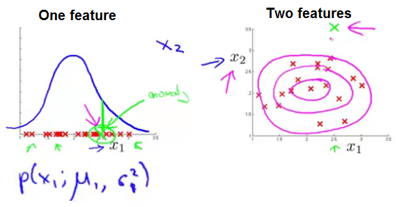
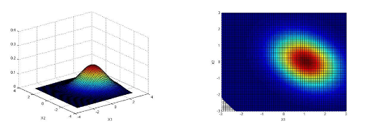
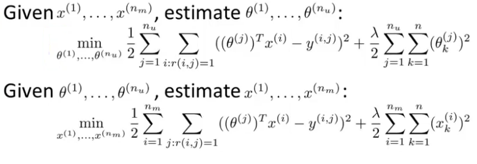
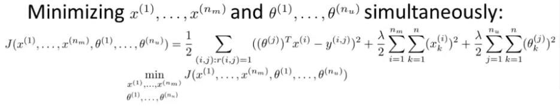
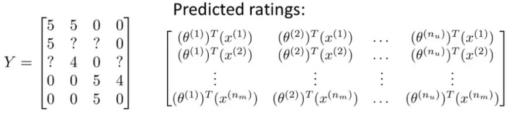
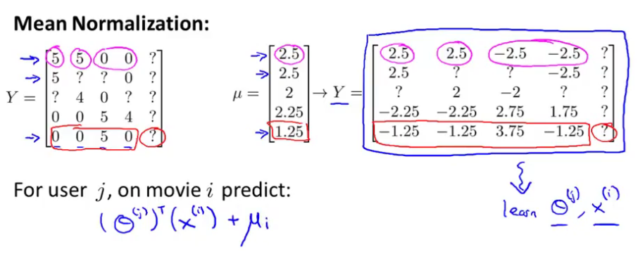

## Anomaly Detection
### Density Estimation
#### Problem Motivation
More formally in the anomaly detection problem, we're give some data sets, x1 through Xm of examples, and we usually assume that these end examples are normal or non-anomalous examples, and we want an algorithm to tell us if some new example x-test is anomalous.

Having built a model of the probability of x; if p of x-test is less than some epsilon then we flag this as an anomaly.

Process:
- $x^{(i)} =$ features
- Model $p(x)$ from data
- Identify anomalies, i.e. $p(x) \lt \epsilon$

#### Gaussian Probability Distribution
$x$ is distributted Gaussian with mean $\mu$ and variance $\sigma^2$

$$
X \sim \mathcal{N}(\mu,\,\sigma^{2}) \\
p(x; \mu, \sigma^2) = \frac{1}{\sqrt{2\pi}\sigma}\exp\left(-\frac{(x-\mu)^2}{2\sigma^2}\right)
$$

#### Algorithm
Training set: $\{x^{(1)}, \dots, x^{(m)}\}$
$$
p(x) = \prod_{j=1}^{n} p(x_j;\mu_j, \sigma_j^2)
$$
Estimation for $\mu_j\in\mathbb{R},\sigma_j^2\in\mathbb{R}$:
$$
\displaystyle \mu_j = \frac{1}{m}\sum_{i=1}^m x_j^{(i)} \\ \sigma_j^2 = \frac{1}{m}\sum_{i=1}^m(x_j^{(i)} - \mu_j)^2
$$

1. Choose features $x_i$ that you think might be indicative of anomalous examples.
1. Fit parameters $\mu_1$, ..., $\mu_n$, $\sigma_1^2$, ..., $\sigma_n^2$
1. compute
$$
p(x) = \frac{1}{\sqrt{2\pi}\sigma_j}\exp\left(-\frac{(x_j-\mu_j)^2}{2\sigma_j^2}\right)
$$
1. Identity anomaly if $p(x) \lt \epsilon$

### Building an Anomaly Detection System
#### Developing and Evaluating an Anomaly Detection System
##### Real-number evaluation
When developing a learning algorithm (choosing features), making decisions is much easier if we have a way of evaluating our learning algorithm.

Assume we have some labeled data, of anomalous and non-anomalous examples, i.e. $y=0$ if normal and $y=1$ if anomalous:2

- Training set: $\{x^{(1)}$, ..., $x^{(m)}\}$
  - Assume normal/not anomalous examples $y=0$.
  - Compute $(\mu_1, \sigma_1^2)$, ..., $(\mu_n, \sigma_n^2)$
  - Use to fit $p(x) = p(x_1; \mu_1, \sigma_1^2)$ ... $p(x_n; \mu_n, \sigma_n^2)$

- Cross validation set: $(x_{\text{CV}}^{(1)}, y_{\text{CV}}^{(1)})$, ..., $(x_{\text{CV}}^{(m)}, y_{\text{CV}}^{(m)})$

- Test set: $(x_{\text{test}}^{(1)}, y_{\text{test}}^{(1)})$, ..., $(x_{\text{test}}^{(m)}, y_{\text{test}}^{(m)})$

> Use only normal $(y=0)$ in the training set and split anomalous $(y=1)$ between CV and test sets equally.

##### Algorithm Evaluation
1. Fit model $p(x)$ on training set $\{x^{(1)}$, ..., $x^{(m)}\}$ (normal examples)
1. On CV/test example $x$, predict:
$$
y = \left\{\begin{array}{ll} 1 & \mbox{if } p(x) \leq \epsilon \text{ (anomaly)} \\ 0 & \mbox{if } p(x) > \epsilon \text{ (normal)} \end{array}\right.
$$

Possible evaluation metrics:
- True Positive, False Positive, False Negative, True Negative.
- Precision/Recall
- $F_1$-score

> Can also use cross validation set to choose the parameter $\epsilon$.

#### Anomaly Detection vs. Supervised Learning
**Anomaly detection:**
- Small number of positive examples $(y=1)$ and large number of negative examples $(y=0)$
- Many different *types* of anomalies; future anomalies differ from the ones used. Model the negative examples instead of the positive examples.
- Examples:
    - Fraud detection (strange behavior)
    - Manufactoring (unusual performance)
    - Monitoring machines in data center

**Supervised learning:**
- Large number of positive and negative examples.
- Enough positive examples and future ones are likely to be similar.
- Examples:
    - Email spam classification
    - Weather prediction
    - Cancer classification

#### Choosing What Features to Use
Choose features that might take on unusually large or small values in the event of an anomaly.

Example:
- $x_1$ = Memory use of computer
- $x_2$ = Number of disk accesses/sec
- $x_3$ = CPU load
- $x_4$ = Network traffic

Data more like Gaussian:
```matlab
hist(log(x), 50)
xNew = log(x)
```
##### Error Analysis
Want:
- $p(x)$ large for normal examples
- $p(x)$ small for anomalous examples

Common problem:
- $p(x)$ is comparable for normal and anomalous examples

Look at the anomaly that the algorithm is failing to flag, and see if that inspires you to create some new feature, so that with this new feature it becomes easier to distinguish the anomalies from your good examples.



> More features to distinguish between the normal and the anomalous.

### Multivariate Gaussian Distribution
Don't model $p(x_1)$,$p(x_2)$, ..., etc. separately but model $p(x)$ all in one go.

$$
p(x;\mu,\Sigma) = \frac{1}{(2\pi)^{\frac{n}{2}} \vert \Sigma \vert^{\frac{1}{2}}}\exp\left(-\frac{1}{2} (x-\mu)^T \Sigma^{-1} (x-\mu)\right)
$$

$\vert \Sigma \vert$: determinant of $\Sigma$

Parameters:
- $\mu \in \mathbb{R}^n$, vector
$$
\displaystyle \mu = \frac{1}{m}\sum_{i=1}^m x^{(i)}
$$

- $\Sigma \in \mathbb{R}^{n \times n}$, matrix.
$$
\Sigma = \frac{1}{m}\sum_{i=1}^m (x^{(i)} - \mu) (x^{(i)} - \mu)^T
$$

Sigma is the covariance matrix and so it measures the variance, range of values or the variability of the features $x \in \mathbb{R}^n$.

- $\mu$: Shift the centers
- Diagonal: Variance, shrink/increase sigma so the width diminishes/increases and the height increases/decreases a bit (area under the surface is equal to 1).
- Off diagonal: positively/negatively correlated.

Example:  

$$
\mu=\begin{bmatrix}1\\0\end{bmatrix},\ \Sigma=\begin{bmatrix}1 & -0.3 \\ -0.3 & 1\end{bmatrix}
$$

#### Anomaly Detection using the Multivariate Gaussian Distribution
1. Fit the model by setting $\mu$ and $\Sigma$
1. Compute $p(x)$ given a new example $x$
1. Flag an anomaly if $p(x) \lt \epsilon$

New model (Multivariate) is equal to the original if the covariance matrix $\Sigma$ has only 0 elements off the diagonals, so you aren't allowed to model the correlations between the different features. Where the contours of $p(x;\mu,\Sigma)$ are axis-aligned.

##### Original vs Multivariate
Original:
- Manually create features to capture anomalies where $x_1$, $x_2$ take unusual combinations of values.
- Scales better to large $n$, computationally cheaper.
- Ok even if $m$ (training set size) is small.
$$
p(x_1;\mu_1,\sigma_1^2)\times\dots\times p(x_n;\mu_n,\sigma_n^2)
$$

Multivariate:
- Automatically captures correlations between features.
- computationally more expensive.
- Must have $m \gt n$ or else $\Sigma$ is non-invertible.
$$
p(x;\mu,\Sigma)
$$

> Also $\Sigma$ is non-invertible with redundant features (linearly dependent).

## Recommender Systems
### Predicting Movie Ratings
#### Problem Formulation
Algorithms that can try to automatically learn a good set of features for you.

Notation:
$n_u:$ n° users  
$n_m:$ n° movies  
$r(i, j) = 1$ if user $j$ has rated movie $i$ (0 otherwise)  
$y^{(i, j)}:$ value of the rating given by user $j$ to movie $i$ (if rated)

#### Content Based Recommendations
For each user $j$, learn a parameter $\theta^{(j)} \in \mathbb{R}^{n+1}$. Predict user $j$ as rating movie $i$ with $(\theta^{(j)})^T x^{(i)}$ stars.

Parameters:
$\theta^{(j)}$: parameter vector for user $j$  
$x^{(i)}$: feature vector for movie $i$
For user $j$, movie $i$, predicted rating: $(\theta^{(j)})^T x^{(i)}$

> Essentially the same as linear regression

### Collaborative Filtering
*Feature learning:*
Algorithm that can start to learn for itself what features to use.

Consider the following movie ratings:
|         | User 1 | User 2 | User 3 | (romance) |
|---------|--------|--------|--------|-----------|
| Movie 1 | 0      | 1.5    | 2.5    | ?         |

Suppose that:
$$
\theta^{(1)} = \begin{bmatrix}0\\0\end{bmatrix},\ \theta^{(2)} = \begin{bmatrix}0\\3\end{bmatrix},\ \theta^{(3)} = \begin{bmatrix}0\\5\end{bmatrix}
$$

Value for $x_1^{(1)}$ denoted ? is 0.5

##### Gradient descent to minimize
$$
\displaystyle \min_{x^{(1)},\dots,x^{(n_m)}} \frac{1}{2}\sum_{i=1}^{n_m}\sum_{j:r(i,j)=1}\left((\theta^{(j)})^T x^{(i)}-y^{(i,j)}\right)^2 + \frac{\lambda}{2}\sum_{i=1}^{n_m}\sum_{k=1}^n(x_k^{(i)})^2
$$

Gradient descent update rule for $i\neq 0$
$$
x_k^{(i)} := x_k^{(i)} - \alpha\left(\sum_{j:r(i,j)=1}\left((\theta^{(j)})^T(x^{(i)}) - y^{(i,j)}\right)\theta_k^{(j)}+ \lambda x_k^{(i)}\right)
$$

##### Collaborative Filtering Review
- Given $x^{(1)}$, ..., $x^{(n_m)}$ and movie ratings, we can estimate $\theta^{(1)}$, ..., $\theta^{(n_u)}$

- Given $\theta^{(1)}$, ..., $\theta^{(n_u)}$ we can estimate $x^{{1}}$, ..., $x^{(n_m)}$



Every user is helping the algorithm a little bit to learn better features
and then these features can be used by the system to make better movie predictions for everyone else.

#### Collaborative Filtering Algorithm
Cost as a function of both $x$ and $\theta$ and minimize simultaneously  



Process:
1. Initialize $x^{(1)}, ..., x^{(n_m)}, \theta^{(1)}, ..., \theta^{(n_u)}$ to small random values; this serves as symmetry braking so the algorithm learns features $x^{(1)}, \dots, x^{(n_m)}$ that are different from each other.
1. Minimize $J(x^{(1)}, ..., x^{(n_m)}, \theta^{(1)}, ..., \theta^{(n_u)})$ using gradiente descent (or an advanced optimization algorithm) for every $j=1, ..., n_u, i=1, ..., n_m$
$$
x_k^{(i)} := x_k^{(i)} - \alpha\left(\sum_{j:r(i,j)=1}\left((\theta^{(j)})^T(x^{(i)}) - y^{(i,j)}\right)\theta_k^{(j)}+ \lambda x_k^{(i)}\right)
$$
$$
\theta_k^{(j)} := \theta_k^{(j)} - \alpha\left(\sum_{i:r(i,j)=1}\left((\theta^{(j)})^T(x^{(i)}) - y^{(i,j)}\right)x_k^{(i)}+ \lambda \theta_k^{(j)}\right)
$$
1. For a user with parameters $\theta$ and a movie with (learned) features $x$, predict a start rating of
$$
(\theta^{(j)})^T(x^{(i)})
$$

> $x \in \mathbb{R}^n$ no $x_0 = 1$
> $\theta \in \mathbb{R}^n$ no $\theta_0 = 1$

### Low Rank Matrix Factorization
#### Vectorization: Low Rank Matrix Factorization
The rating that the column user $j$ will give to row movie $i$.  
$$
\displaystyle \begin{bmatrix} (x^{(1)})^T(\theta^{(1)}) & \ldots & (x^{(1)})^T(\theta^{(n_u)})\\ \vdots & \ddots & \vdots \\ (x^{(n_m)})^T(\theta^{(1)}) & \ldots & (x^{(n_m)})^T(\theta^{(n_u)})\end{bmatrix}
$$
  

Let:
$$
X = \begin{bmatrix} - & (x^{(1)})^T & - \\ & \vdots & \\ - & (x^{(n_m)} & - \end{bmatrix},\ \Theta = \begin{bmatrix} - & (\theta^{(1)})^T & - \\ & \vdots & \\ - & (\theta^{(n_u)} & - \end{bmatrix}
$$

We can write:
$$
X\Theta^T
$$

##### Finding related movies
Movie $j$ is related to movie $i$:
Find the smallest distance:
$$
\Vert x^{(i)} - x^{(j)} \Vert
$$

#### Implementational Detail: Mean Normalization
Mean normalization as a sort of pre-processing step for collaborative filtering.

Normalizing each movie to have an average rating of zero, so subtract the mean movie rating, ignoring the unrated, this is $\mu_i$

- Training data: subtracted off all the means.
- Make predictions: add back the means $\mu_i$.  



### Review
$$
m = \sum_{i=1}^{n_m} \sum_{j=1}^{n_u} r(i,j)
$$

$$
\frac{1}{m} \sum_{(i,j):r(i,j)=1} ((\theta^{(j)})^T x^{(i)} - y^{(i,j)}  )^2
$$

$$
\frac{1}{m} \sum_{i=1}^{n_m} \sum_{j:r(i,j)=1} ( \sum_{k=1}^n (\theta^{(j)})_k x^{(i)}_k - y^{(i,j)}  )^2
$$

The cost function for the content-based recommendation system is:
$$
J(\theta) = \frac{1}{2} \sum_{j=1}^{n_u} \sum_{i:r(i,j) =1} \left( (\theta^{(j)})^Tx^{(i)} - y^{(i,j)} \right)^2  + \frac{\lambda}{2} \sum_{j=1}^{n_u} \sum_{k=1}^n (\theta_k^{(j)})^2
$$
