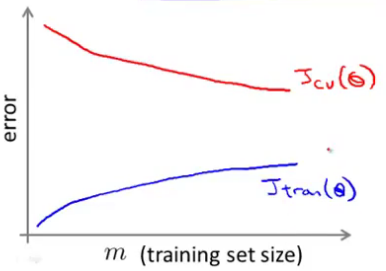
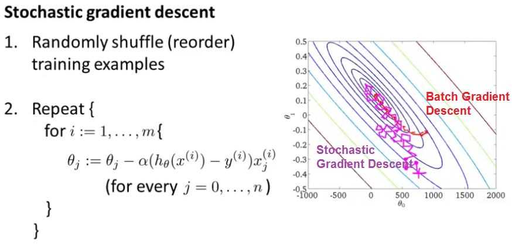
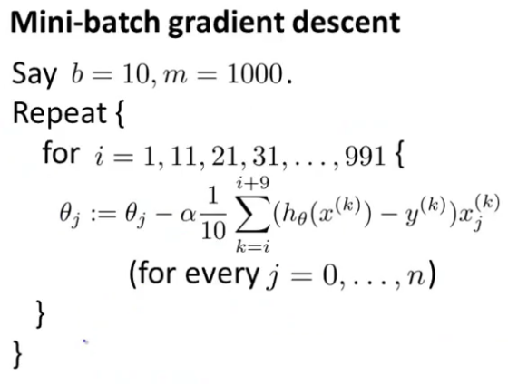
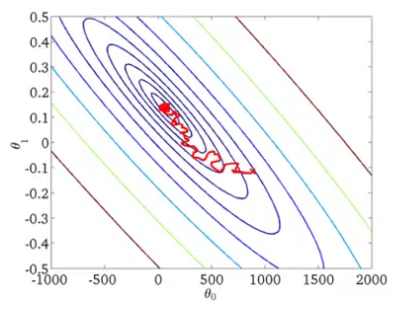

## Large Scale Machine Learning
### Gradient Descent with Large Datasets
#### Learning With Large Datasets
*Algorithms for dealing with massive data sets.*

Using all of the data is likely to perform much better than using a small subset of the data for a high-variance learning algorithm.  

Plot the learning curve ($J_\text{train}(\theta)$ and $J_\text{CV}(\theta)$ as a function of $m$)
for a range of values of $m$ and verify that the algorithm has high variance when m is small.

#### Stochastic Gradient Descent
With a very large training set; *batch* gradient descent becomes a computationally very expensive.

In contrast, *Stochastic Gradient Descent* looks at only a single training example in one iteration. So we can modify the parameters a little bit and make progress towards a global minimum.  

Stochastic gradient descent it doesn't actually converge in the same sense as Batch gradient descent. What it ends up doing is wandering around continuously in some region that's in some region close to the global minimum.

##### Review
- When the training set size $m$ is very large, stochastic gradient descent can be much faster than batch gradient descent.
- The cost function should go down with every iteration for batch (assuming a well-tuned $\alpha$) but not necessarily for stochastic.
- Stochastic is applicable to linear regression and other models such as logistic regression and neural networks.
- It is always a good idea to *shuffle* the training data.

> Scale up the learning algorithms to much bigger data sets and get better performance.

#### Mini-Batch Gradient Descent
Like batch gradient descent but with a much smaller batch size $b$.  

> A vectorized implementation can sometimes run even faster that Stochastic gradient descent.

#### Stochastic Gradient Descent Convergence
This is a method that does not require scanning over the entire training set periodically to compute the cost function on the entire training set, but instead it looks at only the last $n$ examples or so to make sure is converging or tune the learning rate alpha.

Compute the costs $$
\text{cost}(\theta, (x^{(i)}, y^{(i)})) = \frac{1}{2}(h_\theta(x^{(i)})-y^{(i)})^2
$$ right before updating $\theta$ and average the last $n$ costs that we computed and plot that.

Average large number examples:
- Smoother curve
- More delayed

Average small number examples:
- Noise, can see the trend.

Curve increases:
- Algorithm is diverging
- Use smaller learning rate $\alpha$ (poorly tuned).

##### Decreasing the Learning Rate
As the algorithm runs, the iteration number becomes large So alpha will slowly become small, and so you take smaller and smaller steps until it hopefully converges to the global minimum:
$$
\alpha = \frac{\text{const1}}{\text{iterationNumber} + \text{const2}} \rightarrow 0
$$  

> Stochastic Gradient Descent can converge to a (local) minimum rather than *oscillate* around it, we should slowly **decrease $\alpha$** over time.

### Advanced Topics
#### Online Learning
It allows us to learn from a continuous stream of data, since we use each example once then no longer need to process it again.

This sort of online learning algorithm can adapt to changing user preferences/tastes $p(y\vert x;\theta)$ and theta will slowly adapt your parameters (learned hypothesis) to whatever your latest pool of users looks like.

Large companies get so much data, that there's really maybe no need to save away a fixed training set, but instead you can use an online learning algorithm to just learn continuously from the data that users are generating on your website.

> We still need to pick a learning rate $\alpha$ and good features.

#### Map Reduce and Data Parallelism
If the learning algorithm be expressed as a summation over the training set, then by paralleling the computation over different computers/cores can potentially speed up the learning process.

So, if you apply the map-reduce method to train a neural network on 10 machines. In each iteration, each of the machines will compute forward propagation and back propagation on 1/10 of the data to compute the derivative with respect to that 1/10 of the data.
