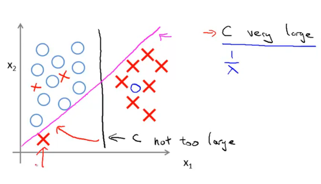

## Support Vector Machines
### Large Margin Classification
**Support vector machine:**
Hypothesis makes a prediction, not a probability.

Minimize to solve for parameters $\theta$, where $C = \frac{1}{\lambda}$. Informally, this parameter is a positive value that controls the penalty for misclassified training examples

#### Optimization Objective
#### Large Margin Intuition
###### SVM Decision Boundary
$$
\min \frac{1}{2} \sum_{j=1}^{n} \theta_j^2
= \frac{1}{2} (\theta_1^2 + \theta_2^2)
= \frac{1}{2} \Vert \theta \Vert ^2
$$
$$
\theta^T x^{(i)}
= p^{(i)} \Vert \theta \Vert ^2
= \theta_1 x_1^{(i)} + \theta_2 x_2^{(i)}
$$
So we can write
$$
\begin{align*} \min_\theta & \frac{1}{2}\sum_{j=1}^n\theta_j^2\\ \mbox{} & \|\theta\|\cdot p^{(i)} \geq 1\quad \mbox{if}\ y^{(i)} = 1\\ & \|\theta\|\cdot p^{(i)} \leq -1\quad \mbox{if}\ y^{(i)} = 0 \end{align*}
$$
Where $p^{(i)}$ is the (signed - positive or negative) projection of $x^{(i)}$ onto the verctor $\theta$.

#### Mathematics Behind Large Margin Classification
###### Vector Inner Product
$\Vert u \Vert$: norm or length, $\sqrt{u_1^2 + u_2^2}$
$p$: Signed length of projection of $v$ onto $u$, real number.

Inner product
$$
u^Tv = p \Vert u \Vert
= u_1 v_1 + u_2 v_2
= v^Tu
$$

### Kernels
Complex non-linear classifiers/decision boundary

*Kernel:* Similarity function
$$
f_1
= \text{similarity}(x, l^{(i)})
= k(x, l^{(i)})
$$
Measure how similar $x$ is to the landmarks $l$, if are close $\approx 1$ and if are far $\approx 0$.

If we increase $\sigma$ of the Gaussian kernel; we move away from $l$ slowly, if we decrease it, the bump becomes narrower and we fall to zero much more rapidly on $f_1$.
#### Kernels
choose $m$ landmarks:
$$
l^{(1)} = x^{(1)}, ...,
l^{(m)} = x^{(m)}
$$
Similarity:
$$
f_0 = 1 \\
f_1 = \text{similarity}(x, l^(1)) \\
f_2 = \text{similarity}(x, l^(2)) \\
...
$$
**Hypothesis:**
Given $x$ compute $m +1$ features and predict $y = 1$ if
$$
\theta^{T} f \geq 0 \\
\theta_0 f_0 + ... + \theta_m f_m \geq 0
$$
**Training:**
$$
\min_\theta C \sum_{i=1}^{m} y^{(i)} \text{cost}_1 (\theta^T f^{(i)}) + (1 - y^{(i)}) \text{cost}_0 (\theta^T f^{(i)}) + \frac{1}{2} \sum_{j=1}^{m} \theta_j^2
$$
We do not regularize $\theta_0$, si ignoring it:
$$
\sum^{j=1}_{m} \theta_j^2
= \theta^T \theta
$$

###### Parameters
$C = \frac{1}{\lambda}$:
* Large C (small $\lambda$):
  * Lower bias
  * High variance
  * The cost function is close to zero
  * Prone to overfitting

> A large C parameter tells the SVM to try to classify all the examples correctly.

* Small C (large $\lambda$):
  * Higher bias
  * Low Variance
  * Ignores outliers
  * Prone to underfitting

$\sigma^2$:
* Large:
  * Features $f_i$ vary **more** smoothly
  * Higher bias
  * Lower variance

* Small:
  * Features $f_i$ vary **less** smoothly
  * Lower bias
  * Higher variance

So to fix underfitting:
* Increase $C$ and decrease $\sigma^2$

So to fix overfitting:
* Decrease $C$ and increase $\sigma^2$

> Choose whatever performs best on the cross-validation data.

### SVMs in Practice
#### Using An SVM
Need to specify:
* Choice of parameter $C$
* Choice of kernel (computes the similarity function)

> No kernel (linear kernel), i.e. predict $y=1$ if $\theta^T x \geq 0$

###### Gaussian kernel
You can think of the Gaussian kernel as a similarity function that measures the *distance* between a pair of examples $x^{(i)}, x^{(j)}$

$$
l^{(j)} = x^{(j)} \\
f = \text{kernel}(x^{(i)}, l^{(j)})
= \text{exp}(- \frac{\Vert x^{(i)} - l^{(j)} \Vert^2 }{2 \sigma^2})
$$
> Do perform feature scaling before using this.

The Gaussian kernel is also parameterized by a bandwidth parameter $\sigma$ which determines how fast the similarity metric decreases (to 0) as the examples are further apart.

###### Multi-class classification
One-vs-all method to train $K$ SVMs, one to distinguish $y = i$ from the rest (for $i = 1, 2, ..., K$) and get $\theta^{i}, ..., \theta^{(K)}$ then pick the class $i$ with largest $(\theta^{(i)})^T x$

###### Logistic regression vs. SVMs
$n$: number of features
$m$: number of training examples

* $n$ is large relative to $m$
Use logistic regression or SVM without a kernel (linear kernel)
* $n$ is small, $m$ is large:
Add more features, then use logistic regression or SVM
* $n$ is small, $m$ is intermediate:
Use SVM with Gaussian kernel
