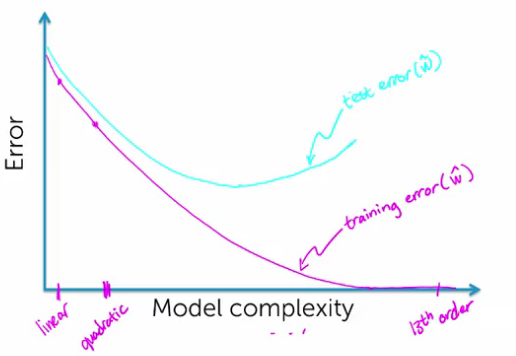
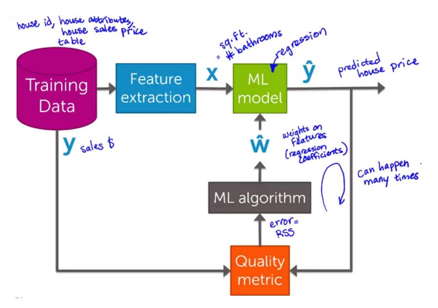

## Regression: Predicting House Prices
In this module, we are going to focus on using regression to predict a continuous value (house prices) from features of the house (square feet of living space, number of bedrooms,...).

### Linear regression modeling
**Predicting house prices: A case study in regression**
*how am I gonna use these observations to estimate my house value?.*
- X
  - Feature
  - Covariate
  - Predictor
  - Independent Variable

- Y
  - Observation
  - Response
  - Dependent Variable

#### Linear Regression
Model the relationship between the square footage of the house and the house sales price:
$$
f_w(x) = w_0 + w_1 x
$$
Parameters of our model $w=(w_0,w_1)$:
$w_0$ the intercept
$w_1$ the slope, *regression coefficient*

> *Regression Coefficient*: as we vary X, the square footage of the house, how much of an impact does that have on changes in the observed house sales price?  

**Cost of using a given line**

*Which $w$ do we want to choose for our model?*

Residual Sum of Squares (RSS):
We look at the square of the distances
between the observation and from what the model would predict.


What we do is we research over all possible $w_0$ and $w_1$. So all possible lines, and we choose the one that minimizes the residual sum of squares:
$$
\hat{w} = (\hat{w}_0, \hat{w}_1) \\
f_{\hat{w}} = \hat{w}_0 + \hat{w}_1 x
$$

#### Adding higher order effects
*Fitting the data with a line, what does a good choice?.*

No if its not a linear relationship. May be a square function:
$$
f_w(x)= w_0 + w_1 x + w_2 x^2
$$

> A quadratic function fit to the data, it is still called linear regression, because we think of x squared just as another feature. And what we see is that the w's always appear just as w's, not w squared or other functions of w.

### Evaluating regression models
#### Evaluating overfitting via training/test split
**Overfitting**
What we've done is we've taken a model and really, really, really honed in to our actual observations, but **it doesn't generalize** well to thinking about new predictions.


> So although it minimizes the residual sum of squares, it ends up leading to very bad predictions.

**How to choose model order/complexity:**
Want good predictions, but can't observe future
- Simulate predictions
    1. Remove some houses
    1. Fit model on remaining, *The training set*
    1. Predict heldout houses, *The test set*
- Training error:
  Minimize RSS only on the houses that are present in our training data.
- Test error:
  Residual sum of squares over all houses that are in our test data set.

#### Training/test curves
*how does test error and training error vary as a function of the model complexity?*

We're gonna have our training error decreasing as we increase the flexibility of the model and at some point, our test error is likely to increase.



#### Adding other features
Instead of fitting a line to the data, I can think about fitting a hyper plane.  


### Summary of regression
#### Regression ML block diagram
**The machine learning pipeline**


1. Training set  
    - House attributes
1. Feature extraction: $x$  
    - Number of bathrooms
1. Machine Learning Model: $f_{\hat{w}}(x)$  
    - Regression Coefficients
1. Predictions: $\hat{y}$  
    - The house price
1. Quality Metric:
    - RSS, how well we're doing with our prediction?.
1. Update
    - The parameters of our model $w$

This process of updating our parameters tends to happen in an iterative way, again and again.



> So regression, relates our features to our output.

### Predicting house prices: IPython Notebook

```Python
import graphlab

# structure for tabular data
sales = graphlab.SFrame('home_data.gl/')

# Ipython notebook Plot
graphlab.canvas.set_target('ipynb')

# visualization
sales.show(view='Scatter Plot', x='sqft_living', y='price')

# split the data, 80% training
train_data, test_data = sales.random_split(.8, seed=0)

# Regression model to predict house prices
sqft_model = graphlab.linear_regression.create(train_data, features=['sqft_living'], target='price')

# Evaluating error (RMSE)
sqft_model.evaluate(test_data)

# Visualizing predictions
import matplotlib.pyplot as plt
% matplotlib inline
plt.plot(test_data['sqft_living'], test_data['price'], '.', test_data['sqft_living'], sqft_model.predict(test_data), '.')

# Inspecting the model coefficients learned (weights)
sqft_model.get('coefficients')

# Exploring other features of the data
my_features = ['bedrooms', 'bathrooms', 'sqft_living', 'floors', 'zipcode']
sales[my_features].show()
sales.show(view='Boxwhisker Plot', x='zipcode', y='price')

# Model to predict from more features

my_features_model = graphlab.linear_regression.create(train_data, target='price', features=my_features)

# compare the two models
sqft_model.evaluate(test_data)
my_features_model.evaluate(test_data)

# predict the price
house1 = sales[sales['id']='69']
sqft_model.predict(house1)
my_features_model.predict(house1)

# convert to SFrame to predict other data
my_features_model.predict(graphlab.SFrame(dictionary_data))
```
