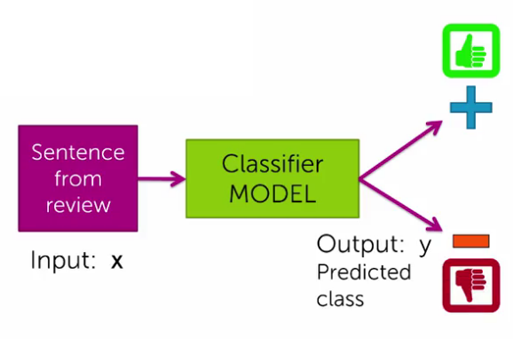
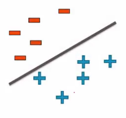
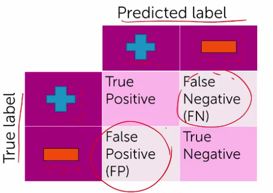
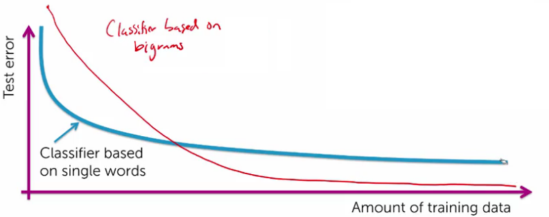
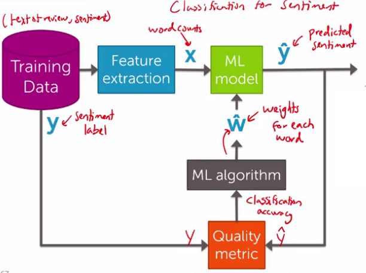

## Classification: Analyzing Sentiment
In our second case study, analyzing sentiment, you will create models that predict a class (positive/negative sentiment) from input features (text of the reviews, user profile information,...)

### Classification modeling


#### Linear classifiers
Called a linear classifier, because output is weighted sum of input.

Count positive and negative words in sentence:
- if number of postive words $\gt$ number of negative words then $\hat{y}$ = postive
- else, $\hat{y}$ = negative

#### Decision boundaries
*The decision boundary:* everything on one side we predict is positive, everything on the other we predict is negative.



### Evaluating classification models
- Classification error: Measures fraction of mistakes.
$$
\text{error} = \frac{\text{# of mistakes}}{\text{total # sentences}}
$$
- Accuracy: Measures fraction of correct predictions.
$$
\text{accuracy} = \frac{\text{# of correct}}{\text{total # sentences}}
$$

> $\text{error} = 1 - \text{accuracy}$

#### What's a good accuracy?
- *Random guessing:* for $k$ classes, accuracy $= 1/k$

- *Majority class prediction:* Just predicted classes that are most common.

- *Class imbalance:* One class has much more representation than the others.

> Problem because class imbalance/majority beats random guessing

#### False positives, false negatives, and confusion matrices
**Types of mistakes (Confusion Matrix)**


$$
\text{accuracy} = \frac{\sum{\text{True values}}}{\text{total # sentences}}
$$

#### Learning curves

- More complex models require more data
- More complex models tend to have less bias.

*Bias:* Even with infinite data, the test error will not go to zero.

**How confident is your prediction**
Use class probability to express degree of confidence in prediction:
$$
P(y_{+}=\text{value} \vert x)
$$

### Summary of classification
Classification ML block diagram:


### Analyzing sentiment: IPython Notebook
```Python
import graphlab

# Loading & exploring data
products = graphlab.SFrame('amazon_baby.gl/')
products.head()

# Creating the word count vector
product['word_count'] = graphlab.text_analytics.count_words(products['reviews'])

# Exploring the most popular product
graphlab.canvas.set_target('ipynb')
products['name'].show()
giraffe_reviews = products[products['name'] == 'Vulli Sophie the Giraffe Teether']
giraffe_reviews['rating'].show(view='Categorical')

# Build a sentiment classifier
# ignore all 3* reviews
products = products[products['rating'] != 3]
#positive sentiment = 4* or 5* reviews
products['sentiment'] = products['rating'] >=4

# Training a sentiment classifier
train_data, test_data = products.random_split(.8, seed=0)
sentiment_model = graphlab.logistic_classifier.create(train_data, target='sentiment', features=['word_count'], validation_set=test_data)

# Confusion matrix & the ROC curve
sentiment_model.evaluate(test_data, metric='roc_curve')

# predict and sort
giraffe_reviews['predicted_sentiment'] = sentiment_model.predict(giraffe_reviews, output_type='probability')
giraffe_reviews = giraffe_reviews.sort('predicted_sentiment', ascending=False)

# most positive & negative
giraffe_reviews[0]['review']
giraffe_reviews[-1]['review']
```
