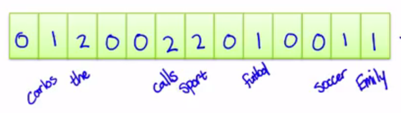
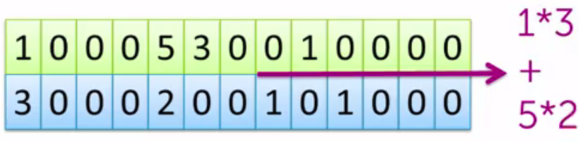
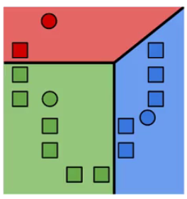
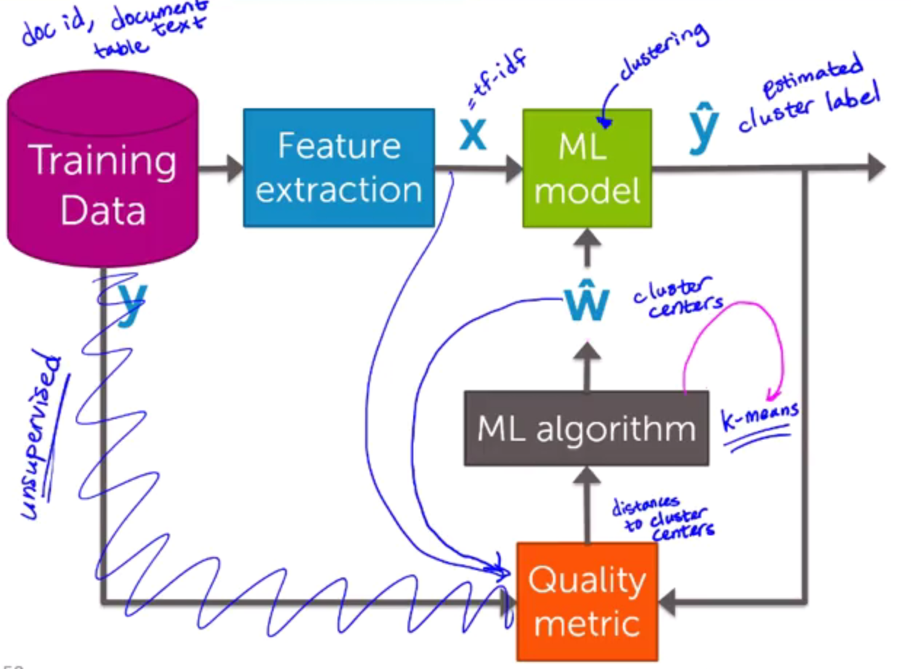

## Clustering and Similarity: Retrieving Documents
#### What is the document retrieval task?
- How do we measure similarity
- How do we search over articles

#### Word count representation for measuring similarity
- Bag of words model
  - Ignore order of words
  - Count # of instances of each word in vocabulary



> Counts the number of words in the document

- Measuring similarity


> Element wise product between the vectors and then adding.

**Normalize** by the norm of the vector, to avoid issues with word counts (doc length)

#### Prioritizing important words with tf-idf
*Common words dominate rare words*.

An **important word** that appears frequently in the current document *common locally* and rarely in corpus *rare globally*

> Trade off between local frequency and global rarity.

#### Calculating tf-idf vectors
*Term frequency - inverse document frequency (tf-idf).*

1. Term frequency: count the number of words
1. Inverse document frequency (down-weight):
$$
log \ \frac{\text{docs in corpus}}{\text{1 + # docs using word of interest}}
$$

- Word in many docs: $log \ 1 = 0$
- Rare word: $log \ \text{large #}$

> Very common word like 'the' gets down weighted and the rare/important words get up weighted.

### Clustering models and algorithms
#### Clustering documents task overview
*Query articles:* article that we are reading
*Corpus:* All the documents we whant to search over to recommend some article

**Nearest neighbor search:**
Specify a distance metric (measure of similarity):
1. Compute the similarity between the query and every article in corpus.
1. Output the **most** similar article (one nearest neighbor), or a sorted list of similar articles ($k$ nearest neighbor)

#### Clustering documents: An unsupervised learning task
**Clustering**
- No labels provided
- Want to uncover cluster structure
- **input:** docs as vectors
- **output:** cluster labels
- Assign and observation (doc) to cluster (topic label)

> A cluster is defined by *center* and *shape/spread*.

#### k-means: A clustering algorithm
*Similarity metric:* distance to cluster center, where **smaller** is **better**.

**k-means algorithm:**
*Must specify the number of clusters ahead of time*
1. Randomly initialize cluster centers
1. Assign every observation to closes cluster center
1. Revise cluster centers as mean of assigned observations

> Repeat until convergence.



#### Other examples of clustering
- Similar medic patients
- Discover product categories from purchase histories
- Structuring web search results
- Discover similar neighborhoods

### Summary of clustering and similarity
Clustering and similarity ML block diagram


### Document retrieval: IPython Notebook
```Python
# Loading & exploring Wikipedia data
people = graphlab.SFrame('people_wiki.gl/')
people.head()

# Word counts
obama['word_count'] = graphlab.text_analytics.count_words(obama['text'])
# dict of word counts into two columns
obama_word_count_table = obama[['word_count']].stack('word_count', new_column_name = ['word','count'])
# sort
obama_word_count_table.sort('count',ascending=False)

# Compute TF-IDF for the corpus
people['word_count'] = graphlab.text_analytics.count_words(people['text'])
# tf-idf to normalize
tfidf = graphlab.SFrame()
tfidf['docs'] = graphlab.text_analytics.tf_idf(people['word_count'])
people['tfidf'] = tfidf['docs']
# for obama
obama = people[people['name'] == 'Barack Obama']
obama[['tfidf']].stack('tfidf',new_column_name=['word','tfidf']).sort('tfidf',ascending=False)

# cosine distance, lower is better
clinton = people[people['name'] == 'Bill Clinton']
beckham = people[people['name'] == 'David Beckham']
graphlab.distances.cosine(obama['tfidf'][0],clinton['tfidf'][0])
graphlab.distances.cosine(obama['tfidf'][0],beckham['tfidf'][0])

# Nearest neighbors model
knn_model = graphlab.nearest_neighbors.create(people,features=['tfidf'],label='name')
# Who is closest to Obama?
knn_model.query(obama)
```
