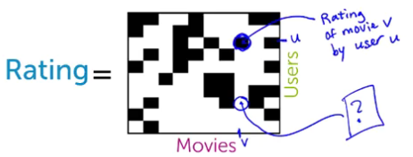
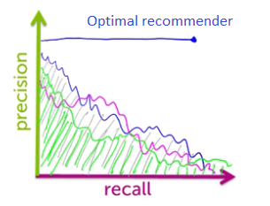
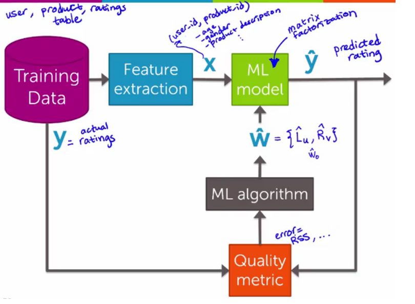

## Recommending Products
### Recommender systems
How to use machine learning techniques in order to use the past history of your own purchases, as well as the purchases of other people, to determine which products to recommend to you.

*Personalization:* Connects users and items

> Recommendations combine global and session interests

### Co-occurrence matrices for collaborative filtering
*Collaborative filtering: People who bought this also bought that.*

**Co-occurrence matrix must be normalized**
- *Jaccard similarity*, normalizes by popularity:
$$
\frac{\text{# purchased i AND j}}{\text{# purchased i OR j}}
$$

  > Limitations: No history

- Weighted average of purchased items
  > Does not utilize, context, user/product features.

*Cold start problem:* new user or product arrives (no history).

### Matrix factorization
The matrix completion task


We're gonna guess what rating a person would give to a movie that they've never watched by similarity vectors described by categories/topics (action, romance, drama, ...), so only using these black cells.
$$
\text{RSS(L, R)} = (\text{Rating(u, v)} - \text{<Lv, Rv>})^2
$$

**Combining features and discovered topics**
- Features capture **context**:
    - Time of day, user info, past purchases, ...
- Discovered topics from matrix factorization capture **groups of users** who behave similarly:
    - Women from Seattle who teach and have a baby

- **Combine** to mitigate cold-start
    - Ratings for a new user from **features** only
    - As more information about user is discovered, matrix factorization topics becomes more relevant

> Blending/combining models get performance that exceeds the performance of any of the individual models.

### Performance metrics for recommender systems
#### A performance metric for recommender systems
**Recall**
How many of my liked items were actually retrieved or actually recommended to me.
$$
\frac{\text{# liked & shown}}{\text{# liked}}
$$

**Precision**
How much garbage do I have to look at compared to the number of items that I like.
$$
\frac{\text{# liked & shown}}{\text{# shown}}
$$

> Optimal recommenders: R = 1 & P = 1

#### Precision-recall curves
- Algorithm-specific precision-recall curve
- For a given *precision*, want *recall* as large as possible.
    - Largest area under the curve (AUC)
    - Set desired recall and maximize precision (lit number of recommendations)



> Vary threshold on \# items recommended and for each calculate P & P

### Summary of recommender systems
$\hat{L}_u$: features of users
$\hat{R}_v$: features of products



### Song recommender: IPython Notebook
```Python
# Loading and exploring song data
import graphlab
graphlab.canvas.set_target('ipynb')

# Popularity-based song recommender
train_data,test_data = song_data.random_split(.8,seed=0)
popularity_model = graphlab.popularity_recommender.create(train_data, user_id='user_id', item_id='song')
popularity_model.recommend(users=[users[0]])

# Personalized song recommender
personalized_model = graphlab.item_similarity_recommender.create(train_data, user_id='user_id', item_id='song')
personalized_model.recommend(users=[users[0]])
# similar songs to any song
personalized_model.get_similar_items(['With Or Without You - U2'])

# Using precision-recall to compare recommender models
model_performance = graphlab.recommender.util.compare_models(test_data, [popularity_model, personalized_model], user_sample=.05)
```
