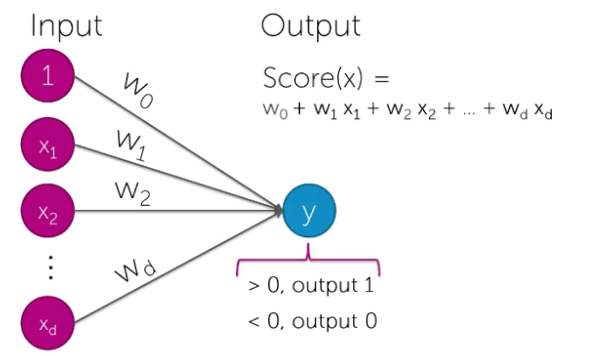
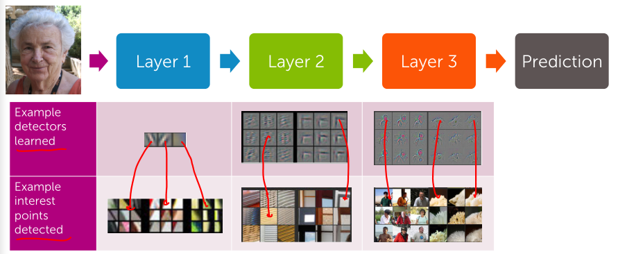
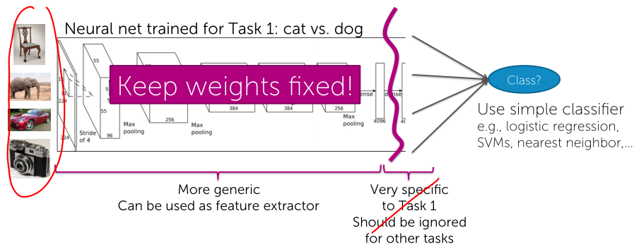
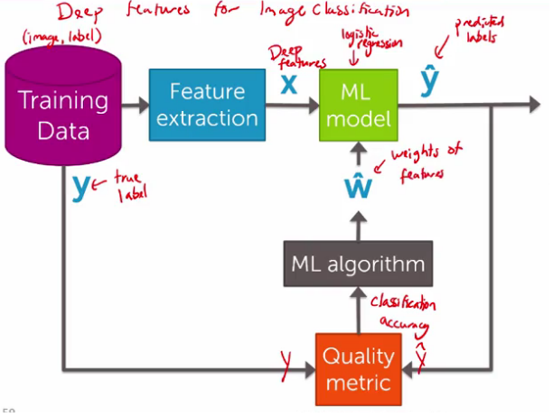

## Deep Learning: Searching for Images
### Neural networks: Learning very non-linear features
Layers and layers of linear models and non-linear transformations.



### Deep learning & deep features
#### Application of deep learning to computer vision
Features are the representation of our data that's use to feed into the classifier.

Image features are collections of locally interesting points, combined to build classifiers.  



Neural networks capture different types of image features at different layers and then they get learned automatically.

#### Challenges of deep learning
- Pros
  - Enables learning of features
  - Impressive performance gains
- Cons
    - Requires a lot of labeled data for high accuracy
    - Computationally expensive
    - Extremely hard to tune (Hyperparameters, algorithms, number of layers and units etc...)

#### Deep Features
**Transfer learning**
*Use data from one task to help learn on another.*  



### Summary of deep learning


### Deep features for image classification: IPython Notebook
```Python
# Loading image data
image_train = graphlab.SFrame('image_train_data/')
image_test = graphlab.SFrame('image_test_data/')
raw_pixel_model = graphlab.logistic_classifier.create(image_train,target='label', features=['image_array'])
# predict
raw_pixel_model.predict(image_test[0:3])
# evaluate
raw_pixel_model.evaluate(image_test)

# Transfer Learning
deep_learning_model = graphlab.load_model('http://s3.amazonaws.com/GraphLab-Datasets/deeplearning/imagenet_model_iter45')
image_train['deep_features'] = deep_learning_model.extract_features(image_train)
deep_features_model = graphlab.logistic_classifier.create(image_train, features=['deep_features'], target='label')
```

### Deep features for image retrieval: IPython Notebook
```Python
# Nearest neighbors model
knn_model = graphlab.nearest_neighbors.create(image_train,features=['deep_features'], label='id')
# retrieve images
cat = image_train[18:19]
knn_model.query(cat)
```
