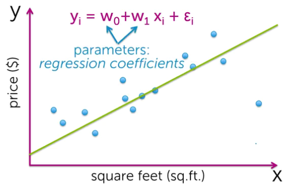
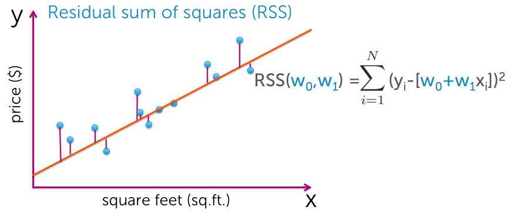
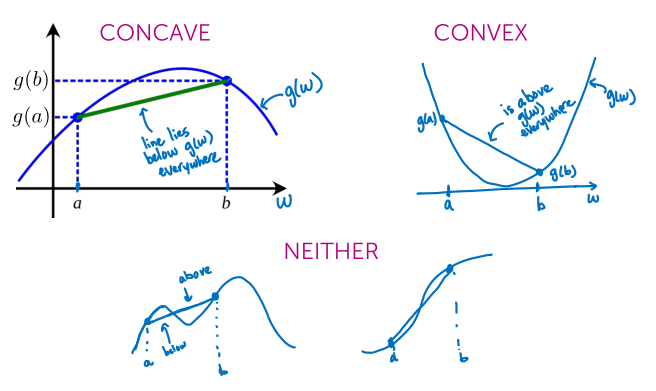
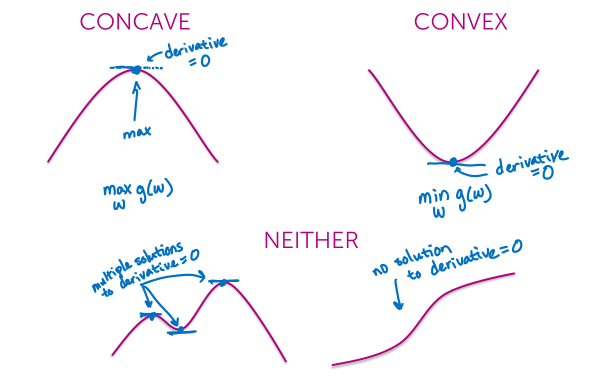
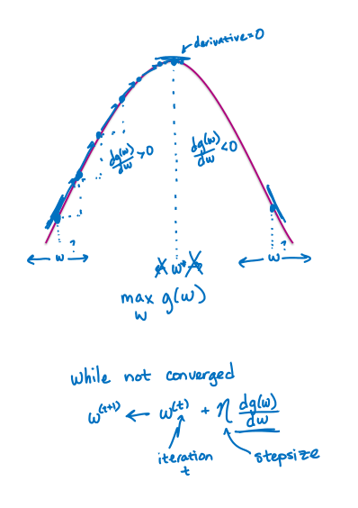
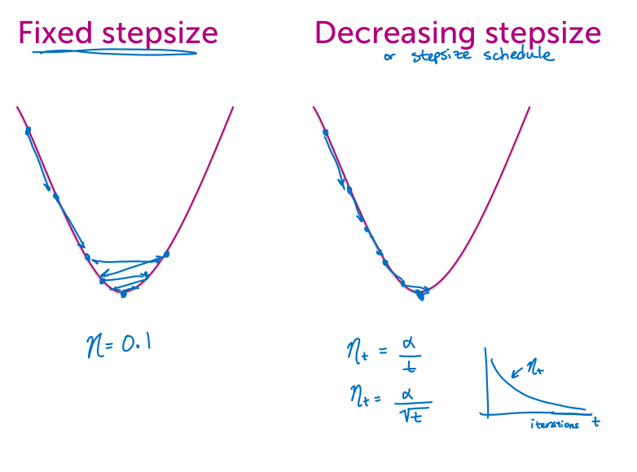
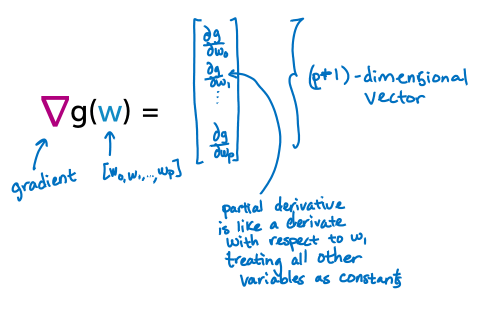
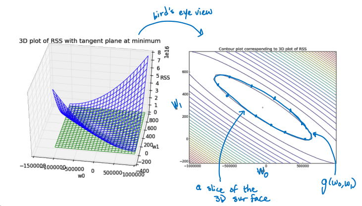
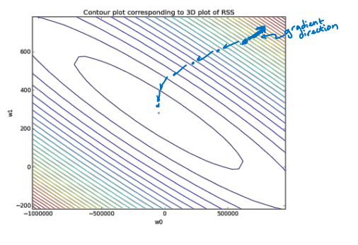
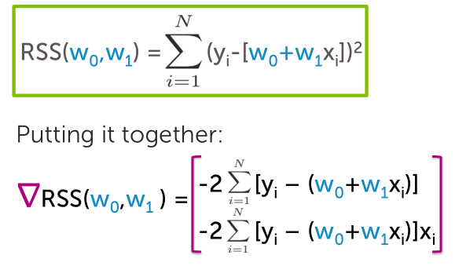

### Simple regression
We assume that we just have one input and we're just trying to fit a line.  



error ($\varepsilon$): distance from our specific observation to the line.

**Regression coefficients**
$w_0$: Intercept, value when no input.
$w_1$: Slope, represents the predicted change in the output per unit change in the input.

> Magnitude, has meaning in terms of the units used for input and output.

### Cost: Residual Sum of Squares

*Residual:* difference between a prediction and an actual value.

### Model vs. fitted line
*Estimated parameters:* $\hat{w}_0, \hat{w}_1$ take actual values.

### Convex & Concave functions


We have an objective to find the minimum of a convex or the maximum of a concave. The solution is gonna be unique, and it's gonna exist. The others have multiple solutions or none at all.



### Finding the max via hill climbing
- On the left of the optimal, we have that the derivative of g with respect to w is greater than 0. And these are the cases where we're gonna wanna increase w.

- On the right-hand side of the optimum we have that the derivative of g with respect to w is negative.
And these are cases where we're gonna wanna decrease w.

- At the optimum, we know that the derivative is 0. So, again, the derivative is telling me what I wanna do. I don't wanna change w at all.



#### Choosing the stepsize $\eta$

- Fixed:
    you can imagine going back and forth and back and forth quite a number of times.
- Decreasing /schedule:  
    Decrease the stepsize as the number of iterations increase.
$$
\eta_t = \frac{alpha}{t} \\
\eta_t = \frac{alpha}{\sqrt{t}}
$$

#### Convergence criteria
Stop when:
$$
\vert \frac{\partial g(w)}{\partial w} \vert \lt \varepsilon
$$

### Gradients
*Derivatives in multiple dimensions.*


#### Contour plot

We're slicing the function at different values, and that creates these different contours.

While not converged:
$$
W^{(t+1)} := W^{(t)} - \eta \nabla g (w^{(t)})
$$

Convergence when the magnitude of the gradient:
$$
\Vert \nabla g (w^{(t)}) \Vert \lt \varepsilon
$$



### Finding the least squares line
#### Computing the gradient of RSS
**Convex problem**
- The solution is unique
- Gradient descent algorithm will converge to minimum



### Comparing the approaches
- For most ML problems, cannot solve gradient = 0
- Gradient descent relies on choosing *stepsize* and *convergence* criteria, and can be more computationally efficient.

## Code
```Python
import graphlab
sales = graphlab.SFrame.read_csv('Philadelphia_Crime_Rate_noNA.csv/')
#Fit the regression model using crime as the feature
crime_model = graphlab.linear_regression.create(sales, target='HousePrice', features=['CrimeRate'],validation_set=None,verbose=False)
# scatter plot
import matplotlib.pyplot as plt
%matplotlib inline
plt.plot(sales['CrimeRate'],sales['HousePrice'],'.',
sales['CrimeRate'],crime_model.predict(sales),'-')
# remove outlier and re-fit

# Compare coefficients
crime_model.get('coefficients')
```
