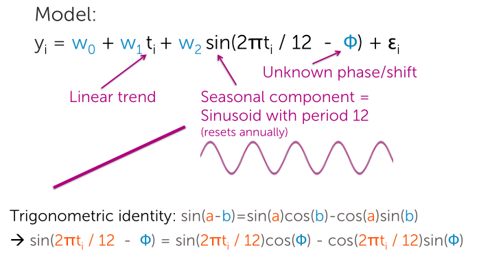
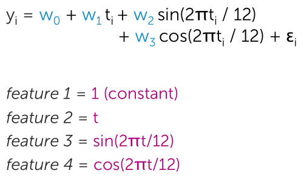
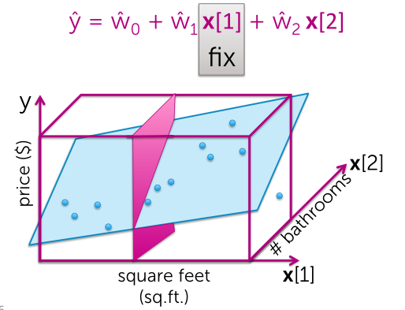
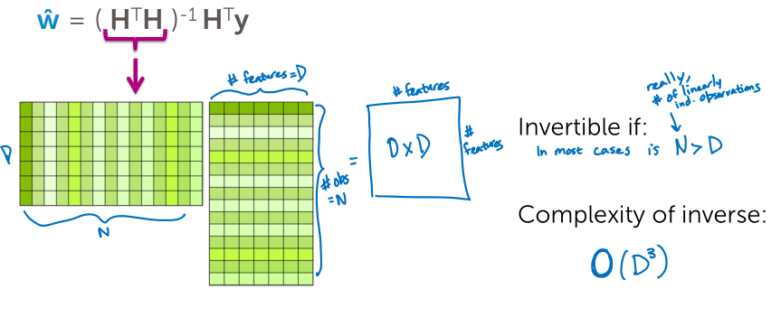
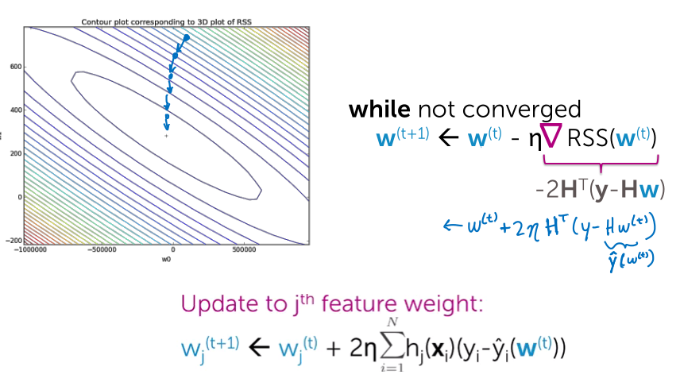

### Polynomial regression
$$
y_i = w_0 + w_1 x_i + w_2 x_i^2 + ... + w_p x_i^p + \varepsilon_i
$$
- feature 1: constant 1, parameter : $w_0$
- feature 2: $x$, parameter $w_1$
- feature $p+1$: $x^p$, parameter $w_p$

Although we often think of multiple regression as including multiple different features (e.g. # of bedrooms, square feet, and # of bathrooms) but we can also consider transformations of existing variables e.g. the log of the square feet or even "interaction" variables such as the product of bedrooms and bathrooms.

> A linear regression model is always linear in the parameters, but may use non-linear features.

#### Polynomial trend and sinusoidal seasonal component

Equivalently:

Now the unknown $\phi$ is part of the parameters/weights $w_2$ and $w_3$.

### Interpreting the coefficients
Must fix other features to interpretate the coefficients.

> Analyze the coefficients in the context of the model.

### Matrix notation
$$
\hat{y} = H w + \varepsilon \\
\text{RSS} = \sum^N_{i=1}(y_i - h(x_i)^T w)^2 = (y-Hw)^T (y-Hw) \\
\nabla \text{RSS}(w) = -2H^T (y-Hw) \\
\hat{w} = (H^T H)^{-1} H^T y
$$

#### Closed-form solution

#### Gradient descent

