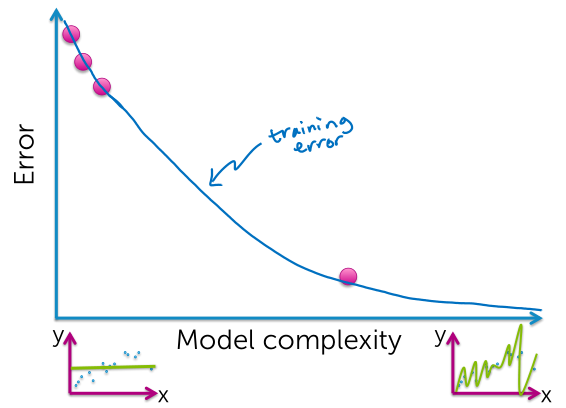
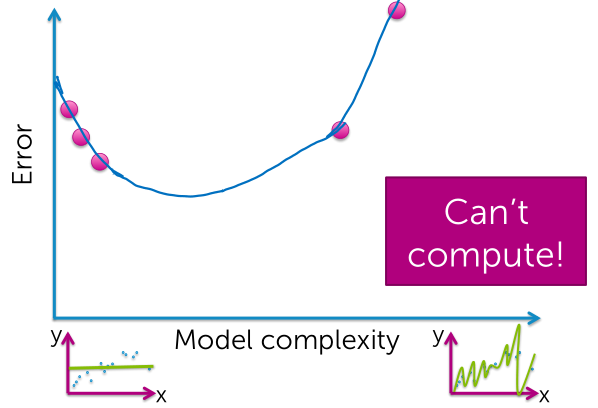
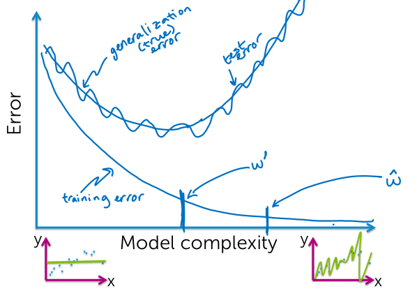
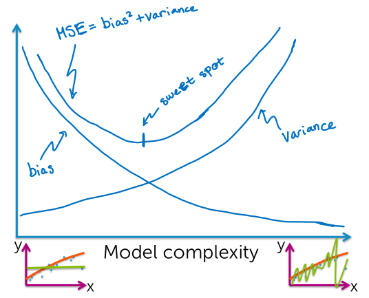
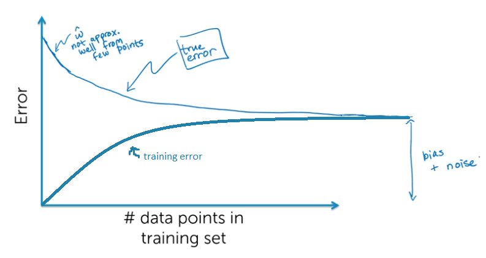
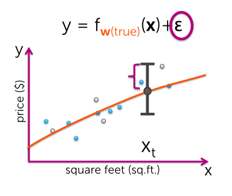
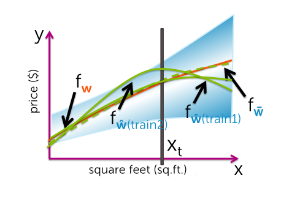
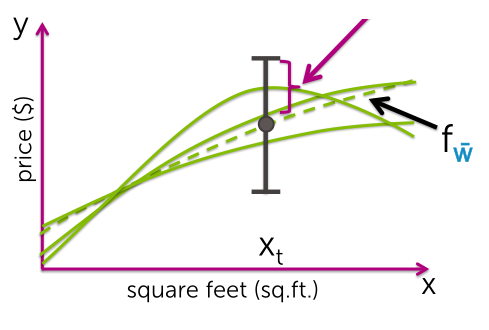

### Measuring Loss:
*How much am I losing compared to having made perfect predictions?*

**Loss function:**
*Actual vs predicted value.*
$L(y, f_{\hat{w}}(x))$

> Assuming symmetric loss function; underpredicting = overpredicting.

*Remember that all models are wrong; the practical question is how wrong do they have to be to not be useful.* George Box, 1987.

### Training error
*Assessing loss on the training set.*

We take our training data and we use it to estimate our model parameters (fit our model).

### Compute training error
1. Define a loss function $L(y, f_{\hat{w}}(x))$
    - Squared error
    - Absolute error
1. Training Error
    - RMSE: Root Mean Squared Error
    $$
    \sqrt{\frac{1}{N} \sum^N_{i=1} L(y, f_{\hat{w}}(x))}
    $$

> Having small training error does not imply having good predictive performance.

### Generalization error
$E_{x, y}:$ Average over all posible (x, y) pairs weighted by how likely each is:
$$
E_{x, y}[L(y, f_{\hat{w}}(x))]
$$

We can't actually compute generalization error. Because everything was relative to this true distribution, the true way in which the world works.

### Test error
*Proxy for what we can actually might see and compute.*

The estimated parameters $\hat{w}$ were fit on the **training data set**, and the function we're looking at was fit on **training data**.

#### Overfitting
*Highly fit to the training data set but don't generalize well.*

1. training error ($\hat{w}$) $\lt$ training error ($w'$)
1. true error ($\hat{w}$) $\gt$ true error ($w'$)

#### Training/Test split
Enough points in your test set to approximate generalization error well, and all others in your training data set to learn a good model.

### Error and bias
1. Noise (Data inherently noisy)
    - $\varepsilon_i$: variance of noise
    - Irreducible error
1. Bias
    - Is our model flexible enough to have a good approximation to the true relationship.
    - Low complexity model has high bias. And high complexity model has low bias.
1. Variance
    - How sensitive the prediction is to the data set.
    - Low complexity model has low variance. And, high complexity models have high variance.

#### Bias-Variance tradeoff

#### Error vs. amount of data
For a fixed model complexity

In the limit:
  - The curve is gonna flatten out to how well our model can fit to the true relationship.
  - Our true error equals our training error.

### Sources of error
For a given training set, how well should I expect the performance of this model to be, regardless of what specific training dataset I'm looking at?  

True function: $f_w(x)$
Average estimated function: $f_{\bar{w}}(x) = E_{\text{train}}[f_{\hat{w}(\text{train})}(x)]$

Average prediction error at $x_t$:
$$
\sigma^2 + \text{bias}^2(f_{\hat{w}}(x_t)) + \text{var} (f_{\hat{w}}(x_t))
$$

$\sigma^2$:  
Irreducible error, variance of the noise $\varepsilon$  

$\text{bias}(f_{\hat{w}}(x_t)) = f_w(x_t) - f_{\bar{w}}(x_t)$:  
Difference between the true relationship versus average (at our target $x_t$) estimated over all possible training data sets.  

$\text{var} (f_{\hat{w}}(x_t)) = E_{\text{train}}[(f_{\hat{w}(\text{train})}(x_t)-f_{\bar{w}}(x_t))^2]$:  
Over all possible fits we might see. How much do they deviate from this expected fit?  

### Regression
1. Model selection
    - Choose tuning parameters ($\lambda$, model complexity)
1. Model assessment
    - Generalization error

#### Model selection
For each considered model complexity $\lambda$

1. Estimate/fit parameters $\hat{w}_\lambda$ on **training set**
1. Select $\lambda'$ such that $\hat{w}_{\lambda'}$ minimizes error on **validation set**
1. Approximate generalization error of $\hat{w}_{\lambda'}$ using **test set**

> Have a large enough validation and test set in order to assess the generalization error.
