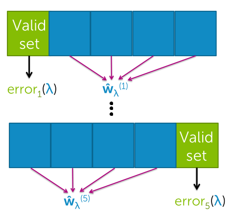

So what ridge regression is gonna do is it's going to quantify overfitting through this measure of the magnitude of the coefficients.

minimizing this leave one out cross-validation error that we're gonna talk about, approximates minimizing the average mean squared error in our predictions.

## Overfitting / High variance:
The model is very well tuned to our training set, but it doesn't generalize well to other observations we might see.

### Overfitting with many features
Not unique to polynomial regression, but also if **lots of features/inputs**. Then again we're in this place where the model has a lot of flexibility to explain the data and we're subject to becoming overfit.

### Overfitting dependence on number of observations
- If we have very **few observations**, then our model can **rapidly overfit** to the data.
- If we have **many observations**, even with really complex models, then our model is **harder overfit**.

### Balancing fit and magnitude of coefficients
*Adding term to cost-of-fit to prefer small coefficients.*

Total cost wants to balance:
- How well function fits data
    - small number, good fit to training data
    - Measure: Residual Sum of Squares $\text{RSS}(w)$
- Magnitude of coefficients
    - small number, not overfit
    - Measure: $L_2$ norm $\Vert W \Vert^2_2$

#### Norms
$L_1$: Sum of absolute values
$$
\Vert W \Vert_1 := \sum^D_{j=0} \vert w_j \vert
$$
$L_2$: Sum of squares
$$
\Vert W \Vert^2_2 := \sum^D_{j=0} w^2_j
$$

### Ridge regression / L2 regularization
*Balance of fit and magnitude.*
$$
\text{RSS}(w) + \lambda \ \Vert W \Vert^2_2
$$
$\lambda$: tuning parameter
- if $\lambda = 0$
    - old solution, only RSS
- if $\lambda = \infty$
    - coefficients are 0

#### Bias-variance tradeoff
- Large $\lambda$
    - High bias
    - Low variance
- Small $\lambda$
    - Low bias
    - High variance

> In essence, $\lambda$ controls model complexity

#### Gradient descent
$$
\nabla \text{cost}(w) = -2 H^T (y-Hw)+2 \lambda w \\
w_j^{(t+1)} := (1-2 \eta \lambda) w_j^{(t)} + 2 \eta \sum^N_{i=1} h_j (x_i)(y_i - \hat{y}_i (w^{(t)}))
$$

At every iteration we first take the last value and we make it smaller. We're saying we want smaller coefficients to avoid over fitting, then we're going to say well okay let's listen to how well my model's fitting the data.

Use all of the data subsets. Because if you're doing that, then you can think about averaging your performance across these validation sets. And avoid any sensitivity you might have to one specific choice of validation set.

### K-fold cross validation
1. Preprocessing: we're gonna take our data, and divide it into K different blocks. So, every block of data is gonna have N/K observations, and these observations are randomly assigned to each block.
1. Fixed $\lambda$, for k=1, ..., K
    1. Estimate $\hat{w}_{\lambda}^{(k)}$ on the training blocks.
    1. Compute error on validation block, $\text{error}_k(\lambda)$
1. Compute average error across the validation sets in each of the different blocks. Cross Validation (CV):
$$
\text{CV}(\lambda) = \frac{1}{K} \sum^K_{k=1} \text{error}_k(\lambda)
$$

> Repeat procedure for each choice of $\lambda$ and choose $\lambda'$ to minimize $\text{CV}(\lambda)$

#### Leave-one-out cross validation
The best approximation occurs for validation of sets of size 1 (K=N), so every block has one observation

> Computationally intensive, requires computing N fits of model per $\lambda$

#### How to handle the intercept
- Don't penalize intercept
    1. First entry of identity matrix = 0
    1. use $\lambda$ = 0 to estimate $w_0$
- Center data first
    1. Transform $y$ to have zero mean
    1. Run Ridge regression as normal (closed-form or gradient descent)
