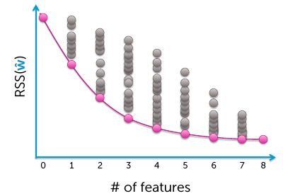
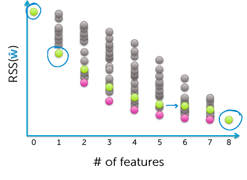
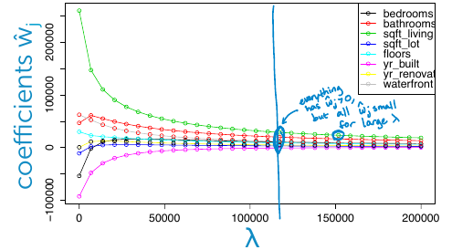
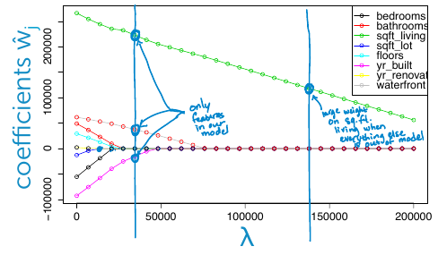
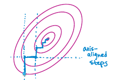
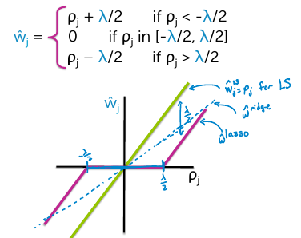

## Feature selection
**All subsets**
1. Start with a model with no features, just noise.
1. Add one feature at a time, and keep track of the lowest training error.
1. Add two features ...
1. Until we get to a model that has capital D features.

The line represent the set of all best possible models, each with a given number of features.

Choosing model complexity
- Assess on validation set
- Cross validation
- Other metrics or penalizing model complexity like BIC

Complexity: $2^{D+1}$ models
> Computationally prohibitive to do this all subset search.

### Greedy algorithms
**Forward stepwise algorithm**
1. Pick a dictionary of features {$h_0(x)$, ..., $h_D(x)$}
    - e.g. polynomials for linear regression
1. Greedy Heuristic
    1. Start with empty set of features, or a simple set
    1. Fit model using current feature set to get $\hat{w}^{(t)}$
    1. Select next best feature $h_j(x)$, with lowest training error
    1. Add to the feature set and iterate

Complexity: $O(D^2) \ll 2^{D}$, at most D steps to full model. D(D+1)/2 models.

- From iteration to iteration, error can never increase.
- The training error will be equivalent to that of all subsets when you're using all of your features at the end.

Stop using **validation set** or **cross validation**, do not rely on training or test error.

### Regularization
#### Ridge regression
*Encourages small weights, but no exactly 0*

$L_2$ regularized regression:
$$
\text{total cost} = \text{measure of fit} + \lambda \  \text{measure of magnitude of coefficients} \\
= \text{RSS}(w) + \lambda \ \Vert w \Vert^2_2
$$

Instead of searching over a discrete set of solutions:
1. Start with full modell (all possible features)
1. *Shrink* some coefficients exactly to 0 (knock out certain features)
1. Non-zero coefficients indicate *selected* features

**Thresholding ridge coefficients:**
Ridge regression is gonna prefer a solution that places a bunch of smaller weights on all the features, rather than one large weight on one of the features.

Just taking ridge regression and thresholding out these small weights, is not a solution to our feature selection problem.

#### Lasso regression
$L_1$ regularized regression:
$$
\text{total cost} = \text{measure of fit} + \lambda \  \text{measure of magnitude of coefficients} \\
= \text{RSS}(w) + \lambda \ \Vert w \Vert_1
$$

$\lambda$: Tuning parameter that balances how much we're favoring sparsity of our solutions relative to the fit on our training data.

Only one features in our model is non-zero, and all the other ones, have dropped completely exactly to zero.

> We get sparse solutions; where we're knocking out features. This is in contrast to ridge regression, which simply shrink the coefficient of each one of the features.

The absolute value sign makes the cost function non-differentiable, so simple gradient descent is not viable (you would need to implement a method called subgradient descent). Instead, we will use *coordinate descent.*

**Coordinate descent**
*Hard to find minimum for all coordinates, but easy for each when keeping others fixed (1D optimization problem)*

Minimize some function $g(w) = g(w_0, w_1, ..., w_D)$

1. Pick one coordinate $j$ to Minimize
1. Cycle through the coordinates

> No stepwise. Converges for lasso objective

**Normalizing features**
Scale training columns (not rows) as:
$$
h_j(x_k) = \frac{h_j(x_k)}{\sqrt{\sum^N_{i=1}h_j(x_i)^2}}
$$

> So every features in the same numeric range.

Apply the same scale factor/normalizer to test data.

**Coordinate descent for least squares regression**
set: $\hat{w}_j = p_j$
$$
p_j = \sum^N_{i=1}h_j(x_j)(y_i - \hat{y}_i (\hat{w}_{-j}))
$$

The correlation between our features and the residuals from a prediction, leaving $j$ out of the model.

**Coordinate descent for lasso**

- If this correlation is within $- \frac{\lambda}{2}$ and $\frac{\lambda}{2}$, meaning that there's not much a relationship between our feature and the residuals from predictions without feature $j$ in our model, we're just gonna completely eliminate that feature. We're gonna set it's weight exactly equal to 0.

- But if we're outside that range we're still gonna include the feature in the model. But we're gonna shrink the weight on that feature relative to the least square solution by an amount $\frac{\lambda}{2}$

- So this is why it's called soft thresholding, we're shrinking the solution everywhere, but we're strictly driving it to zero within the mentioned range.

Contrast with the ridge regression solution shrinks the coefficients everywhere, but never strictly to zero.

**Convergence criteria**
We have to cycle through all of our coordinates, zero to d.

If the maximum step that you take in that entire cycle is less than your tolerance epsilon, then that's one way you can assess that your algorithms converged.

- For convex problems, will start to take smaller and smaller steps
- Measure size of steps taken in a full loop over all features
    - Stop when max step $\lt \varepsilon$

**Choosing the tuning parameter lambda**
- If we have enough data, we can think about holding out a validation set and using that to choose amongst these different model complexities lambda.

- If we don't have enough data, use cross validation.

Cross validation is choosing the $\lambda$ that provides best predictive accuracy. This tends to favor less sparse solutions, thus smaller $\lambda$, than optimal choice for feature selection.

**Debiasing lasso**
Lasso shrinks the coefficients relative to the least square solution.

So is increasing the bias of the solution in exchange for having lower variance.

Can reduce bias as follows:
- Run lasso to select features (not set to zero)
- Run standard least squares regression with only selected features

> Relevant features no longer shrunk relative to least squares fit of same reduced model.

**Issues with standard lasso objective**
With group of highly correlated features, lasso tends to select amongst them arbitrarily. Often prefer to select all together.

**Interpreting selected features**
- Selection only considers features included
- Sensitive to correlations between features
- result depends on algorithm used
