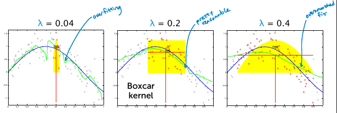

## Non-parametric regression
Fitting our function locally to different regions, allows the complexity of the models to increase as you get more data.

**Distance metrics**
- In 1D, Euclidean distance:
$$
\text{distance}(x_j, x_q) = \vert x_j - x_q \vert
$$
- In multiple dimensions, weight different dimensions differently, *scaled euclidean distance*
$$
\text{distance}(x_j, x_q) = \sqrt{a_1(x_j[1]-x_q[1])^2 + ... + a_1(x_j[d]-x_q[d])^2}
$$
    - Others: Mahalanobis, rank-based, correlation based, cosine similarity, Manhattan, Hamming,

### 1-Nearest neighbor algorithm
*Specify distance metric and output most similar house.*
 - Nearest Neighbors is really sensitive to noise in the data (over fitting)
- Nearest Neighbor struggles to interpolate across regions of the input space.

### k-Nearest neighbors regression
We're gonna output a set of k similar houses.

**Find k closest x_i in dataset**
Every other observation in the data set, is further away than the kth nearest neighbor.
$$
\text{distance}(X_i, X_q) \geq \text{distance}(X_{NN_k}, X_q)
$$

**Predict**
Query point is the average value of all the nearest neighbor outputs.
$$
\hat{Y}_q = \frac{1}{K} \sum^k_{j=1} Y_{NN_k}
$$

**In practice**
- Much more reasonable fit in th presence of noise
- Boundary and sparse regions issues
- Discontinuities (jumps), neighbor either in or out.

### Weighted k-nearest neighbors
Down weights the neighbors that are further from the specific query/target point.
$$
\hat{y}_q = \frac{C_{qNN1} \ Y_{NN_1} + ... + C_{qNNk} \ Y_{NN_k}}{\sum^k_{j=1}C_{qNNj}}
$$

**Simple method:**
$$
C_{qNN_j} = \frac{1}{\text{distance}(x_j, x_q)}
$$

**Kernel**
Isotropic kernels; function of the distance between any point and the target point $(x_j, x_q)$


### Kernel regression
Instead of just weighting some set of k-NN, we're gonna apply weights to every observation in our training set. *Nadaraya-Watson kernel weighted average*.


$\lambda$: Bandwidth that defines a region in which our observations are gonna be included in our weighting.

*Bounded support*: Only subset of data needed to compute local fit. There's some region in which points will have these decaying sets of weights. And then outside this region the observations are completely discarded from our fit at this one point.

**Choice of bandwidth $\lambda$**
The choice of bandwidth has a much larger impact than the choice of kernel.



Use cross validation or the validation set (assuming you have enough data to do so).

**Contrasting with global average**
A global average takes all of our observations, add them together and take the average or just divide by that total number of observations.

So that's exactly equivalent to summing over a weighted set of our observations, where the weights are exactly the same on each of our data points, and then dividing by the total sum of these weights.

$$
\hat{y} = \frac{1}{N}\sum^N_{i=1}y_i = \frac{\sum^N_{i=1}c \ y_i}{\sum^N_{i=1}c}
$$

Kernel regression leads to locally constant fit
- Slowly add in some points and let others gradually die off
$$
\hat{y}_q = \frac{\sum^N_{i=1}\text{Kernel}_\lambda (\text{distance}(x_i, x_q)) * y_i}{\sum^N_{i=1}\text{Kernel}_\lambda (\text{distance}(x_i, x_q))}
$$

**Local linear regression**
- Fitting constant function locally at each point, *locally weighted averages*
- Fitting a line or polynomial locally at each point, *locally weighted linear regression*
    - reduces bias at boundaries with minimum increase in variance

### Non-parametric approaches
*The complexity of the fit can grow as you get more data points.*

- K-NN and Kernel regression are examples of non-parametric regression
- General goals of non-parametric
    - Flexibility
    - Make few assumptions about f(x)
    - complexity can grow with the number of observations N
- Lots of other choices
    - Splines, trees, locally weighted structured regression models.

**Limiting behavior of NN for noiseless data**
In the limit of getting an infinite amount of noiseless data, the MSE of 1-NN fit goes to 0, i.e having mean squared error go to zero means that both bias and variance are going to zero.

In contrast, if we look what just just our standard least squares fit, No matter how much data we get, there's always gonna be some bias for a fixed model complexity.

**Limiting behavior of NN for noisy data**
As you get more and more observations, if you're allowing k to grow, you can smooth over the noise being introduced by each one of these observations, and have the mean squared error going to zero.

But in contrast, again, if we look at just our standard least squares regression here in this case of a quadratic fit, we're always gonna have bias.

> MSE of NN fit goes to zero if k grows too.

### Issues with high-dimensions, data scarcity, and computational complexity
NN and kernel methods work well when the data cover the space, But
- The more dimension d, the more points N you need to cover the space
- Nedd N= O(exp(d)) data points for good performance

The cases where you have limited data relative to the dimension of the input space you're looking at is where these parametric models that we've talked about throughout the rest of this course become so important.

**Complexity of NN search**
- 1-NN: O(N) per query
- k-NN: O(N log k) per query

> Both of these have complexity linear in the number of observations we have.

### Code
In computing distances, it is crucial to normalize features. Otherwise, for example, the sqft_living feature (typically on the order of thousands) would exert a much larger influence on distance than the bedrooms feature (typically on the order of ones). We divide each column of the training feature matrix by its 2-norm, so that the transformed column has unit norm.

Make sure to store the norms of the features in the training set. The features in the test and validation sets must be divided by these same norms, so that the training, test, and validation sets are normalized consistently.

```Python
features_train, norms = normalize_features(features_train) # normalize training set features (columns)
features_test = features_test / norms # normalize test set by training set norms
features_valid = features_valid / norms # normalize validation set by training set norms
```

To do nearest neighbor regression, we need to compute the distance between our query house and all houses in the training set.
