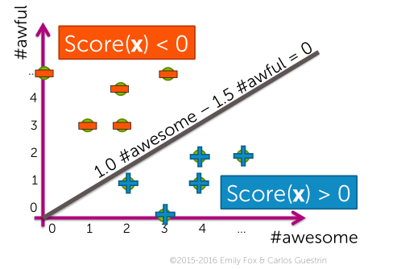
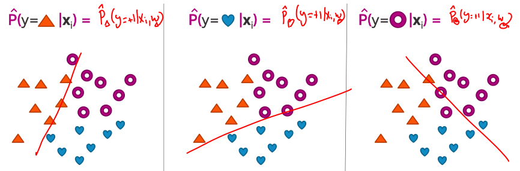

## Linear Classifiers:
*Called a linear classifier, because output is weighted sum of inputs.*

Take as input coefficient associated with each word and compute a score. If the score is greater than zero, the prediction $\hat{y}$ is +1. And if the score is less than zero, we say that the prediction is -1.

### Decision boundaries
Everything below the line is positive and above the line is negative.

### Linear classifier model
- Hyperplane that separate the positives from the negative examples:
$$
\hat{y}_i = \text{sign}(\text{Score}(x_i))
$$
- The score function uses a weighted combination:
$$
\text{Score}(x_i) = w_0 + w_1 x_i[1] + ... + + w_d x_d[d] \\
= \sum^D_{j=0} w_j x_i \\
= w^T h(x_i)
$$
Where $h(\mathbf{x}_i)$ represents the features for example $i$

## Logistic regression
*Link function, squeeze real line into [0, 1] interval.*
$$
\hat{P}(y=+1 \vert x_i) = g(w^T x_i)
$$

### Logistic function (sigmoid, logit)
Symmetric function that provides exactly the mapping from minus infinity to infinity to the interval 0, 1.
$$
\text{sigmoid}(\text{Score}) = \frac{1}{1+e^{-\text{Score}}}
$$

### Logistic regression model
$$
P(y=+1 \vert x, w) = \frac{1}{1 + e^{-w^T h(x)}}
$$

## Encoding categorical inputs
An encoding takes an input which is categorical, for example country of birth and tries to encode it using some kind of numerical values that are naturally multiplied by some coefficients.

**One-hot encoding:**
Create one feature for every possible feature.

**Bag of words**
Takes text and then codes its as counts.

In both cases, we've taken a categorical input, and defined a set of features, one for each possible category, to contain either a single value on or account. And we can feed this directly into the logistic regression model.

## Multiclass classification
**One versus all**
Train one category as positive and the others as negative.

So, it's going to be 1 versus all for each one of the classes.

If the probability that an input is a heart against everything else is higher than the point is a triangle, higher than the point is a donut, you said that the class is heart.

> The class that has the highest probability wins.
