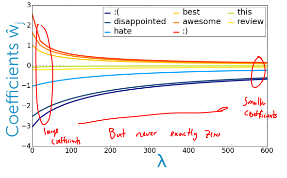

## Maximum likelihood estimation
The likelihood function is the product over my data point of the probability of the true label given the input centers that we have:
$$
l(w) = \prod^N_{i=1} P(y_i \vert x_i, w)
$$
To get the estimated probability that $y=1$ on input $x$:
$$
P(y_i = +1 \vert x_y, w) =\frac{1}{1 + e^{-\theta^{T}x}} \\
P(y_i = -1 \vert x_y, w) = 1- P(y_i = +1 \vert x_y, w) \\
\theta^Tx = w_0x_0 + w_1x_1 + ...
$$

> We want to optimize/maximize picking w with gradient ascent.

### Finding the best linear classifier with gradient ascent
$$
\max_{w_0, ..., } \prod^N_{i=1} P(y_i \vert x_i, w)
$$
**Algorithm**
$$
w^{(t+1)} := w^{(t)} + \eta \frac{\partial l}{\partial w} \bigg \vert_{w^{(t)}} \\ w^{(t+1)} := w^{(t)} + \eta \nabla l(w^{t})
$$
**(log-)likelihood**
$$
\ell\ell(\mathbf{w}) = \sum_{i=1}^N \Big( (\mathbf{1}[y_i = +1] - 1)\mathbf{w}^T h(\mathbf{x}_i) - \ln\left(1 + \exp(-\mathbf{w}^T h(\mathbf{x}_i))\right) \Big)
$$
**Derivate of (log-)likelihood**
Uses the probability of a positive outcome, $P(y_i = +1 \vert x_y, w)$:
$$
\frac{\partial\ell}{\partial w_j} = \sum_{i=1}^N h_j(\mathbf{x}_i)\left(\mathbf{1}[y_i = +1] - P(y_i = +1 | \mathbf{x}_i, \mathbf{w})\right)
$$

This gradient helps us push the coefficients bigger for positive training examples, and smaller for negative training examples.

**Logistic regression model**
$$
P(y=+1 \vert x, w) = \frac{1}{1+e^{-w^T h(x)}}
$$

### Choosing step size
*Plot quality (likelihood) over iterations.*
$ln \prod^N_{i=1} P(y_i \vert x_i, w)$ vs \# of iterations

- If step size is too small, it can take a long time to converge
- If step size is too big, you end up oscillating back and forth.

> You can also try step size that decreases with iterations, $\eta_t=\eta_0 / t$

**Predictions**
$$
\hat{y}_i =
\left\{
\begin{array}{ll}
      +1 & \mathbf{x}_i^T\mathbf{w} > 0 \\
      -1 & \mathbf{x}_i^T\mathbf{w} \leq 0 \\
\end{array}
\right.
$$

### Evaluating a classifier
Compare the output $\hat{y}$ of the classifier with the true label $y$
**Error**
*Measures fraction of mistakes.*
$$
\text{error} = \frac{\text{# mistakes}}{\text{total # datapoints}}
$$
> Best possible value is 0

**Accuracy**
*Fraction of correct predictions.*
$$
\text{accuracy} = \frac{\text{# correct}}{\text{total # datapoints}}
$$
> Best possible value is 1

## Overfitting in classification
In classification the concept of over-fitting can be even stranger than it is in regression because here we're not just predicting a particular value, but we're often asking probabilistic questions like what is the probability that this review is positive?

### Linearly-separable data
There exist coefficients $\hat{w}$ such that
- For **all positive** training data:
$$
\text{score} = \hat{w}^T \gt 0
$$
- For **all* negative** training data:
$$
\text{score} = \hat{w}^T \lt 0
$$

> So the training error = 0, and you should be careful because you might be getting to an over-fitting situation. With enough features, your training error will go to 0.

Maximum likelihood estimation (MLE), prefers most certain model, so coefficients go to infinity for linearly-separable data.

**Overfitting in logistic regression**
Is twice as bad
- Learning tries to find decision boundary that separates the data
    - Overly complex boundary
- If data are linearly separable
    - Coefficients go to infinity

## L2 regularized logistic regression
### Penalizing large coefficients to mitigate overfitting
Want to balance
- How well function fits data
- Magnitude of coefficients

**Maximum Likelihood Estimation (MLE)**
*Measure of fit.*
- Choose coefficients $w$ that maximize likelihood:
$$
\prod^N_{i=1} P(y_i \vert x_i, w)
$$
- Typically, we use the log of likelihood for better convergence properties:
$$
l(w) = ln \prod^N_{i=1} P(y_i \vert x_i, w)
$$

So the method for quality is going to be the log of the data likelihood, and we're going to make that log as big as possible.

**Measure of magnitude of logistic regression coefficients**
What summary \# is indicative of size of logistic regression coefficients
- Sum of squares ($L_2$ norm)
$$
\Vert w \Vert^2_2 = w_0^2 + ... + w_D^2
$$
- Sum of absolute value ($L_1$ norm), to get a *sparse solution*
$$
\Vert w \Vert_1 = \vert w_0 \vert + ... + \vert w_D \vert
$$

> Both of these approaches are penalize larger coefficients.

**Total Cost**
total quality = measure of fit - measure of magnitude of coefficients
$$
\text{total quality} = l(w) - \Vert w \Vert^2_2
$$
$l(w)$: log data likelihood
$\Vert w \Vert^2_2$: $L_2$ penalty

### Tunning parameter
**$L_2$ regularized logistic regression**
$\lambda$: balance of fit and magnitude
$$
l(w) - \lambda \ \Vert w \Vert^2_2
$$
- $\lambda = 0$
    - Standard unpenalized MLE solution
- $\lambda = \infty$
    - $\rightarrow w = 0$

When the lambda parameter's low, you have large coefficients learned, and when the lambda parameters gets larger, you got smaller coefficients. So, they go from large to small, but they're never exactly 0.  

**Regularization reduces *overconfidence***
So the region where I don't know if it's positive or negative is really those points in the boundary which kind of between those clusters of positive points and the clusters of negative points. And you get this kind of beautiful smooth transition.  

**Pick $\lambda$ using:**
- Validation set for large datasets
- Cross-validation for smaller datasets

**Bias-Variance tradeoff**
*$\lambda$ controls model complexity.*
- Large $\lambda$:
    - high bias
    - low variance
- Small $\lambda$
    - low bias
    - high variance

### Gradient of L2 regularized log-likelihood
$$
\text{total derivate} = \frac{\partial l(w)}{\partial w_j} - \lambda \frac{\partial \Vert w \Vert^2_2}{\partial w_j} = \frac{\partial l(w)}{\partial w_j} - 2 \lambda w_j
$$

$$
\frac{\partial\ell}{\partial w_j} = \sum_{i=1}^N h_j(\mathbf{x}_i)\left(\mathbf{1}[y_i = +1] - P(y_i = +1 | \mathbf{x}_i, \mathbf{w})\right)
$$

$$
\frac{\partial \Vert w \Vert^2_2}{\partial w_j} = \frac{\partial}{\partial w_j} [w_0^2+...+w_D^2] = 2 w_j
$$

The regularization takes positive coefficients and decreases them a little bit, negative coefficients and increases them a little bit. So it tries to push coefficients to 0.

$$
w_j^{(t+1)} := w_j^{(t)} + \eta (\frac{\partial\ell}{\partial w_j} - 2 \lambda w_j^{(t)})
$$

### Sparse logistic regression with L1 regularization
I only have to look at no zero quotations $w_j$. Everything else can be ignored.
$$
\hat{y}_i = \text{sign} \bigg(\sum_{\hat{w}_j \neq 0} \hat{w}_j h_j(x_i)\bigg)
$$

**Total Cost**
$$
\text{total quality} = l(w) - \Vert w \Vert_1
$$

**$L_1$ regularized logistic regression**
$\lambda$: balance of fit and sparsity
$$
l(w) - \lambda \ \Vert w \Vert_1
$$
- $\lambda = 0$
    - Standard unpenalized MLE solution
- $\lambda = \infty$
    - all weight is on regularization $\rightarrow w = 0$

You see these transitions where the coefficients of those small numbers goes to zero except one that stays non zero for the longest time.
