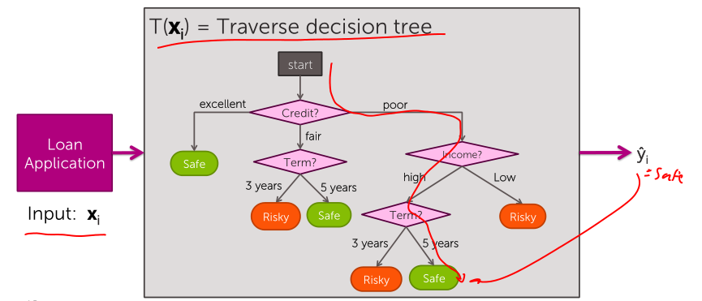
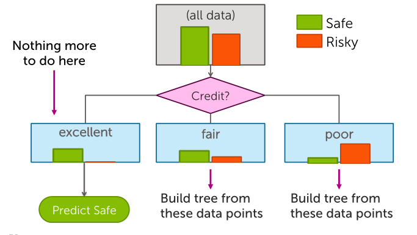
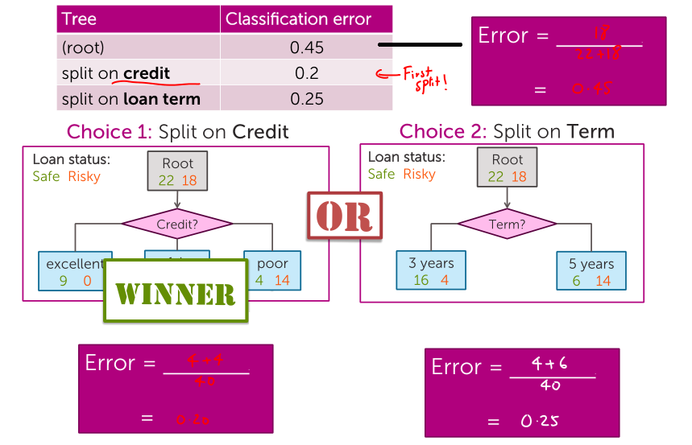
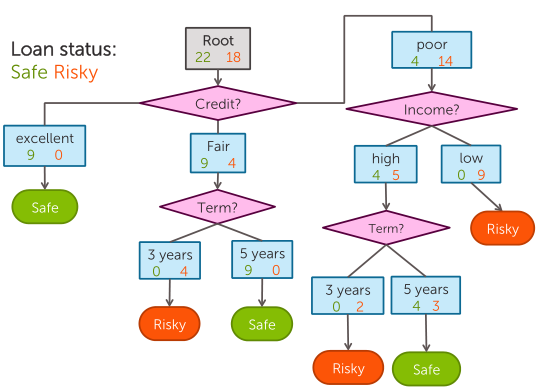
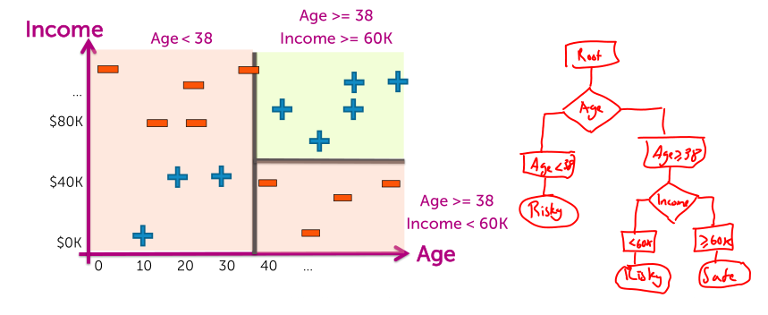
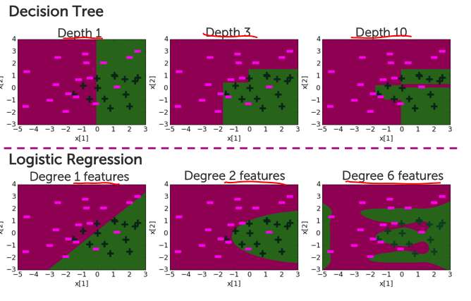

## binary decision trees
Given some input $x_i$, I'm going to traverse the decision tree down the particular branches. And then I'm going to make a prediction $\hat{y}_i$.

> Exponentially large number of possible trees makes decision tree learning hard (NP-hard problem)

Unlike *logistic regression* (diagonal decision boundary). Here we're only going to get straight up, or straight across, decision boundary.

**Quality metric: Classification error**
*Measures fraction of mistakes*
- Best possible value: 0.0
- Worst possible value: 1.0

$$
\text{Error} = \frac{\text{# incorrect predictions}}{\text{# examples}}
$$

### Recursive greedy algorithm
Incrementally build a tree, one layer at a time, in order to get the best possible classification error at each step.

1. Start with an empty tree
1. Select a feature to split data, **Feature split selection**
1. For each split on the tree
    - If nothing more to split (*leaf node*), make predictions, **Stopping condition**
    - Otherwise, **Recursion**; go to step 2 and continue (recurse on this split)

**Feature split selection**
*Can be viewed as a *decision stump.*

So for each node, we look at the majority value to make a prediction.

For each intermediate node, set:
$$
\hat{y} = \text{mayority value}
$$

**Calculating classification error**
*what is the best feature to split on and how do we measure that?*

1. $\hat{y}$ = class of majority of data in node
1. Calculate classification error of prediction $\hat{y}$ for this data

> A better split is one that gives you lowest classification error.

**Feature split selection algorithm**
- Given a subset of data $M$ (a node in a tree)
- For each feature $h_i(x)$
    1. Split data of $M$ accoriding to feature $h_i(x)$
    1. Compute classification error split
- Choose feature $h'(x)$ with lowest classification error

**Simple greedy decision tree learning**
1. Pick best feature to split on
1. Learn decision stump with this split
1. For each leaf decision stum, recurse

Stop if:
1. Every data point agrees
1. Run out of features

### Threshold splits for continuous inputs

**Threshold split selection algorithm**
1. Sort the values of a feature $h_j(x)$:  
  Let $v_1, ..., v_N$ denote sorted values
1. For i = 1 ... N-1
    - Consider split $t_i = (v_i + v_{i+1}) / 2$
    - Compute classification error for treshold split $h_j(x) \geq t_i$

> Chose the $t'$ with the lowest classification error.

When you have continuous variables, unlike for discrete/categorical ones, we can split on the same variable multiple times.

**Comparing decision boundaries**

