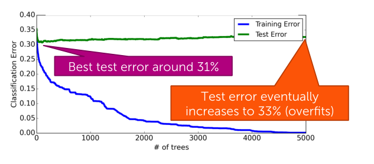

## The boosting question
*Can a set of weak learners be combined to create a stronger learner?*

Simple (weak) classifiers
- Low variance
- Learning fast
> High bias

### Ensemble classifier
- Goal
  - Predict output $y$ from input $x$
- Learn ensemble model:
  - Classifiers: $f_1(x), ..., f_T(x)$
  - Coefficients: $\hat{w}_1, ..., \hat{w}_T$
- Predict:
$$
\hat{y} = \text{sign} \bigg( \sum^T_{t=1} \hat{w}_t f_t (x) \bigg)
$$

**Learning on weighted data**
*More weight on hard or more important pints*

We're going to look at where we're making mistakes so far and want to increase, see the proportion or the impact or how much we care about the points where we've made mistakes.

- Weighted dataset:
  - Each $x_i, y_i$ weighted by $\alpha_i$
  - More important point, **higher weight** $\alpha_i$

- Learning:
  - Data point $j$ counts as $\alpha_i$ data points

### AdaBoost
1. We start with, even weights, uniform weights, equal weights for all data points.
    - Start same weight for all points: $\alpha_i = 1/N$

1. We learn a classify, and find its coefficient depending on how good it is in terms of weighted error
    - Compute coefficient $\hat{w}_t$

1. Then we update the weights to weight mistakes more than things we got correct.
    - Recompute $f_t(x)$ with data weights $\alpha_i$

1. Finally, we normalize the weights by dividing each value by this total sum of the weights.
    $$
    \alpha_i = \frac{\alpha_i}{\sum^N_{j=1} \alpha_j}
    $$

1. Final model predicts by:
$$
\hat{y} = \text{sign} \bigg( \sum^T_{t=1} \hat{w}_t f_t (x) \bigg)
$$

**Computing coefficient $\hat{w}_t$**
- if it's doing well in our data, we want it to be large.
- if it's really bad, we should not trust that particular vote and down weight it.

> $f_t(x)$ is good if has low training error

- Total weight of mistakes:
$$
\sum^N_{i=1} = \alpha_i \ \text{mistake} (\hat{y}_i \neq y_i)
$$
- Total weight of all points:
$$
\sum^N_{i=1} = \alpha_i
$$
- Weighted error measures fraction of weight of mistakes:
$$
\text{weighted error} = \frac{\text{Total weight of mistakes}}{\text{Total weight of all points}}
$$

> Best error = 0.0

Formula for computing coefficient $\hat{w}_t$ of classifier $f_t(x)$
$$
\hat{w}_t = \frac{1}{2} \ln \bigg( \frac{1 - \text{weighted error}(f_t)}{\text{weighted error}(f_t)} \bigg)
$$

**Formula for updating weights $\alpha_i$**
- If correct: $f_t(x) = y_i$, decrease the weight by:
$$
\alpha_i e^{- \hat{w}_t}
$$
- If incorrect $f_t(x) \neq y_i$, increase the weight by:
$$
\alpha_i e^{\hat{w}_t}
$$

**Normalizing weights**
After each iteration, we go ahead and normalize the weights of all data points to add up to one.
$$
\alpha_i = \frac{\alpha_i}{\sum^N_{j=1} \alpha_j}
$$

**Finding best next decision stump $f_t(x)$**
*Picking the best feature, the one that has lowest weighted error.*

### The Boosting Theorem
We expect the training error (may oscillate), which to go eventually to zero.

**Variants of boosting and related algorithms**
- Gradient boosting
    - Like AdaBoost, but useful beyond basic classification
- Random forest
    - Bagging: Pick random subsets of the data (learn a tree and average)
    - Simpler than boosting and easier to parallelize
    - Typically higher error than boosting for same number of trees (number of iterations T)
