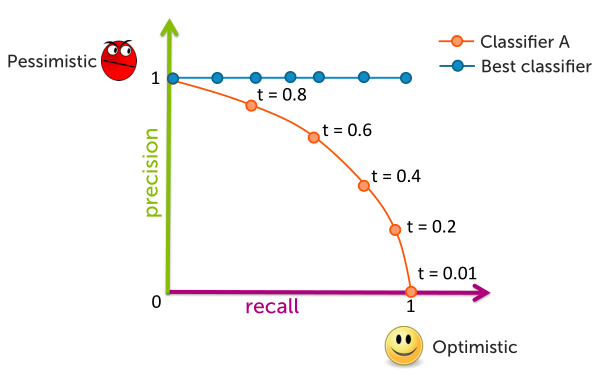

## Precision and Recall
**Precision**
Fraction of positive predictions that are actually positive:
$$
\text{precision} = \frac{\text{# true positives}}{\text{# true positives + # false positives}}
$$

Best possible value: 1.0
Worst possible value: 0.0

**Recall**
Fraction of positive data predicted to be positive, did I find every possible positive?

$$
\text{recall} = \frac{\text{# true positives}}{\text{# true positives + # false negatives}}
$$

Best possible value: 1.0
Worst possible value: 0.0

### Balancing precision & recall
Optimistic model:
*Predict almost everything as positive*
- Low precision
- High recall
$$
\hat{P}(y=+1 \vert x_i) > 0.001
$$
> Finds all positive sentences, but includes many false positives

Pessimistic model:
*Predict positive only when very sure*
- High precision
- Low recall
$$
\hat{P}(y=+1 \vert x_i) > 0.999
$$
> Finds few positive sentences, but includes no false positive

**Precision-Recall curve**

*Precision at k:* Sentencs model most sure are positive. Only showing k sentences.
