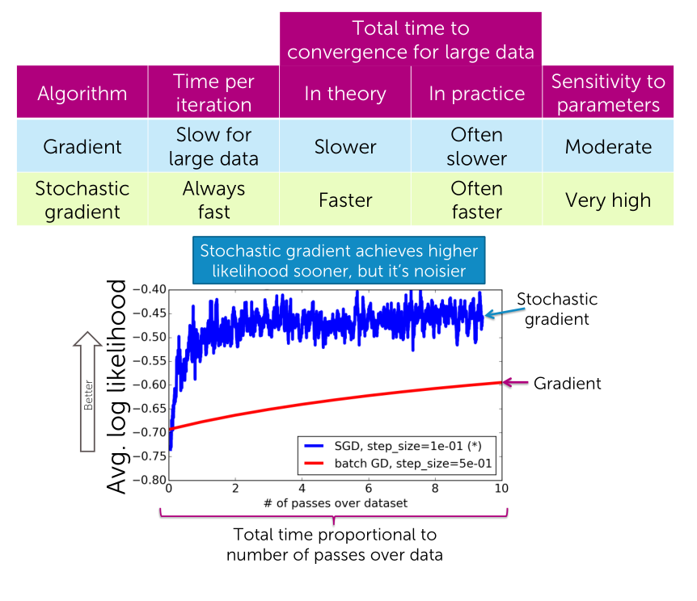
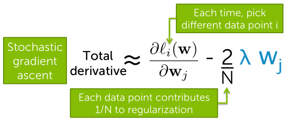

## Scaling ML to huge datasets
**Stochastic gradient**
*it doesn't convert smoothly to the optimal solution. It oscillates around the optimal solution*

Just a single data point, every time we're going to do an update will use a different data point. So we're just going to use one gradient but we use a different one every time.

> So in gradient ascent we did a sum over all data points. In stochastic gradient, we just going to approximate the gradient by the contribution of one data point.

**Shuffle data before running stochastic gradient**
Systematic order in data can introduce significant bias, e.g., all negative points first, or temporal order, younger first, etc.

**Choosing step size**
- If step size is too small,
stochastic gradient slow to converge
- If step size is too large,
stochastic gradient oscillates

Advanced tip: step size that decreases with iterations is very important for stochastic gradient (reduces noise)

$$
\eta_t = \frac{\eta_0}{t}
$$

**Choosing coefficients**
When you are outputting $\hat{w}$, your final self-coefficient, you don't use the last value, use the average of all the values that you've computed.
$$
\hat{w} = \frac{1}{T} \sum^T_{t=1} w^{(t)}
$$

**Mini-batches**
*We go batch by batch, but instead of considering one data point at a time in the competition of the gradient.*

- Reduces noise
- Increases stability
- Makes a convergence path smoother
- Oscillates better, you quickly get to great solution, and you stay around that.

**Measuring convergence**
For every time stamp I want to keep an average, it's called a moving average, of the last few likelihoods in order to measure convergence.

**Adding regularization**

### Online learning
*Data arrives (streams in) over time*

Must train model as data arrives

Pros:
- Model always up to date $\rightarrow$ often more accurate
- Lower computational cost
- Don't need to store all data

Cons:
- Overall system is *much* more complex
