## Document retrieval
*Retrieval as k-nearest neighbor search*

The goal is to retrieve another article that might be of interest to this reader.

**Challenges**
- How do we measure similarity?
- How do we search over articles?

*Query article*: This is the article that the person is currently reading.

### Nearest Neighbor
1. Compute the distance between this query article and all other articles out there.
1. Search for the article that has the smallest distance to the query article

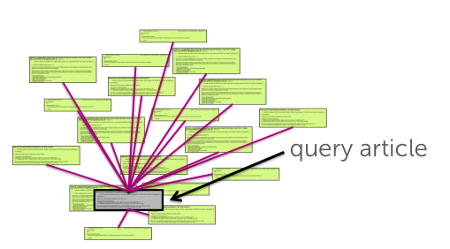

We might want to present the reader with a set of possible articles, the *k-nearest neighbors*.

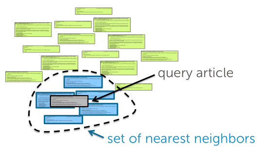

#### Document representation
**Bag of words model**
- Ignore order of words
- Count \# of instances of each word in vocabulary

> Common words dominate rare words.

**TF-IDF**
*Emphasizes important words.*

We're going to up-weight rare words that appear often in the document that we're looking at but not in the corpus.

And we're going to down-weight words like the and of, and all these things that probably appear in the document that we're looking at, but also appear in basically every other document out there.

- Appears frequently in document (common locally)
    - Term frequency = word counts
- Appears rarely in corpus (rare globally)
    - Inverse doc frequency $log \frac{\text{# docs}}{\text{1 + # docs using words}}$
> Trade off: Local frequency vs. global rarity

### Distance metrics
- Weighting different features
    - Some features are more relevant than others
    - Some features vary more than others
> Specify weights as a function of feature spread, for feature j:
$$
\frac{1}{\max{x_i[j]} - \min{x_i[j]}} \ \text{or} \ \frac{1}{\sigma^2}
$$

**Scaled Euclidean distance**
$$
\text{distance}(x_i, x_q) = \sqrt{a_1(x_i[1]-x_q[1])^2 + ... + a_d(x_i[d]-x_q[d])^2} \text{ , } a_j: \text{weights} \\
\sqrt{(x_i-x_q)^T A (x_i-x_q)} \text{ , } \text{A: diagonal matrix with weights}
$$

**Cosine similarity**
*Operates with normalized vectors*
$$
\frac{\sum^d_{j=1} x_i[j] x_q[j]}{\sqrt{\sum^d_{j=1}(x_i[j])^2}\sqrt{\sum^d_{j=1}(x_q[j])^2}} \\
= \frac{x_i^T x_q}{\Vert x_i \Vert \Vert x_q \Vert} = cos(\theta)
$$
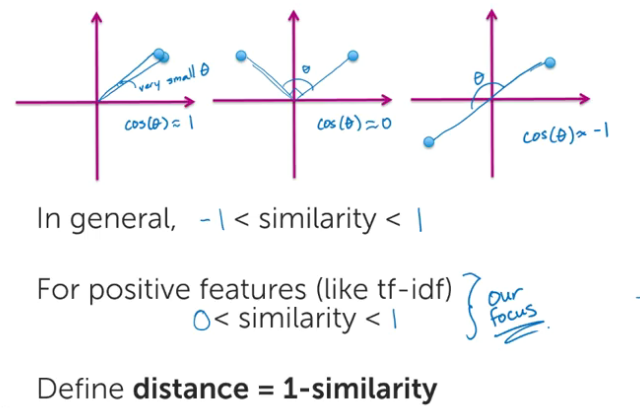

> If we normalize the documents, we become invariant to the length of the documents.

#### Combining distance metrics
1. Text of document
    - Distance metric: Cosine similarity
1. \# of reads:
    - Distance metric: Euclidean distance
> Add together with user-specified weights

## Scaling up k-NN search using KD-trees
**Complexity of brute-force search**
- O(N) distance computations per 1-NN
- O(N log k) per k-NN

### KD-tree construction
If we look at datapoint, and the first feature has a value greater than 0.5, we're going to place it in the yes table, the table to right, otherwise it's going to go into the no table, the table to the left.  

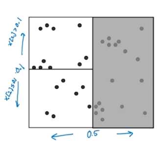

Continue splitting points at each set to create a *binary tree structure*, where each leaf node contains a list of points.

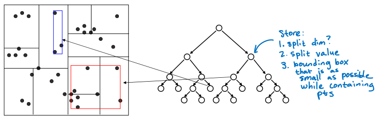

**Choices**
Use heuristics to make splitting decisions:
- Which dimension do we split along?
    - Widest or alternating dimensions
- Which value do we split at?
    - Median or center
- When do we stop?
    - Fewer than $m$ points, or box hits minimum width

### NN search with KD-trees
We're going to have our query point and traverse the tree all the way down to the leaf node that contains that query point.

Once we're at this leaf node, the first thing we do is start searching for nearest neighbors.

There are other points that are closer that live in other neighboring boxes.

1. Start by exploring lead node containing query point
1. Compute distance to each other point at leaf node
1. Backtrack and try other branch at  each node visited

Use distance bound and bounding box of each node to *prune* parts of tree that *cannot include* nearest neighbor. So if the distance to this box exceeds the distance to our nearest neighbor, we prune.  

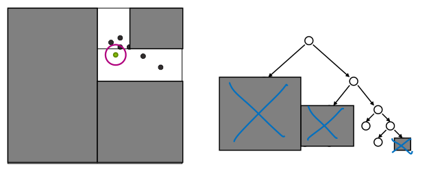

### Complexity
For (nearly) balanced, binary trees
- Construction
    - Size: 2N-1, O(N)
    - Depth: O(log(N))
    - Median + splitting: O(N)
    - Construction time: O(N log(N))
- 1-NN query
    - Transverse down tree to staring point: O(log(N))
    - Maximum backtrack and traverse: O(N)
    - Complexity range: O(log(N)) $\rightarrow$ O(N)
- N queries
    - Ask for nearest neighbor to each document: N
    - Brute force 1-NN: $O(N^2)$
    - KD-trees: O(N log(N)) $\rightarrow O(N^2)$

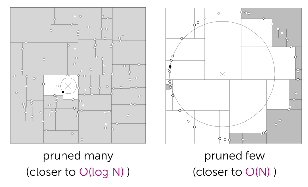

Under some assumptions on distributions of points, we get O(log(N)) but exponential in d. So for large d, This is really a regime where using kd-trees becomes pretty pointless.

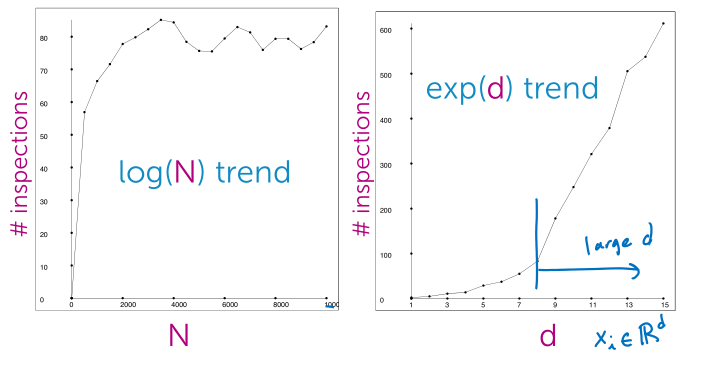

### Approximate k-NN search
So a question is, can we do things even more efficiently if we don't care about the nearest neighbor but just a pretty good approximation?

Prune when distance to bounding box:
- Before: $\gt r$
- Now: $\gt r / \alpha$, *more aggressive pruning*

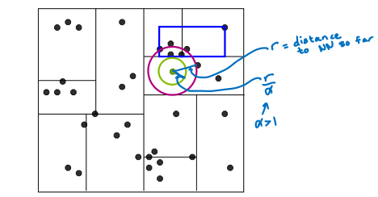

Can guarantee that if we return a neighbor at distance $r$, then there is no neighbor closer than $r / \alpha$. Bound loose, but in practice, often closer to optimal.

> Rule of thumb $N \gt \gt 2^d$, so typically useless for large d.

## Locality sensitive hashing (LSH) for approximate NN search
LSH performs an efficient neighbor search by randomly partitioning all reference data points into different bins.

Kd-trees:
- Non-trivial to implement efficiently
- Problems with high-dimensional data
    - Unlikely to have any data points close to query point
    - Once *nearby* point is found, the search radius is likely to intersect many hyper-cubes in at least one dim
    - Not many nodes can be pruned
    - Can show under some conditions that you visit at least $2^d$ nodes

### Locality sensitive hashing (LSH)
*Binary index.*

Search over all data points that have the same bin index as the query point, is using a hashtable.

We're going to associate with a key a set of values, a list of points, that are the indices of the data points, that have that bin value.  

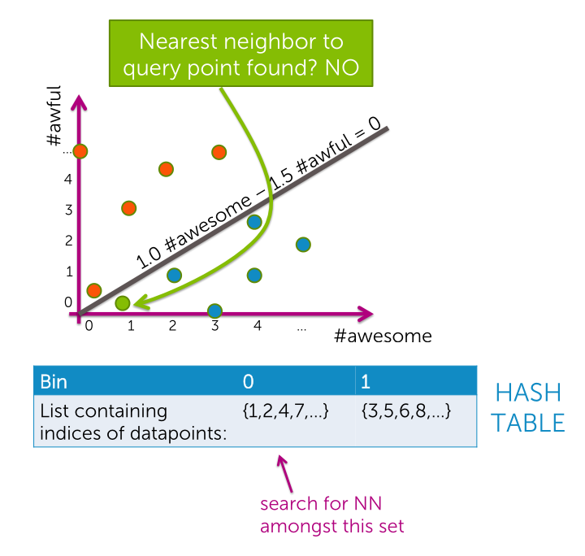

> Does not return an exact nearest neighbor

**Potential issues with simple approach**
1. Challenging to find good line
    - Random
1. Poor quality solution
    - Points close together get split into separate bins, unlikely if $\theta_{xy}$ is small
1. Large computational cost
    - Bins might contain many points

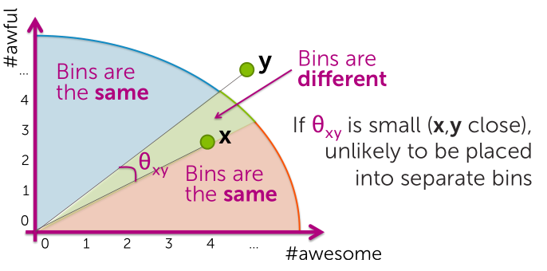

**Reducing search cost through more bins**
Search within the bin.

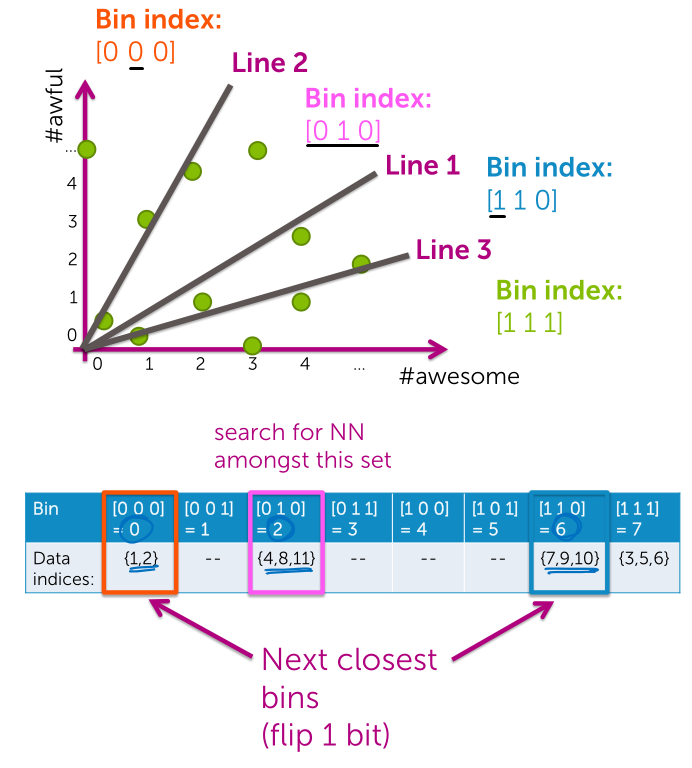

When throwing down multiple lines, what were **trading off is accuracy for speed**. Because there's a greater chance that searching within a single bin we're not going to find our true nearest neighbor, but we can search much efficiently.

But don't have to just search the one bin that our query point falls into, we can **also search nearby bins**; the ones that are just one bit off from our current bin indices.

> Quality of retrieved NN ca only improve with searching more bins until time limit or quality metric.

**Cost of binning points in d-dim**
- Per data point, need **d multiplies** to determine bin index per plane.
- In high dimensions (and some applications) this is often a sparse multiplication.
- One-time cost offset if many queries of fixed dataset.

### Some observations
* As we increase the search radius, we find more neighbors that are a smaller distance away.
* With increased search radius comes a greater number documents that have to be searched. Query time is higher as a consequence.
* With sufficiently high search radius, the results of LSH begin to resemble the results of brute-force search.
