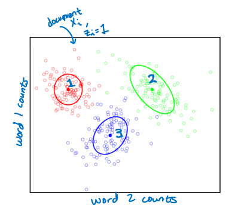
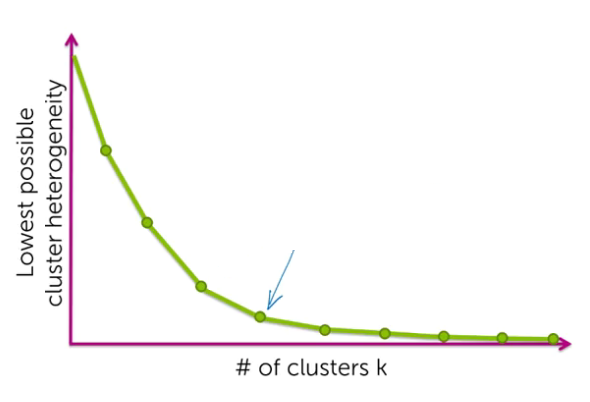
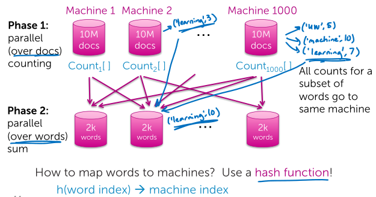
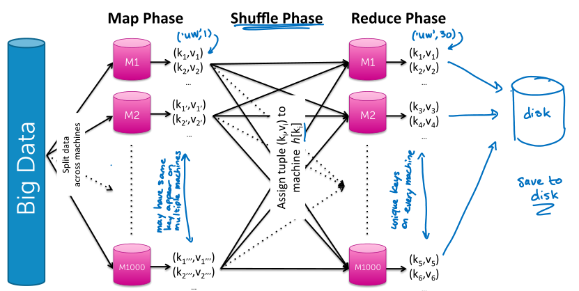

## Clustering
There are no labels provided, and the goal here is to uncover this grouping structure directly from the data, the input values alone.

*Unsupervised learning task:* We're presenting the inputs and the algorithm is supposed to output a set of labels as the output.

**What defines a cluster?**
- Center, *centroid*
- Shape, *spread*

Assign observation $x_i$ (doc, specific document) to cluster $k$ (topic label) if
- Score under cluster $k$ is higher than under others
    - Score as distance to cluster center, ignoring the shape

Even when the data look really clean, and nice, and well separated, sometimes it can be hard to define what it means to be a cluster and to devise algorithms to discover that.

> Think very carefully about what are the implications of the data, the model and the algorithm that you're specifying.

### K-Means
**k-means objective**
Try to minimize the sum of the square distances between our observations and the cluster centers.

$$
\sum^k_{j=1} \sum_{i:z_j = j} \Vert \mu_j - x_i \Vert^2_2
$$

Score: distance to cluster center, **small is better** (tighter clusters, homogenous). This metric of quality based on the distance is called *cluster heterogeneity*.

#### K-means algorithm
K-means iterate between two steps. One is assigning observations to the nearest cluster center. And the other is updating the cluster centers.

1. Initialize cluster centers:
$$
\mu_1, ..., \mu_k
$$
1. Assign all observations to closest cluster centers:
$$
z_i \leftarrow \text{arg} \min_{j} \Vert \mu_j - x_i \Vert^2_2
$$
   > Index where the distance was the smallest.

1. Update the cluster centers as mean of assigned observations:
$$
\mu_j = \frac{1}{n_j} \sum_{i:z_i = j} x_i
$$
    $n_j$: number of observations in cluster $j$
    $i:z_i = j$: observation $i$ is in cluster $j$

1. Iterate between assigning observations to cluster centers and updating the cluster centers until convergence.

Similar to *coordinate descent algorithm*, because we're iterating between two different steps where each step represents a minimization of some objective.

> Converges to local mode. If we initialize our algorithm with different cluster centers, then we've converge to a completely different solution.

**K-means++ overview**
*Initialization of k-means algorithm is critical to quality of local optima found*

Smart initialization:
1. Choose first cluster center uniformly at random from data points, $x$
1. For each observation, compute the distance to nearest cluster center, $d(x)$
1. Choose new cluster center from amongst data points, with probability of $x$ being chose proportional to $d(x)^2$
1. Repeat the steps until we've sampled $k$ different cluster centers.

We're going to be more likely to select a data point as a cluster center if that data point is far away.

And the fact that in the algorithm we're looking at the distant squares, makes that even more exaggerated.

> Computationally costly relative to random initialization, but the subsequent k-means often converges more rapidly.

Tends to **improve quality** of local optimum and **lower runtime**

**What happens as $k$ increases?**
Can refine clusters more and more to the data $\rightarrow$ **overfitting**.

Extreme case of $k = N$:
- Each cluster center equal to datapoint.
- Heterogeneity = 0, all distances to cluster centers are 0.

> Lowest possible cluster heterogeneity decreases with increasing $k$.

Choose $k$ based on the *elbow* of the curve  

### MapReduce for scaling k-means
The MapReduce abstraction has two different steps, one is the map step and the other one is the reduce step.

*Data parallel task:* some task that can be done completely independently across the different data points.

Counting words in parallel and merging tables in parallel
1. Phase 1, parallel counting (over docs)
1. Phase 2, parallel sum (over words)
    > Send all counts of a given word to a single machine.

**Execution overview**

In the map phase, these are not necessarily unique keys that appear across the different machines, Whereas when we're in the reduce phase we're going to end up with unique keys on every machine.

*Combiners*: reduce locally before communicating for global reduce to improve performance.

#### MapReduce abstraction
**Map**
Data-parallel over elements to generate (key, value) pairs:
- *Key*: different words in our vocabulary
- *Value*: count of that word

> We're saying that the word count in a given document doesn't depend on any other document.

**Reduce**
Must be commutative (a + b = b + a) and associative ((a + b) + c = a + (b + c))

Aggregate values for each key, data-parallel over keys to generate (key, value) pair:

- *Key*: Word assigned
- *Value*: count of that word

> We're saying, the total count of a given word doesn't depend on the total count of any other word.

#### MapReduce for k-means
- **Classify** step: Assign observations to closes cluster center $\rightarrow$ **Map** for each data point, given ($\mu_j, x_i$) emit ($z_i, x_i$)
    - Input: set of cluster centers and a datapoint.
    - Output: Cluster label as key and datapoints as values.

> Data parallel over data points

- **Re-center** step: Revise cluster centers as mean of assigned observations $\rightarrow$ **Reduce**, average over all points in cluster $j$ ($z_i = k$)
    - Input: Cluster label (key) and all datapoints assigned to cluster $j$.
    - Output: Returns cluster label and new centroid.

> Data parallel over centers.

## Code
**Normalize all vectors**
Euclidean distance can be a poor metric of similarity between documents, as it unfairly penalizes long articles. For a reasonable assessment of similarity, we should disregard the length information and use length-agnostic metrics, such as cosine distance.

Euclidean distance closely mimics cosine distance when all vectors are unit length. The squared Euclidean distance between any two vectors of length one is directly proportional to their cosine distance.

**Assessing convergence**
We'll be looking at an additional criteria: the sum of all squared distances between data points and centroids.
$$
J(\mathcal{Z},\mu) = \sum_{j=1}^k \sum_{i:z_i = j} \|\mathbf{x}_i - \mu_j\|^2
$$

> The smaller the distances, the more homogeneous the clusters are. In other words, we'd like to have "tight" clusters.

The **variation** in heterogeneity for different initializations, indicates that k-means sometimes gets stuck at a bad local minimum.

Use *k-means++* to provide a smart initialization. This method tries to spread out the initial set of centroids so that they are not too close together. It is known to improve the quality of local optima and lower average runtime.

- On average, k-means++ produces a better clustering than Random initialization.
- Variation in clustering quality is smaller for k-means++.

> In general, you should run k-means at least a few times with different initializations and then return the run resulting in the lowest heterogeneity

**How to choose K**
*Not all runs for larger K will result in lower heterogeneity than a single run with smaller K due to local optima.*

Heterogeneity goes down as we increase the number of clusters. Does this mean we should always favor a higher K? Not at all!, setting K too high may end up separating data points that are actually pretty alike.
